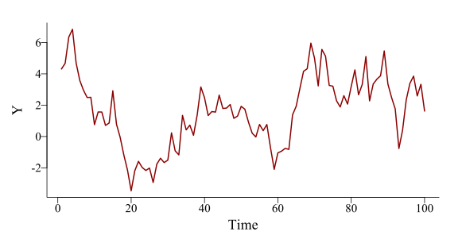
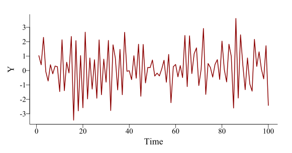
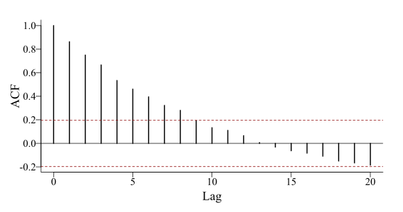
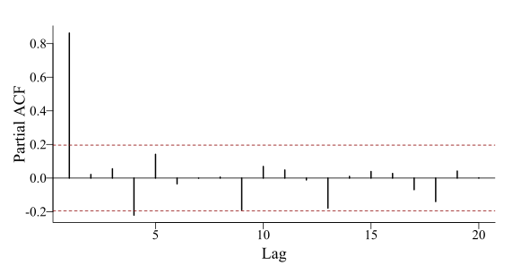
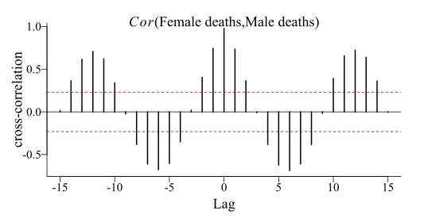
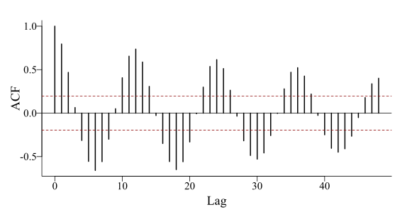

class: inverse middle center big-subsection

```{r setup, include=FALSE, cache=FALSE}
options(htmltools.dir.version = FALSE)
knitr::opts_chunk$set(cache = FALSE, dev = 'svg', echo = TRUE,
                      message = FALSE, warning = FALSE,
                      fig.align = 'center',
                      fig.height = 5.1, fig.width = 1.9 * 5.1)
library('mgcv')
library('mvgam')
library('fontawesome')
```

```{r xaringan-panelset, echo=FALSE}
xaringanExtra::use_panelset()
xaringanExtra::style_panelset_tabs(foreground = '#8F2727',
                                   inactive_opacity = 0.8)
```

```{r xaringan-animate-css, echo=FALSE}
xaringanExtra::use_animate_css()
```

```{r xaringanExtra-clipboard, echo=FALSE}
xaringanExtra::use_clipboard()
```

```{r xaringan-tile, echo=FALSE}
xaringanExtra::use_tile_view()
```

```{r setup II, echo = FALSE}
c_light <- c("#DCBCBC")
c_light_highlight <- c("#C79999")
c_mid <- c("#B97C7C")
c_mid_highlight <- c("#A25050")
c_dark <- c("#8F2727")
c_dark_highlight <- c("#7C0000")

mypar = function(...){
  par(family = "serif", 
      las = 1, 
      mar=c(4,4.1,2,2),
      mgp = c(2,0.5,0),
      bty = "l", 
      cex.axis = 1.25, 
      cex.lab = 1.5, 
      cex.main = 1.5,
      xaxs = 'r',
      yaxs = 'r',
      pch = 16)
}

myparsmall = function(...){
  par(family = "serif", 
      las = 1, 
      mgp = c(4, 1, 0),
      mar=c(5,6,2,2),
      bty = "l", 
      cex.axis = 1.85, 
      cex.lab = 2.75, 
      cex.main = 2.75,
      xaxs = 'r',
      yaxs = 'r',
      pch = 16)
}

myhist = function(x, 
                  xlim,
                  xlab = '',
                  main = '',
                  big = TRUE){

  if(big){
      mypar()
  } else {
      myparsmall()
  }

  if(missing(xlim)){
    xlim <- range(x, na.rm = TRUE)
  }
  
  hist(x, 
       xlim = xlim,
       yaxt = 'n',
       xlab = xlab,
       ylab = '',
       col = c_mid_highlight,
       border = 'white',
       lwd = 2,
       breaks = 20,
       main = main)
}

mybar = function(x, 
                  xlab = '',
                  main = '',
                  big = TRUE){

  if(big){
      mypar()
  } else {
      myparsmall()
  }
  
  barplot(table(x),
          yaxt = 'n',
          xlab = xlab,
          border = NA,
       ylab = '',
       col = c_mid_highlight,
       lwd = 2,
       main = main)
  axis(1, labels = NA, tck=0, lwd =2)
}

mylines = function(x, xlab = '', 
                   ylim,
                   ylab = '',
                   big = TRUE){

  if(big){
      mypar()
  } else {
      myparsmall()
  }
  
  if(missing(ylim)){
      plot(x = x, 
       type = 'l',
       col = c_dark_highlight,
       lwd = 3.5,
       bty = 'l',
       xlab = xlab,
       ylab = ylab)
  } else {
      plot(x = x, 
       ylim = ylim,
       type = 'l',
       col = c_dark_highlight,
       lwd = 3.5,
       bty = 'l',
       xlab = xlab,
       ylab = ylab)
  }

  box(bty = 'l', lwd = 2)
}

myscatter = function(x, 
                     y, 
                     xlab = '', 
                     ylab = '', 
                     big = TRUE){
  
    if(big){
      mypar()
  } else {
      myparsmall()
  }

  plot(x = x, 
       y = y, 
       pch = 21,
       bg = c_dark,
       col = 'white',
       cex = 2,
       bty = 'l',
       xlab = xlab,
       ylab = ylab)
  box(bty = 'l', lwd = 2)
}
```

# Welcome

???

---
## About me


Australian Research Council Early Career Fellow

The University of Queensland
- School of Veterinary Science 
- Located in Gatton, Australia


Expertise in:
- Quantitative ecology
- Molecular genetics
- Multivariate time series modelling

---

## Workflow


Press the "o" key on your keyboard to navigate among slides

Access the [tutorial html here](https://nicholasjclark.github.io/physalia-forecasting-course/day1/tutorial_1_physalia)
- Download the data objects and exercise `R` script from the html file
- Complete exercises and use Slack to ask questions

Relevant open-source materials include:
- [Forecasting Principles and Practice](https://otexts.com/fpp3/)
- [Applied Time Series Analysis](https://atsa-es.github.io/atsa-labs/)
- [Ecological Forecasting & Dynamics Course](https://course.naturecast.org/)
- [Edward Malthouse's Time Series Lectures](https://www.youtube.com/playlist?list=PLDD7yyOAeWWc-CBJuXcF6WRa2dhLwiHC0)

---

## This lecture's topics

Why forecast?

Why are time series difficult?

Visualizing time series

Common time series models

Why they fail in ecology

---
class: inverse middle center big-subsection

# Why forecast? 

---
class: middle center
###“Because all decision making is based on what will happen in the future, either under the status quo or different decision alternatives, decision making ultimately depends on forecasts”
  
[Dietze et al. 2018](https://ecoforecast.org/about/)

---

background-image: url('./resources/fc_cycle.png')
background-size: contain

---

background-image: url('./resources/big_data.gif')
background-size: contain
background-color: #F2F2F2

---

## Where is forecasting used?
Fisheries stocks, landings and bycatch risks

Coral bleaching and algal bloom risks

Carbon stocks

Wildlife population dynamics

[Many other examples](https://ecoforecast.org/member-forecasting-profiles/)

---

class: full-size

## [NOAA Coastwatch's `EcoCast`](https://coastwatch.pfeg.noaa.gov/ecocast/)
.pull-right[]
Tell fishers where to avoid bycatch

Harnesses up-to-date information for ecological models:
- Fisheries bycatch data
- Satellite observations
- Oceanography products

Builds distribution models and dynamically updates maps

---


background-image: url('./resources/ecocast_screen.png')
background-size: contain

---

class: full-size

## [Portal Project's `Portalcast`](https://portal.naturecast.org/)
.pull-right[<br>]

Predict rodent abundance up to one year ahead

Harnesses up-to-date information for ecological models:
- Rodent captures from baited traps
- Satellite observations

Builds time series models and dynamically update forecasts

---

background-image: url('./resources/portal_forecast.png')
background-size: contain

---

class: inverse middle center big-subsection

# Why are time series difficult?

---

## Some challenges of time series 
Temporal autocorrelation 

Lagged effects

Non-Gaussian data and missing observations 

Measurement error

Time-varying effects

Nonlinearities

Multi-series clustering

---

## Let's focus on these for now 
.emphasize[*Temporal autocorrelation*] 


.emphasize[*Lagged effects*]

.grey[
Non-Gaussian data and missing observations 

Measurement error

Time-varying effects

Nonlinearities

Multi-series clustering]

---

## What is temporal autocorrelation?
Values at current time .emphasize[*correlated with past values*]

$$Cor({Y}_{t}, {Y}_{t-lag})\neq0$$

---
## Refresher: what is correlation?

```{r,fig.height = 6, fig.width = 3.25 * 6, echo=FALSE}
set.seed(111)
x = rnorm(100)
y1 = rnorm(100,x*0.1)
y2 = rnorm(100,x*0.4)
y3 = rnorm(100,x*0.85)
layout(matrix(1:3, nrow=1))
myscatter(x = x, y = y1, xlab = '', ylab = 'Y', big = FALSE)
title(main = expression(paste(italic(Cor),"(",X,",",Y, ") = 0.1")))
abline(lm(y1~x), lwd = 2)

myscatter(x = x, y = y2, xlab = 'X', ylab = '', big = FALSE)
title(main = expression(paste(italic(Cor),"(",X,",",Y, ") = 0.5")))
abline(lm(y2~x), lwd = 2)

myscatter(x = x, y = y3, xlab = '', ylab = '', big = FALSE)
title(main = expression(paste(italic(Cor),"(",X,",",Y, ") = 0.85")))
abline(lm(y3~x), lwd = 2)
```

Correlation assumes a .emphasize[*linear*] relationship among two variables

---

## What is temporal autocorrelation?
Values at current time .emphasize[*correlated with past values*]

$$Cor({Y}_{t}, {Y}_{t-lag})\neq0$$

We can estimate the correlation $(\beta)$ with linear regression

$$\boldsymbol{Y}_{t}\sim \text{Normal}(\alpha + \color{darkred}{\beta} * \boldsymbol{Y}_{t-lag},\sigma)$$

---

## What is temporal autocorrelation?
Values at current time .emphasize[*correlated with past values*]

$$Cor({Y}_{t}, {Y}_{t-lag})\neq0$$

We can estimate the correlation $(\beta)$ with linear regression

$$\boldsymbol{Y}_{t}\sim \text{Normal}(\alpha + \color{darkred}{\beta} * \boldsymbol{Y}_{t-lag},\sigma)$$

Generalize to state that current value of a series (at time $t$) is .emphasize[*a function*] of it's own past values (at time $t-lag$)

$$\boldsymbol{Y}_{t}\sim \text{f}( \boldsymbol{Y}_{t-lag})$$

---
## A *positively* autocorrelated series
.panelset[
.panel[.panel-name[Code]

```{r ar_sim, echo=FALSE,fig.show='hide', fig.height=4.25, fig.width=1.9*4.25}
# set seed for reproducibility
set.seed(1111)

# number of timepoints
T <- 100

# use arima.sim to simulate from an AR(1) model
series <- arima.sim(model = list(ar = 0.8), n = T, sd = 1)

# plot the time series as a line
mypar()
plot(series, type = 'l', bty = 'l', lwd = 2, 
     col = 'darkred', ylab = 'Y', xlab = 'Time')
```

```{r eval=FALSE}
# set seed for reproducibility
set.seed(1111)

# number of timepoints
T <- 100

# use arima.sim to simulate from an AR(1) model
series <- arima.sim(model = list(ar = 0.8), n = T, sd = 1)

# plot the time series as a line
plot(series, type = 'l', bty = 'l', lwd = 2, 
     col = 'darkred', ylab = 'Y', xlab = 'Time')
```
]

.panel[.panel-name[Model]
$$\boldsymbol{Y}_{t}\sim \text{Normal}(\color{darkred}{0.8} * \boldsymbol{Y}_{t-1},\color{darkred}{1})$$
]

.panel[.panel-name[Plot]
.center[]

]
]

---

## A *negatively* autocorrelated series
.panelset[
.panel[.panel-name[Code]

```{r ar_simneg, echo=FALSE,fig.show='hide', fig.height=4.25, fig.width=1.9*4.25,echo=FALSE}
# set seed for reproducibility
set.seed(1111)

# number of timepoints
T <- 100

# use arima.sim to simulate from an AR(1) model
series <- arima.sim(model = list(ar = -0.8), n = T, sd = 1)

# plot the time series as a line
mypar()
plot(series, type = 'l', bty = 'l', lwd = 2, 
     col = 'darkred', ylab = 'Y', xlab = 'Time')
```

```{r eval=FALSE}
# set seed for reproducibility
set.seed(1111)

# number of timepoints
T <- 100

# use arima.sim to simulate from an AR(1) model
series <- arima.sim(model = list(ar = -0.8), n = T, sd = 1)

# plot the time series as a line
plot(series, type = 'l', bty = 'l', lwd = 2, 
     col = 'darkred', ylab = 'Y', xlab = 'Time')
```
]

.panel[.panel-name[Model]
$$\boldsymbol{Y}_{t}\sim \text{Normal}(\color{darkred}{-0.8} * \boldsymbol{Y}_{t-1},\color{darkred}{1})$$
]

.panel[.panel-name[Plot]
.center[]

]
]

---
## Correlations *over >1 lag*

Can include multiple lags of the same predictor variable (the response in this case)

<br/>

$$\boldsymbol{Y}_{t}\sim \text{f}(\boldsymbol{Y}_{t-1},\boldsymbol{Y}_{t-2},\boldsymbol{Y}_{t-3})$$

---

## Lagged effects of predictors

External conditions (eg temperature, humidity, landcover) can also influence what happens to a series at later timepoints

<br>

$$\boldsymbol{Y}_{t}\sim \text{f}( \boldsymbol{Y}_{t-lag}, \color{darkred}{\boldsymbol{X}_{t-lag}})$$
<br>
Where: 
- $\boldsymbol{X}_{t}$ is the matrix of predictor values at time $t$
---


class: middle center
### Many series show complex correlation structures; they can also show other temporal patterns

---

class: full-size

## Seasonality
.pull-right-bigger[]


Many time series show .emphasize[*repeated periodic cycles*]
- Breeding seasons
- Migration
- Green-ups / green-downs
- Lunar cycles
- Predator / prey dynamics

Often change slowly over time

---

## Example seasonal series
```{r echo = FALSE}
mypar()
data("AirPassengers")
plot(AirPassengers, bty = 'l', lwd = 3.5,
     col = 'darkred')
```

---
## Another seasonal series
```{r echo = FALSE}
mypar()
portal_data %>%
  dplyr::mutate(time = moon - (min(moon)) + 1) %>%
  dplyr::mutate(count = PP) %>%
  dplyr::mutate(series = as.factor('PP')) %>%
  dplyr::select(series, year, time, count, mintemp, ndvi) -> model_data
mylines(x = model_data$count,
        xlab = 'Time',
        ylab = 'Rodent captures')
```
---

class: inverse middle center big-subsection

# Visualizing time series 

---

## Detecting lagged effects
[Lag plots](https://otexts.com/fpp3/lag-plots.html)

Autocorrelation functions ([ACFs](https://otexts.com/fpp3/acf.html))

Partial autocorrelation functions ([pACFs](https://online.stat.psu.edu/stat510/lesson/2/2.2#:~:text=In%20general%2C%20a%20partial%20correlation,some%20other%20set%20of%20variables.)) 

Cross-correlation functions ([CCFs](https://online.stat.psu.edu/stat510/lesson/8/8.2))

---

## *Independent* correlations
.panelset[
.panel[.panel-name[Code]

```{r ar1_acf, echo=FALSE,fig.show='hide', fig.height=4.25, fig.width=1.9*4.25}
# set seed for reproducibility
set.seed(1111)

# number of timepoints
T <- 100

# use arima.sim to simulate from an AR(1) model
series <- arima.sim(model = list(ar = c(0.8)), n = T, sd = 1)

# plot the empirical ACF
mypar()
acf(series, lwd = 2, bty = 'l',
    ci.col = 'darkred', main = '')
```

```{r eval=FALSE}
# set seed for reproducibility
set.seed(1111)

# number of timepoints
T <- 100

# use arima.sim to simulate from an AR(1) model
series <- arima.sim(model = list(ar = c(0.8)), n = T, sd = 1)

# plot the empirical ACF
acf(series, lwd = 2, bty = 'l',
    ci.col = 'darkred', main = '')
```
]

.panel[.panel-name[Plot]
.center[]

]
]

---

## *Conditional* correlations
.panelset[
.panel[.panel-name[Code]

```{r ar1_pacf, echo=FALSE, fig.show='hide', fig.height=4.25, fig.width=1.9*4.25}
# set seed for reproducibility
set.seed(1111)

# number of timepoints
T <- 100

# use arima.sim to simulate from an AR(1) model
series <- arima.sim(model = list(ar = c(0.8)), n = T, sd = 1)

# plot the empirical pACF
mypar()
pacf(series, lwd = 2, bty = 'l',
    ci.col = 'darkred', main = '')
```

```{r eval=FALSE}
# set seed for reproducibility
set.seed(1111)

# number of timepoints
T <- 100

# use arima.sim to simulate from an AR(1) model
series <- arima.sim(model = list(ar = c(0.8)), n = T, sd = 1)

# plot the empirical pACF
pacf(series, lwd = 2, bty = 'l',
    ci.col = 'darkred', main = '')
```
]

.panel[.panel-name[Plot]
.center[]

]
]

---

## *Independent* cross-correlations
.panelset[
.panel[.panel-name[Code]

```{r death_ccf, echo=FALSE,fig.show='hide', fig.height=3.9, fig.width=1.9*3.9}
# compute a CCF of the built-in lung cancer dataset
mypar()
ccf(as.vector(mdeaths), as.vector(fdeaths), 
    # compute cross-correlations at each lag
    type = 'correlation',
    bty = 'l', lwd = 2, ci.col = 'darkred',
    ylab = "cross-correlation", main = "")
    # add an informative title
    title(main = expression(paste(italic(Cor),
                            "(", Female~deaths,
                            ",", Male~deaths, ")")),
          line = 0)
```

```{r eval=FALSE}
# compute a CCF of the built-in lung cancer dataset
ccf(as.vector(mdeaths), as.vector(fdeaths), 
    # compute cross-correlations at each lag
    type = 'correlation',
    bty = 'l', lwd = 2, ci.col = 'darkred',
    ylab = "cross-correlation", main = "")
# add an informative title
title(main = expression(paste(italic(Cor),
                            "(", Female~deaths,
                            ",", Male~deaths, ")")),
          line = 0)
```
]

.panel[.panel-name[Plot]
.center[]

]
]
---

## ACFs often detect seasonality
.panelset[
.panel[.panel-name[Code]

```{r gas_acf, echo=FALSE, fig.show='hide', fig.height=4.25, fig.width=1.9*4.25}
# load the 'gas' dataset from the forecast library
library(forecast)
data(gas)

# subset to the final 100 observations
gas <- gas[377:476]

# plot the empirical ACF over 48 lags
mypar()
acf(gas, lag.max = 48, lwd = 2, bty = 'l',
    ci.col = 'darkred', main = '')
```

```{r eval=FALSE}
# load the 'gas' dataset from the forecast library
library(forecast)
data(gas)

# subset to the final 100 observations
gas <- gas[377:476]

# plot the empirical ACF over 48 lags
acf(gas, lag.max = 48, lwd = 2, bty = 'l',
    ci.col = 'darkred', main = '')
```
]

.panel[.panel-name[Plot]
.center[]

]
]

---
## But why did we subset?

```{r eval = FALSE}
# load the 'gas' dataset from the forecast library
library(forecast)
data(gas)

# subset to the final 100 observations
gas <- gas[377:476] #<<

# plot the empirical ACF over 48 lags
acf(gas, lag.max = 48, lwd = 2, bty = 'l',
    ci.col = 'darkred', main = '')
```

---

## Because `gas` looks like this ...
```{r echo = FALSE}
library(forecast)
mypar()
data(gas)
gas = gas / 1000
plot(gas,bty = 'l', lwd = 3.5,
     col = 'darkred', ylab = 'gas (thousands of units)')
```

---

## ... and has a nonlinear *trend*
```{r echo = FALSE}
library(forecast)
mypar()
data(gas)
gas = gas / 1000

gas_stl <- stl(gas, s.window = 13)
trend <- gas_stl$time.series[,2]
plot(gas,bty = 'l', lwd = 3.5,
     col = 'grey70', ylab = 'gas (thousands of units)')

## plot the trend
lines(trend, lwd = 3.5, col = 'white')
lines(trend, lwd = 2.5, col = 'darkred')
```

---
## Raw ACF is misleading
```{r echo = FALSE}
# load the 'gas' dataset from the forecast library
library(forecast)
data(gas)

# plot the empirical ACF over 48 lags
mypar()
acf(as.vector(gas), lag.max = 48, lwd = 2, bty = 'l',
    ci.col = 'darkred', main = '')
```
---

## Decompositions
Often it is helpful to split (i.e. [decompose](https://otexts.com/fpp3/decomposition.html)) a time series into several sub-components
- Long-term trends
- Repeated seasonal patterns
- Remaining non-temporal variation

These components can be summed to give the original series

---
## Example: a complex series

```{r echo = FALSE}
mypar()
data("AirPassengers")
plot(as.vector(AirPassengers), bty = 'l', lwd = 3.5,
     type = 'l',
     col = 'darkred',
     xlab = '', 
     ylab = 'Air passengers',
     xaxt = 'n',
     xlim = c(0, 160),
     ylim = c(-50, 600))
title(xlab = 'Time', line = 0.75)
box(bty = 'l', lwd = 2)
```

---

## Decompose: trend + seasonality
```{r echo = FALSE}
mypar()
data("AirPassengers")
plot(as.vector(AirPassengers), bty = 'l', lwd = 3.5,
     type = 'l',
     col = 'grey70',
     xlab = '', 
     ylab = 'Air passengers',
     xaxt = 'n',
     xlim = c(0, 160),
     ylim = c(-50, 600))
title(xlab = 'Time', line = 0.75)
year <- as.numeric(substr(time(AirPassengers), 1, 4))
season <- as.numeric(cycle(AirPassengers))
time <- 1:length(AirPassengers)
library(mgcv)
mod <- gam(AirPassengers ~ s(time, k = 20) +
                       s(season, bs = 'cc'))
trend <- predict(mod, exclude = 's(season)',
                 type = 'iterms') + coef(mod)[1]
## plot the trend
lines(trend, lwd = 3.5, col = 'white')
lines(trend, lwd = 2.5, col = 'darkred')

# plot the cycle
cycle <- predict(mod, exclude = 's(time)',
                 type = 'terms')
lines(cycle, lwd = 3.5, col = 'white')
lines(cycle, lwd = 2.5, col = 'darkblue')
box(bty = 'l', lwd = 2)

# add labels
text(x = 145, y = trend[144], labels = 'Trend',
     adj = 0,
     col = 'darkred', cex = 1.45)
text(x = 145, y = 5, labels = 'Seasonality',
     adj = 0,
     col = 'darkblue', cex = 1.45, xpd = TRUE)
```
---

## Under the hood

```{r echo=FALSE, fig.height = 5.5, fig.width = 1.9 * 5.1}
data("AirPassengers")
plot(stl(AirPassengers, 'periodic'),
     lwd = 2, col = 'darkred', bty = 'l',
     col.range = 'darkred')
```

---

class: middle center
### Modelling these multiple components, either additively or multiplicatively, is a major goal of most time series analysis procedures

---

class: inverse middle center big-subsection

# Common time series models 

---

## Common time series models
Random Walk ([RW](https://atsa-es.github.io/atsa-labs/sec-tslab-random-walks-rw.html))

Autoregressive ([AR](https://atsa-es.github.io/atsa-labs/sec-tslab-autoregressive-ar-models.html)) 

Autoregressive Integrated Moving Average ([ARIMA](https://otexts.com/fpp3/arima.html); require [stationarity](https://otexts.com/fpp3/stationarity.html))

Exponential Smoothing ([ETS](https://otexts.com/fpp3/expsmooth.html))

[Regression with ARIMA errors](https://otexts.com/fpp3/regarima.html)

---

## *Very* easy to apply in `r fa("r-project", fill = "steelblue")`


Hyndman’s tools in the [`forecast` 📦](https://pkg.robjhyndman.com/forecast/) are hugely popular and accessible for time series analysis / forecasting 
  
[ETS](https://pkg.robjhyndman.com/forecast/reference/ets.html) handles many types of seasonality and nonlinear trends 
  
[(S)ARIMAX](https://pkg.robjhyndman.com/forecast/reference/auto.arima.html) includes additive fixed effects of predictors while capturing trends and seasonality

*Some* of these algorithms can handle missing data

*All* are extremely fast to fit and forecast

---


## Great! But what about these? 
.grey[Temporal autocorrelation


Lagged effects]


.emphasize[*Non-Gaussian data and missing observations*

*Measurement error*

*Time-varying effects*

*Nonlinearities*

*Multi-series clustering*]

---

class: inverse middle center big-subsection

# Time series models fail in ecology

---

## Ecological time series include
Counts of multiple species over time

Presence-absence of species

Repeated captures in multiple plots

Censored measures (OTUs / pollutants with limits of detection) 

Phenology records

Tree rings

etc...

---

## Example ecological time series
</br>
.pull-left[
```{r, echo=FALSE}
set.seed(55)
N = 50
beta_temp <- floor(exp(mvgam:::sim_ar3(h = N, tau = 10)))
beta_temp[c(5, 11, 12, 13, 31, 32, 33, 34)] <- NA
mylines(beta_temp, xlab = 'Time', ylab = 'Abundance', big = FALSE)
```
]
.pull-right[
```{r, echo=FALSE}
set.seed(55)
N = 50
beta_temp <- floor(exp(mvgam:::sim_ar3(h = N, tau = 10)))
beta_temp[c(5, 11, 12, 13, 31, 32, 33, 34)] <- NA
myhist(beta_temp, xlab = 'Abundance', big = FALSE)
```
]

---

## Another ecological time series
</br>
.pull-left[
```{r, echo=FALSE}
set.seed(111)
N = 50
beta_temp <- rbinom(n = N, size = 1, prob = 0.4)
myscatter(x = 1:N, y = beta_temp, xlab = 'Time', ylab = 'Occurrence', big = FALSE)
```
]
.pull-right[
```{r, echo=FALSE}
set.seed(111)
N = 50
beta_temp <- rbinom(n = N, size = 1, prob = 0.4)
myhist(beta_temp, xlab = 'Occurrence', big = FALSE,
       xlim = c(0, 1))
```
]

---

## Yet another ecological time series

</br>
.pull-left[
```{r, echo=FALSE}
set.seed(55)
N = 50
beta_temp <- mvgam::sim_mvgam(T = N, family = betar(), prop_train = 1,
                              trend_rel = 0.4)$data_train$y
mylines(beta_temp, xlab = 'Time', ylab = 'Relative abundance', big = FALSE,
        ylim = c(0, 1))
```
]
.pull-right[
```{r, echo=FALSE}
set.seed(55)
N = 50
beta_temp <- mvgam::sim_mvgam(T = N, family = betar(), prop_train = 1,
                              trend_rel = 0.4)$data_train$y
myhist(beta_temp, xlab = 'Relative abundance', big = FALSE,
       xlim = c(0, 1))
```
]

---

## Collections of ecological series
```{r,fig.height = 6, fig.width = 2.2 * 6, echo=FALSE}
set.seed(55)
N = 50
par(family = "serif", 
    las = 1, 
    mar=c(4,4.1,2,2),
    mgp = c(2,0.5,0),
    bty = "l", 
    cex.axis = 1.25, 
    cex.lab = 1.5, 
    cex.main = 1.5,
    col.lab = 'white',
    xaxs = 'r',
    yaxs = 'r',
    pch = 16)
beta_temp <- mvgam::sim_mvgam(T = N, 
                              n_series = 4,
                              family = poisson(), 
                              prop_train = 1,
                              prop_missing = 0.1,
                              trend_rel = 0.6,
                              mu = c(0, 1, 1.5, 1.7))
beta_temp$data_train$Count <- beta_temp$data_train$y
beta_temp$data_train %>%
  dplyr::mutate(series = gsub('series_', 'Species ', series)) -> beta_temp$data_train 
beta_temp$data_train$series <- as.factor(beta_temp$data_train$series)

mvgam::plot_mvgam_series(data = beta_temp$data_train, series = 'all',
                         y = 'Count')
par(las = 0)
mtext('Time', outer = TRUE, side = 1, line = -1.5, cex = 1.5)
mtext('Count', outer = TRUE, side = 2, line = -1.5, cex = 1.5)
```

---

## All can have measurement error
</br>


.small[[Auger-Methe *et al* 2021](https://esajournals.onlinelibrary.wiley.com/doi/10.1002/ecm.1470)]

---

class: inverse middle center big-subsection

# How can we do better?

---

## In the next lecture, we will cover

Useful probability distributions for ecologists

Generalized Linear and Additive Models

Temporal random effects 

Temporal residual correlation structures
