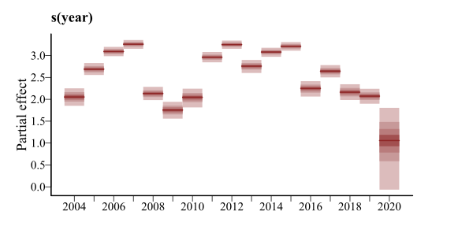
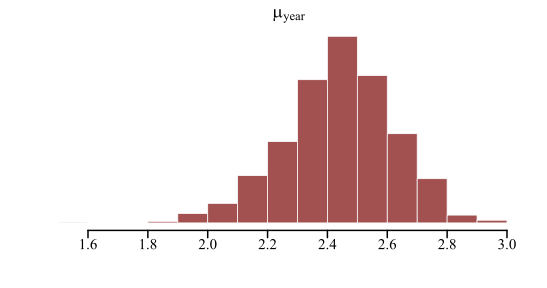
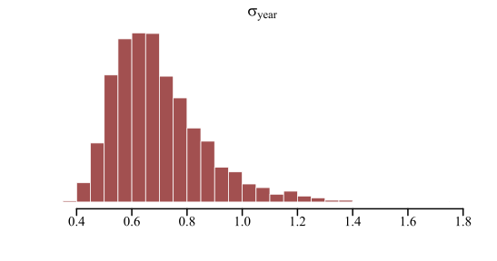
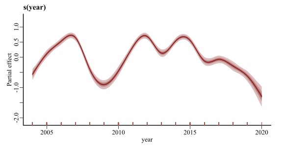
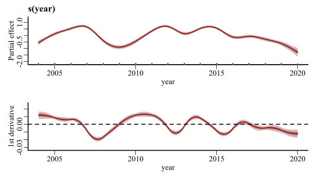
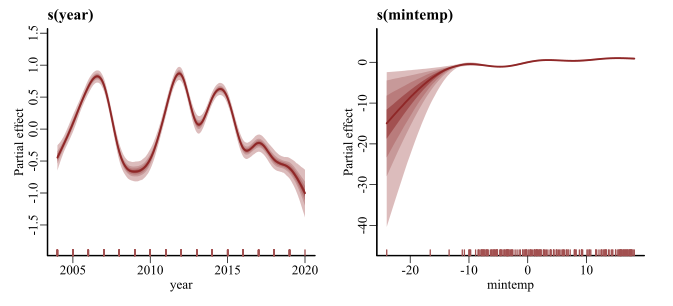
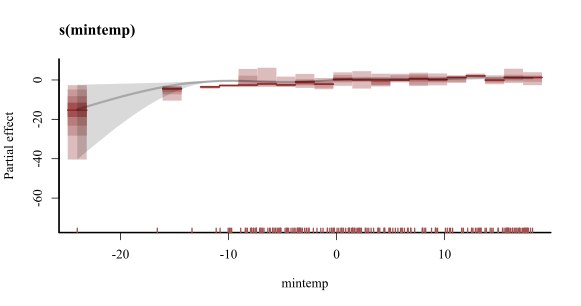

class: animated fadeIn
```{r setup, include=FALSE, cache=FALSE}
options(htmltools.dir.version = FALSE)
knitr::opts_chunk$set(cache = FALSE, dev = 'svg', echo = TRUE,
                      message = FALSE, warning = FALSE,
                      fig.align = 'center',
                      fig.height = 5.1, fig.width = 1.9 * 5.1)
library('mgcv')
library('mvgam')
library('gratia')
library('ggplot2')
library('ggborderline')
library('viridis')
library('gamair')
library('forecast')
library('kableExtra')
```

```{r xaringan-panelset, echo=FALSE}
xaringanExtra::use_panelset()
xaringanExtra::style_panelset_tabs(foreground = '#8F2727',
                                   inactive_opacity = 0.8)
```

```{r xaringan-animate-css, echo=FALSE}
xaringanExtra::use_animate_css()
```

```{r xaringanExtra-clipboard, echo=FALSE}
xaringanExtra::use_clipboard()
```

```{r xaringan-tile, echo=FALSE}
xaringanExtra::use_tile_view()
```

```{r setup II, echo = FALSE}
c_light <- c("#DCBCBC")
c_light_highlight <- c("#C79999")
c_mid <- c("#B97C7C")
c_mid_highlight <- c("#A25050")
c_dark <- c("#8F2727")
c_dark_highlight <- c("#7C0000")

multipar = function(...){
  par(family = "serif", 
    bty = "l", 
    cex.axis = 1.1, 
    cex.lab = 1.1, 
    cex.main = 1.3,
    xaxs = 'r',
    yaxs = 'r',
    pch = 16)
}

mypar = function(...){
  par(family = "serif", 
      las = 1, 
      mar=c(4,4.1,2,2),
      mgp = c(2,0.5,0),
      bty = "l", 
      cex.axis = 1.25, 
      cex.lab = 1.5, 
      cex.main = 1.5,
      xaxs = 'r',
      yaxs = 'r',
      pch = 16)
}

myparsmall = function(...){
  par(family = "serif", 
      las = 1, 
      mgp = c(4, 1, 0),
      mar=c(5,6,2,2),
      bty = "l", 
      cex.axis = 1.85, 
      cex.lab = 2.75, 
      cex.main = 2.75,
      xaxs = 'r',
      yaxs = 'r',
      pch = 16)
}

myhist = function(x, 
                  xlim,
                  xlab = '',
                  main = '',
                  big = TRUE){

  if(big){
      mypar()
  } else {
      myparsmall()
  }

  if(missing(xlim)){
    xlim <- range(x, na.rm = TRUE)
  }
  
  hist(x, 
       xlim = xlim,
       yaxt = 'n',
       xlab = xlab,
       ylab = '',
       col = c_mid_highlight,
       border = 'white',
       lwd = 2,
       breaks = 20,
       main = main)
}

mybar = function(x, 
                  xlab = '',
                  main = '',
                  big = TRUE){

  if(big){
      mypar()
  } else {
      myparsmall()
  }
  
  barplot(table(x),
          yaxt = 'n',
          xlab = xlab,
          border = NA,
       ylab = '',
       col = c_mid_highlight,
       lwd = 2,
       main = main)
  axis(1, labels = NA, tck=0, lwd =2)
}

mylines = function(x, xlab = '', 
                   ylim,
                   ylab = '',
                   big = TRUE){

  if(big){
      mypar()
  } else {
      myparsmall()
  }
  
  if(missing(ylim)){
      plot(x = x, 
       type = 'l',
       col = c_dark_highlight,
       lwd = 3.5,
       bty = 'l',
       xlab = xlab,
       ylab = ylab)
  } else {
      plot(x = x, 
       ylim = ylim,
       type = 'l',
       col = c_dark_highlight,
       lwd = 3.5,
       bty = 'l',
       xlab = xlab,
       ylab = ylab)
  }

  box(bty = 'l', lwd = 2)
}

myscatter = function(x, 
                     y, 
                     xlab = '', 
                     ylab = '', 
                     big = TRUE){
  
    if(big){
      mypar()
  } else {
      myparsmall()
  }

  plot(x = x, 
       y = y, 
       pch = 21,
       bg = c_dark,
       col = 'white',
       cex = 2,
       bty = 'l',
       xlab = xlab,
       ylab = ylab)
  box(bty = 'l', lwd = 2)
}
```

<body><div id="pan"></div></body>

---

class: animated fadeIn
background-image: url('./resources/smooth_only.gif')

---

## Workflow

Press the "o" key on your keyboard to navigate among slides

Access the [tutorial html here](https://nicholasjclark.github.io/physalia-forecasting-course/day1/tutorial_1_physalia)
- Download the data objects and exercise `r fontawesome::fa("r-project", fill = "steelblue")` script from the html file
- Complete exercises and use Slack to ask questions

Relevant open-source materials include:
- [An introduction to Bayesian multilevel modeling with `brms`](https://youtu.be/1qeXD4NQ4To)
- [Introduction to Generalized Additive Models with `r fontawesome::fa("r-project", fill = "steelblue")` and `mgcv`](https://www.youtube.com/watch?v=sgw4cu8hrZM)
- [Statistical Rethinking 2023 - 04 - Categories & Curves](https://www.youtube.com/watch?v=F0N4b7K_iYQ&list=PLDcUM9US4XdPz-KxHM4XHt7uUVGWWVSus&index=4)
- [Statistical Rethinking 2023 - 12 - Multilevel Models](https://www.youtube.com/watch?v=iwVqiiXYeC4&list=PLDcUM9US4XdPz-KxHM4XHt7uUVGWWVSus&index=12)

---

## This lecture's topics

Useful probability distributions for ecologists

Generalized Linear and Additive Models

Temporal random effects 

Temporal residual correlation structures

---
class: middle center
### When applying statistical modelling to a time series, we aim to estimate parameters for a collection of probability distributions
<br>
### These distributions are indexed by *time* (i.e. the observations are random draws from a set of time-varying distributions)
<br>
### Usually we allow the mean of these distributions to vary over time. But what kinds of distributions are available to us?

---

class: inverse middle center big-subsection

# Useful probability distributions

---

## Normal (Gaussian)

$$\boldsymbol{Y_t}\sim \text{Normal}(\mu_t,\sigma)$$
Properties
- Real-valued continuous observations (including any decimal)
- Unbounded (supports $-\infty$ to $\infty$)
- Symmetric spread, controlled by $\sigma$, about the mean $(\mu_t)$

Nearly all common time series models assume this data distribution
- RW, AR, and ARIMA
- ETS and TBATS
- Meta's [Prophet 📦](https://facebook.github.io/prophet/)
---

## Normal (Gaussian)

$$\boldsymbol{Y_t}\sim \text{Normal}(0,2)$$
```{r echo = FALSE}
myhist(rnorm(10000, 0, 2), big = TRUE)
```
---

## Normal (Gaussian)

$$\boldsymbol{Y_t}\sim \text{Normal}(50,20)$$
```{r echo = FALSE}
myhist(rnorm(10000, 50, 20), big = TRUE)
```
---
## Linear regression

It is common to estimate linear predictors of $\mu$ with .emphasize[*regression*]
<br/>
<br/>
$$\boldsymbol{Y_t}\sim \text{Normal}(\alpha + \beta * \boldsymbol{X_t},\sigma)$$
<br/>
Where:
- $\boldsymbol{X_t}$ represents a design matrix of covariates that contribute linearly to variation in $\mu_t$
- $\alpha$ is an intercept coefficient
- $\beta$ is a vector of regression coefficients
- $\sigma$ controls the spread of the errors about $\mu_t$

---
## ETS(A,A,A)

Exponential smoothing with additive components for trend, seasonality and error assumes a Normal (Gaussian) distribution
<br/>
<br/>
$$\boldsymbol{Y}_{t}\sim \text{Normal}({l}_{t-1} + {b}_{t-1} + {s}_{t-m},\sigma)$$
<br/>
Where: 
- ${l}$ gives the value of the level
- ${b}$ gives the value of the trend
- ${s}$ gives the value of the seasonality
- ${m}$ represents the seasonal period
---

## ARMA(*p*, *q*)

ARMA processes also assume Normality
<br/>
<br/>
$$\boldsymbol{Y}_{t}\sim \text{Normal}(c + \sum_{k=1}^{p}\phi_{k}(\boldsymbol{Y}_{t-k}-c)+\sum_{i=1}^{q}\theta_{i}\epsilon_{t-i},\sigma)$$
<br/>
Where: 
- $c$ is a constant (drift parameter)
- ${p}$ and ${q}$ gives orders of AR and MA processes
- ${\phi}$ and ${\theta}$ are AR and MA coefficients
- $\epsilon$ are historical errors (which are $\text{Normal}(0,\sigma)$)

---

class: middle center
### But most real-world ecological observations, including time series, *are not Gaussian*

---

```{r echo = FALSE, fig.cap = "Properties of monthly CO2 measurement time series at the South Pole"}
multipar()
data("co2s")
model_data = data.frame(co2 = co2s$co2,
                        time = 1:NROW(co2s),
                        series = as.factor('South Pole'))
plot_mvgam_series(data = model_data, y = 'co2')
```

---

```{r echo = FALSE, fig.cap = "Properties of lunar monthly Desert Pocket Mouse capture time series from a long-term monitoring study in Portal, Arizona, USA"}
multipar()
portal_data %>%
  dplyr::mutate(time = moon - (min(moon)) + 1) %>%
  dplyr::mutate(count = PP) %>%
  dplyr::mutate(series = as.factor('PP')) %>%
  dplyr::select(series, year, time, count, mintemp, ndvi) -> model_data
plot_mvgam_series(data = model_data, y = 'count')
```

---

```{r echo = FALSE, fig.cap = "Properties of annual American kestrel abundance time series in British Columbia, Canada"}
load(url('https://github.com/atsa-es/MARSS/raw/master/data/kestrel.rda'))
multipar()
model_data = data.frame(time = 1:NROW(kestrel),
                        series = as.factor('kestrel'),
                        count = exp(kestrel[,2]))
plot_mvgam_series(data = model_data, y = 'count')
```

---

class: middle center
###“If our data contains small counts (0,1,2,...), then we need to use forecasting methods that are more appropriate for a sample space of non-negative integers. 
<br>
### *Such models are beyond the scope of this book*”
  
[Hyndman and Athanasopoulos, Forecasting Principles and Practice](https://otexts.com/fpp3/counts.html)

---
class: black-inverse
.center[.grey[.big[Ok. So now what?]]]


---

## Poisson

$$\boldsymbol{Y_t}\sim \text{Poisson}(\lambda_t)$$
Properties
- Discrete, integer-valued observations (including $0$)
- Lower bound (supports $0$ to $\infty$)
- mean = variance = $\lambda_t$

.emphasize[*Virtually no time series models support this distribution*]
- Most analysts use `log` or [`Box-Cox`](https://otexts.com/fpp3/transformations.html) transformation
- But see the [`tscount` 📦](https://cran.r-project.org/web/packages/tscount/vignettes/tsglm.pdf)

---

## Poisson
$$\boldsymbol{Y_t}\sim \text{Poisson}(3)$$
```{r echo=FALSE}
mybar(rpois(10000, 3), big = TRUE)
```

---

## Poisson
$$\boldsymbol{Y_t}\sim \text{Poisson}(50)$$
```{r echo=FALSE}
mybar(rpois(10000, 50), big = TRUE)
```

---

class: middle center

### How can we model non-Normal data using regression?

---

# Generalized linear models

Linear regression can't be trusted to give sensible predictions for non-negative count data (or other types of bounded / discrete / non-Normal data)

We can do better by choosing distributions that obey the constraints on our outcome variables

The idea is to .emphasize[*generalize*] the linear regression by replacing parameters from other probability distributions with linear models

This requires a .emphasize[*link function*] that transforms from the unbounded scale of the linear predictor to a scale that is appropriate for the parameters being modeled

---

# Modelling the mean
Most GLMs are used to model the conditional mean $(\mu_t)$
<br/>
<br/>
$$\mathbb{E}(\boldsymbol{Y_t}|\boldsymbol{X_t})=\mu_t=g^{-1}(\alpha+\boldsymbol{X_t}\beta)$$
<br/>
Where: 
- $\mathbb{E_t}$ is the *expected value* of $\boldsymbol{Y_t}$ conditional on $\boldsymbol{X_t}$
- $g^{-1}$ is the *inverse* of the link function
- $\alpha$ is an intercept coefficient
- $\beta$ is a vector of regression coefficients

---

# Poisson GLM
A Poisson GLM models the conditional mean with a $log$ link
<br/>
<br/>
\begin{align*}
\boldsymbol{Y}_t & \sim \text{Poisson}(\lambda_t) \\
log(\lambda_t) & = \boldsymbol{X}_t \beta \\
& = \alpha + \beta_1 \boldsymbol{x}_{1t} + \beta_2 \boldsymbol{x}_{2t} + \cdots + \beta_j \boldsymbol{x}_{jt}
\end{align*}

Where: 
- $\boldsymbol{X}_{t}$ is the matrix of predictor values at time $t$
- $\alpha$ is an intercept coefficient
- $\beta$ is a vector of regression coefficients
- $\mathbb{E}(\boldsymbol{Y}_{t}|\boldsymbol{X}_{t})=exp(\alpha+\boldsymbol{X}_{t}\beta)$

---

# Poisson GLM
A Poisson GLM models the conditional mean with a $log$ link
<br/>
<br/>
\begin{align*}
\boldsymbol{Y}_t & \sim \text{Poisson}(\lambda_t) \\
log(\lambda_t) & = \boldsymbol{X}_t \beta \\
& = \color{darkred}{\alpha + \beta_1 \boldsymbol{x}_{1t} + \beta_2 \boldsymbol{x}_{2t} + \cdots + \beta_j \boldsymbol{x}_{jt}}
\end{align*}

The .emphasize[*linear predictor component can be hugely flexible*], as we will see in later slides

---

class: middle center

### What if our data are proportional instead?

---

```{r echo = FALSE, fig.cap = "Properties of Merriam's kangaroo rat relative abundance time series from a long-term monitoring study in Portal, Arizona, USA"}
multipar()
portal_data %>%
  dplyr::mutate(time = moon - (min(moon)) + 1) %>%
  dplyr::rowwise() %>%
  dplyr::mutate(total = sum(c(DM, DO, PP, OT), na.rm = TRUE)) %>%
  dplyr::mutate(`relative abundance` = DM / total) %>%
  dplyr::mutate(series = as.factor('DM')) %>%
  dplyr::select(series, year, time, `relative abundance`, mintemp, ndvi) -> model_data
  plot_mvgam_series(data = model_data, y = 'relative abundance')
```

---
## Beta

$$\boldsymbol{Y_t}\sim \text{Beta}(\mu_t,\phi)$$
Properties
- Real-valued continuous observations (including any decimal)
- Both lower and upper bounds (supports $0$ to $1$, noninclusive)
- mean = $\mu_t$
- precision = $\phi$ (higher $\phi$ = a tighter spread about $\mu_t$)

.emphasize[*Virtually no time series models support this distribution*]
- Most analysts would use [`logit`](http://strata.uga.edu/8370/rtips/proportions.html) transformation

---

## Beta
$$\boldsymbol{Y_t}\sim \text{Beta}(0.5,1)$$
```{r echo=FALSE}
beta_shapes = function(mu, phi) {
  return(list(shape1 = mu * phi,
              shape2 = (1 - mu) * phi))
}
myhist(rbeta(10000, shape1 = beta_shapes(0.5, 1)$shape1,
             shape2 = beta_shapes(0.5, 1)$shape2),
       xlim = c(0, 1))
```

---

## Beta
$$\boldsymbol{Y_t}\sim \text{Beta}(0.5,15)$$
```{r echo=FALSE}
beta_shapes = function(mu, phi) {
  return(list(shape1 = mu * phi,
              shape2 = (1 - mu) * phi))
}
myhist(rbeta(10000, shape1 = beta_shapes(0.5, 15)$shape1,
             shape2 = beta_shapes(0.5, 15)$shape2),
       xlim = c(0, 1))
```


---

## Beta
$$\boldsymbol{Y_t}\sim \text{Beta}(0.75,4)$$
```{r echo=FALSE}
beta_shapes = function(mu, phi) {
  return(list(shape1 = mu * phi,
              shape2 = (1 - mu) * phi))
}
myhist(rbeta(10000, shape1 = beta_shapes(0.75, 4)$shape1,
             shape2 = beta_shapes(0.75, 4)$shape2),
       xlim = c(0, 1))
```

---

# Beta GLM
A Beta GLM models the conditional mean with a $logit$ link
<br/>
<br/>
\begin{align*}
\boldsymbol{Y}_t & \sim \text{Beta}(\mu_t,\phi) \\
logit(\mu_t) & = \boldsymbol{X}_t \beta \\
& = \alpha + \beta_1 \boldsymbol{x}_{1t} + \beta_2 \boldsymbol{x}_{2t} + \cdots + \beta_j \boldsymbol{x}_{jt}
\end{align*}

Where: 
- $\boldsymbol{X}_{t}$ is the matrix of predictor values at time $t$
- $\alpha$ is an intercept coefficient
- $\beta$ is a vector of regression coefficients
- $\mathbb{E}(\boldsymbol{Y}_{t}|\boldsymbol{X}_{t})=logit^{-1}(\alpha+\boldsymbol{X}_{t}\beta)$

---

## Some other relevant distributions

[Many other useful GLM probability distributions exist](https://cran.r-project.org/web/packages/brms/vignettes/brms_families.html). Some of these include:
- .emphasize[*Negative Binomial*] &mdash; overdispersed integers in $(0,1,2,...)$
- .emphasize[*Bernoulli*] &mdash; presence-absence data in $\{0,1\}$
- .emphasize[*Student's T*] &mdash; heavy-tailed (skewed) real values in $(-\infty, \infty)$ 
- .emphasize[*Lognormal*] &mdash; heavy-tailed (right skewed) real values in $(0, \infty)$ 
- .emphasize[*Gamma*] &mdash; lighter-tailed (less skewed) real values in $(0, \infty)$ 
- .emphasize[*Multinomial*] &mdash; integers representing $K$ unordered categories in $(0,1,..., K)$
- .emphasize[*Ordinal*] &mdash; integers representing $K$ ordered categories in $(0,1,..., K)$

---

class: middle center

### GLMs allow us to build models that respect the bounds and distributions of our observed data
<br>
### They traditionally assume the appropriately transformed mean response depends *linearly* on the predictors
<br>
### But there are many other properties we'd like to model

---

## Remember these? 
.grey[Temporal autocorrelation


Lagged effects]


.emphasize[*Non-Gaussian data and missing observations*

*Measurement error*

*Time-varying effects*

*Nonlinearities*

*Multi-series clustering*]

---

## Remember these? 
.grey[Temporal autocorrelation


Lagged effects


Non-Gaussian data and missing observations

Measurement error

Time-varying effects]

.emphasize[*Nonlinearities*]

.grey[Multi-series clustering]

---

background-image: url('./resources/smooth_only.gif')
## GAMs use splines ...

```{r basis-functions, fig.height=4.6875, fig.width = 7.5, echo=FALSE,message=FALSE,warning=FALSE,fig.show='hide'}
set.seed(7)
N <- 400
y <- mvgam::sim_mvgam(T = N, prop_missing = 0,
                      prop_train = 1,
                      family = gaussian(),
                      n_series = 1,
                      trend_model = 'GP',
                      trend_rel = 0.95)$data_train$y
x <- 1:N
data <- data.frame(x = x,
                   y = y)
theme_set(theme_classic(base_size = 17, base_family = 'serif'))
basis_funs <- basis(s(x, bs = 'cr', k = 12), 
                    data = data)
ggplot(basis_funs,
       aes(x = x, y = value, colour = bf)) +
  geom_borderline(linewidth=1.5, bordercolour = "white") +
  scale_color_viridis(discrete = TRUE) +
  theme(legend.position = 'none',
        axis.line = element_line(size = 1),
        axis.ticks = element_line(colour = "black", size = 1)) +
  ylab('f(Time)') + xlab('Time') + 
  scale_y_continuous(breaks = c(0, 1))
```

---

background-image: url('./lecture_2_slidedeck_files/figure-html/basis-functions-1.svg')
## ... made of basis functions

```{r basis-functions-weights, fig.height=4.6875, fig.width = 7.5, echo=FALSE,message=FALSE,warning=FALSE,fig.show='hide'}
set.seed(7)
N <- 400
y <- mvgam::sim_mvgam(T = N, prop_missing = 0,
                      prop_train = 1,
                      family = gaussian(),
                      n_series = 1,
                      trend_model = 'GP',
                      trend_rel = 0.95)$data_train$y
x <- 1:N
data <- data.frame(x = x,
                   y = rnorm(n = N, mean = y, sd = 0.75))
theme_set(theme_classic(base_size = 17, base_family = 'serif'))
basis_funs <- basis(gam(y ~ s(x, bs = 'cr', k = 12) - 1, 
                    data = data))
ggplot(basis_funs,
       aes(x = x, y = value, colour = bf)) +
  geom_borderline(linewidth=1.5, bordercolour = "white") +
  scale_color_viridis(discrete = TRUE) +
  theme(legend.position = 'none',
        axis.line = element_line(size = 1),
        axis.ticks = element_line(colour = "black", size = 1)) +
  ylab('f(Time)') + xlab('Time') + 
  scale_y_continuous(breaks = c(0, 1))
```
---

background-image: url('./lecture_2_slidedeck_files/figure-html/basis-functions-weights-1.svg')
## Weighting basis functions ...

---

background-image: url('./resources/basis_weights.gif')
## ... gives a spline $(f(x))$

---

background-image: url('./resources/penalty_spline.gif')
background-size: contain
## Penalize $f"(x)$ to learn weights

---

background-image: url('./resources/smooth_to_data.gif')
## Penalize $f"(x)$ to learn weights

---

class: middle center
### GAMs are just fancy GLMs, where some (or all) of the predictor effects are estimated as (possibly nonlinear) smooth functions
<br>
### But the complexity they can handle is *enormous*

```{r complexity, echo=FALSE, fig.height = 7, fig.width = 10,fig.show='hide'}
df <- data_sim("eg1", n = 200, seed = 1)
df$x4 <- rnorm(NROW(df))
df$x3 <- df$y * mvgam::sim_mvgam(T = 200, n_series = 1,
                                 prop_train = 1,
                                 trend_model = 'GP',
                                 trend_rel = 0.5,
                                 family = gaussian())$data_train$y
m_sim <- gam(y ~ s(x0, bs = 'gp') + te(x1, x2) + s(x3) +
               s(x4, bs = 'cs'),
             data = df, method = "REML")
theme_set(theme_classic(base_size = 18, base_family = 'serif'))
draw(m_sim, ci_col = "#A25050",
     smooth_col = "#7C0000",
     residuals = TRUE,
     resid_col = 'black',
     ci_alpha = 0.5)

```

---

background-image: url('./lecture_2_slidedeck_files/figure-html/complexity-1.svg')

---

class: full-size

## GAMs easy to fit in `r fontawesome::fa("r-project", fill = "steelblue")`

$$\mathbb{E}(\boldsymbol{Y_t}|\boldsymbol{X_t})=g^{-1}(\alpha + \sum_{j=1}^{J}f(x_{jt}))$$

<br/>
Where: 
- $g^{-1}$ is the *inverse* of the link function
- ${\alpha}$ is the intercept
- $f(x)$ are potentially nonlinear functions of the $J$ predictors

---

class: middle center
### But how can GAMs and GLMs be useful for modelling ecological time series?

---
class: inverse middle center big-subsection

# Temporal random effects

---

## Random effects are *hierarchical*
<br>
<br>


.small[[Johnson *et al* 2021](https://www.bayesrulesbook.com/)]

---

class: middle center
### Hierarchical models *learn from all groups at once* to inform group-level estimates
<br>
### This induces *regularization*, where noisy estimates are pulled towards the overall mean
<br>
### The regularization is known as [partial pooling](https://www.jstor.org/stable/25471160)

---
background-image: url('./resources/partial_pool.gif')
## Partial pooling in action
<br>
<br>
<br>
<br>
<br>
<br>
<br>
<br>
<br>
<br>
<br>
<br>
.small[[McElreath 2023](https://www.youtube.com/watch?v=SocRgsf202M)]

---

## Noisy estimates *pulled* to the mean
<br>
.center[]

.small[[Johnson *et al* 2021](https://www.bayesrulesbook.com/)]

---

## How can they be modelled? 
\begin{align*}
\boldsymbol{Y}_t & \sim \text{Poisson}(\lambda_t) \\
log(\lambda_t) & = \beta_{year[year_t]} \\
\beta_{year} & \sim \text{Normal}(\color{darkred}{\mu_{year}, \sigma_{year}}) \\
\color{darkred}{\mu_{year}} & \sim \text{Normal}(0, 1) \\
\color{darkred}{\sigma_{year}} & \sim \text{Exponential}(2) 
\end{align*}

Where we have multiple time points per year, and:
- ${\beta_{year}}$ are yearly intercepts (*one effect per year*)
- ${\color{darkred}{\mu_{year}}}$ estimates *mean effect among all years*
- ${\color{darkred}{\sigma_{year}}}$ estimates *how much effects vary across years*

---

## Modelling with the [`mvgam` 📦](https://github.com/nicholasjclark/mvgam/tree/master)

Bayesian framework to fit Dynamic GLMs and Dynamic GAMs
- Hierarchical intercepts, slopes *and smooths*
- Latent dynamic processes
- State Space models with measurement error

Built off the [`mgcv` 📦](https://cran.r-project.org/web/packages/mgcv/index.html) to construct penalized smoothing splines

Convenient and familiar `r fontawesome::fa("r-project", fill = "steelblue")` formula interface

Uni- or multivariate series from a range of response distributions 

Uses [Stan](https://mc-stan.org/) for efficient Hamiltonian Monte Carlo sampling

---

## Example of the interface

```{r eval = FALSE}
model <- mvgam(
  formula = y ~ 
    s(series, bs = 're') + 
    s(x0, series, bs = 're') +
    x1 +
    s(x2, bs = 'tp', k = 5) +
    te(x3, x4, bs = c('cr', 'tp')),
  data = data,
  family = poisson(),
  trend_model = 'AR1',
  burnin = 500,
  samples = 500,
  chains = 4,
  parallel = TRUE
  )
```

Where `y` = response,`x`'s = covariates, and `series` = a grouping term
---
## Typical formula syntax

```{r eval = FALSE}
model <- mvgam(
  formula = y ~ #<<
    s(series, bs = 're') + #<<
    s(x0, series, bs = 're') + #<<
    x1 + #<<
    s(x2, bs = 'tp', k = 5) + #<<
    te(x3, x4, bs = c('cr', 'tp')), #<<
  data = data,
  family = poisson(),
  trend_model = 'AR1',
  burnin = 500,
  samples = 500,
  chains = 4,
  parallel = TRUE
  )
```

---

## A random intercept effect

```{r eval = FALSE}
model <- mvgam(
  formula = y ~ 
    s(series, bs = 're') + #<<
    s(x0, series, bs = 're') +
    x1 + 
    s(x2, bs = 'tp', k = 5) + 
    te(x3, x4, bs = c('cr', 'tp')), 
  data = data,
  family = poisson(),
  trend_model = 'AR1',
  burnin = 500,
  samples = 500,
  chains = 4,
  parallel = TRUE
  )
```

---

## A random slope effect

```{r eval = FALSE}
model <- mvgam(
  formula = y ~ 
    s(series, bs = 're') + 
    s(x0, series, bs = 're') + #<<
    x1 + 
    s(x2, bs = 'tp', k = 5) + 
    te(x3, x4, bs = c('cr', 'tp')), 
  data = data,
  family = poisson(),
  trend_model = 'AR1',
  burnin = 500,
  samples = 500,
  chains = 4,
  parallel = TRUE
  )
```

---
## A linear parametric effect

```{r eval = FALSE}
model <- mvgam(
  formula = y ~ 
    s(series, bs = 're') + 
    s(x0, series, bs = 're') + 
    x1 + #<<
    s(x2, bs = 'tp', k = 5) + 
    te(x3, x4, bs = c('cr', 'tp')), 
  data = data,
  family = poisson(),
  trend_model = 'AR1',
  burnin = 500,
  samples = 500,
  chains = 4,
  parallel = TRUE
  )
```

---

## A one-dimensional smooth

```{r eval = FALSE}
model <- mvgam(
  formula = y ~ 
    s(series, bs = 're') + 
    s(x0, series, bs = 're') + 
    x1 + 
    s(x2, bs = 'tp', k = 5) + #<<
    te(x3, x4, bs = c('cr', 'tp')), 
  data = data,
  family = poisson(),
  trend_model = 'AR1',
  burnin = 500,
  samples = 500,
  chains = 4,
  parallel = TRUE
  )
```

---

## A two-dimensional smooth

```{r eval = FALSE}
model <- mvgam(
  formula = y ~ 
    s(series, bs = 're') + 
    s(x0, series, bs = 're') + 
    x1 + 
    s(x2, bs = 'tp', k = 5) + 
    te(x3, x4, bs = c('cr', 'tp')), #<<
  data = data,
  family = poisson(),
  trend_model = 'AR1',
  burnin = 500,
  samples = 500,
  chains = 4,
  parallel = TRUE
  )
```

---

## Data and response distribution

```{r eval = FALSE}
model <- mvgam(
  formula = y ~ 
    s(series, bs = 're') + 
    s(x0, series, bs = 're') + 
    x1 + 
    s(x2, bs = 'tp', k = 5) + 
    te(x3, x4, bs = c('cr', 'tp')), 
  data = data, #<<
  family = poisson(), #<<
  trend_model = 'AR1',
  burnin = 500,
  samples = 500,
  chains = 4,
  parallel = TRUE
  )
```

---

## `r fontawesome::fa("burst", fill = "darkred")` latent dynamics

```{r eval = FALSE}
model <- mvgam(
  formula = y ~ 
    s(series, bs = 're') + 
    s(x0, series, bs = 're') + 
    x1 + 
    s(x2, bs = 'tp', k = 5) + 
    te(x3, x4, bs = c('cr', 'tp')), 
  data = data,
  family = poisson(), 
  trend_model = 'AR1', #<<
  burnin = 500,
  samples = 500,
  chains = 4,
  parallel = TRUE
  )
```

---

## Sampler parameters

```{r eval = FALSE}
model <- mvgam(
  formula = y ~ 
    s(series, bs = 're') + 
    s(x0, series, bs = 're') + 
    x1 + 
    s(x2, bs = 'tp', k = 5) + 
    te(x3, x4, bs = c('cr', 'tp')), 
  data = data,
  family = poisson(), 
  trend_model = 'AR1', 
  burnin = 500, #<<
  samples = 500, #<<
  chains = 4, #<<
  parallel = TRUE #<<
  )
```

---

## Example data (long format)

```{r echo=FALSE}
set.seed(100)
data <- sim_mvgam(n_series = 4, T = 24, prop_missing = 0.3)
data$data_train$year <- NULL
data$data_train$season <- NULL
data$data_train$series <- gsub('series', 'species', data$data_train$series)
head(data$data_train, 8) %>%
  kbl() %>%
  kable_minimal(full_width = FALSE)
```

---

## Response (`NA`s allowed)

```{r echo=FALSE}
set.seed(100)
data <- sim_mvgam(n_series = 4, T = 24, prop_missing = 0.3)
data$data_train$year <- NULL
data$data_train$season <- NULL
data$data_train$series <- gsub('series', 'species', data$data_train$series)
head(data$data_train, 8) %>%
  kbl() %>%
  kable_minimal(full_width = FALSE) %>%
  column_spec(1, bold = T, background = '#51247A20')
```

---

## Series indicator (as `factor`)

```{r echo=FALSE}
set.seed(100)
data <- sim_mvgam(n_series = 4, T = 24, prop_missing = 0.3)
data$data_train$year <- NULL
data$data_train$season <- NULL
data$data_train$series <- gsub('series', 'species', data$data_train$series)
head(data$data_train, 8) %>%
  kbl() %>%
  kable_minimal(full_width = FALSE) %>%
  column_spec(2, bold = T, background = '#51247A20')
```

---

## Time indicator

```{r echo=FALSE}
set.seed(100)
data <- sim_mvgam(n_series = 4, T = 24, prop_missing = 0.3)
data$data_train$year <- NULL
data$data_train$season <- NULL
data$data_train$series <- gsub('series', 'species', data$data_train$series)
head(data$data_train, 8) %>%
  kbl() %>%
  kable_minimal(full_width = FALSE) %>%
  column_spec(3, bold = T, background = '#51247A20')
```

---

## Any other predictors

```{r echo=FALSE}
set.seed(100)
data <- sim_mvgam(n_series = 4, T = 24, prop_missing = 0.3)
data$data_train$x0 <- round(rnorm(24), 2)
data$data_train$x1 <- ifelse(
  data$data_train$series %in% c('series_1', 'series_2'), 'A', 'B')
data$data_train$x2 <- round(rnorm(24), 2)
data$data_train$x3 <- round(rnorm(24), 2)
data$data_train$x4 <- round(rnorm(24), 2)
data$data_train$season <- NULL
data$data_train$year <- NULL
data$data_train$series <- gsub('series', 'species', data$data_train$series)
head(data$data_train, 8) %>%
  kbl() %>%
  kable_minimal(full_width = FALSE) %>%
  column_spec(4:8, bold = T, background = '#51247A20')
```

---
class: inverse middle center big-subsection

# Examples

---

background-image: url('./resources/pp_image.jpg')
background-size: cover
background-color: #77654E

```{r echo = FALSE}
load('cache_not_for_upload/lec2_year_random.rds')
```

---

## The data structure
<br>
```{r}
dplyr::glimpse(model_data)
```

---
## The observations
.panelset[
.panel[.panel-name[Code]

```{r obs_properties, echo=FALSE,fig.show='hide', fig.height=4.25, fig.width=1.9*4, warning=FALSE, message=FALSE}

# use mvgam's plot utility to view properties of the observations
multipar()
plot_mvgam_series(data = model_data, y = 'count')
```

```{r eval=FALSE,message=FALSE}

# use mvgam's plot utility to view properties of the observations
plot_mvgam_series(data = model_data, y = 'count')
```
]

.panel[.panel-name[Plot]
.center[]

]
]
---

## Yearly heterogeneity
```{r echo=FALSE}
mypar()
boxplot(count ~ year, data = model_data,
        ylab = 'Count',
        xlab = 'Year',
        col = '#C79999',
        border = 'darkred',
        frame.plot = FALSE,
        outline = FALSE)
```

---
## Yearly random intercepts

```{r eval = FALSE}
year_random <- mvgam(count ~ 
                       s(year, bs = 're') - 1,#<<
                    family = poisson(),
                    data = model_data,
                    trend_model = 'None',
                    burnin = 500,
                    samples = 500,
                    chains = 4)
```

Random effect basis in `mgcv` language

Global intercept suppressed

---

## Estimated yearly intercepts
.panelset[
.panel[.panel-name[Code]

```{r year_random_ests, fig.show='hide', fig.height=4.25, fig.width=1.9*4.25, echo=FALSE}

# plot the random effect posterior estimates
mypar()
plot(year_random, type = 're')
```

```{r eval=FALSE}

# plot the random effect posterior estimates
plot(year_random, type = 're')
```
]

.panel[.panel-name[Plot]
.center[]

]
]

---

## Population parameters
.panelset[
.panel[.panel-name[Code]

```{r eval = FALSE}

# extract population estimates
pop_params <- as.data.frame(year_random, 
                            variable = c('mean(year)',
                                         'sd(year)'))

# plot as histograms
hist(pop_params$`mean(year)`, main = expression(mu[year]))

hist(pop_params$`sd(year)`, main = expression(sigma[year]))
```

```{r year_random_means, echo=FALSE,fig.show='hide', fig.height=4, fig.width=1.9*4}
pop_params <- as.data.frame(year_random, 
                            variable = c('mean(year)',
                                         'sd(year)'))
myhist(pop_params$`mean(year)`, main = expression(mu[year]))
```

```{r year_random_sds, echo=FALSE,fig.show='hide', fig.height=4, fig.width=1.9*4}
pop_params <- as.data.frame(year_random, 
                            variable = c('mean(year)',
                                         'sd(year)'))
myhist(pop_params$`sd(year)`, main = expression(sigma[year]))
```
]

.panel[.panel-name[Means]
.center[]

]

.panel[.panel-name[SDs]
.center[]

]
]

---
## Or using `bayesplot`

.panelset[
.panel[.panel-name[Code]

```{r year_random_mcmcplot, fig.show='hide', fig.height=4.25, fig.width=1.9*4.25, warning=FALSE, message=FALSE}

# use bayesplot utilities to plot parameter estimates
mcmc_plot(year_random, type = 'areas',
          variable = c('mean(year)', 'sd(year)'))
```
]

.panel[.panel-name[Plot]
.center[]

]
]
---

## Conditional predictions
.panelset[
.panel[.panel-name[Code]

```{r year_random_conds, fig.show='hide', fig.height=4.25, fig.width=1.9*4.25, warning=FALSE, message=FALSE}

# use marginaleffects utilities to plot conditional predictions
library(ggplot2)
plot_predictions(year_random, 
                 condition = 'year',
                 n_cores = 2) +
  theme_classic()

```
]

.panel[.panel-name[Plot]
.center[]

]
]

---


## Hindcast predictions
.panelset[
.panel[.panel-name[Code]

```{r year_random_preds, fig.show='hide', fig.height=4.25, fig.width=1.9*4.25, warning=FALSE, message=FALSE,echo=FALSE}

# use mvgam's plot to view hindcast predictions
mypar()
plot(year_random, type = 'forecast')
```

```{r eval=FALSE}

# use mvgam's plot to view hindcast predictions
plot(year_random, type = 'forecast')
```
]

.panel[.panel-name[Plot]
.center[]

]
]
---

## `mvgam` with yearly smooth
```{r echo = FALSE}
load('cache_not_for_upload/lec2_year_smooth.rds')
```

```{r eval = FALSE}
model_data %>%
  dplyr::mutate(year = as.numeric(as.character(year))) -> model_data

year_smooth <- mvgam(count ~ 
                       s(year, bs = 'tp', k = 15), #<<
                    family = poisson(),
                    data = model_data,
                    trend_model = 'None',
                    burnin = 500,
                    samples = 500,
                    chains = 4)
```

A thin plate regression spline of the numeric `year` variable

Retain intercept because smooths are zero-centered
---

## Coefficients uninterpretable
<br>
```{r}
rownames(coef(year_smooth))
```

We .emphasize[*must*] use predictions and plots to understand the model

---

## Estimated yearly smooth
.panelset[
.panel[.panel-name[Code]

```{r year_smooth_ests, fig.show='hide', fig.height=4.25, fig.width=1.9*4.25,echo=FALSE}
multipar()
plot(year_smooth, type = 'smooth')
```

```{r eval=FALSE}

# plot the smooth effect posterior estimates
plot(year_smooth, type = 'smooth')
```
]

.panel[.panel-name[Plot]
.center[]

]
]

---

## Plotting basis functions
.panelset[
.panel[.panel-name[Code]

```{r year_smooth_basis, fig.show='hide', fig.height=4.25, fig.width=1.9*4.25}

# plot the basis functions with gratia
library(ggplot2); library(viridis); library(gratia)
theme_set(theme_classic())
ggplot(basis(year_smooth$mgcv_model), 
       aes(x = year, y = value, color = bf)) +
  geom_borderline(linewidth = 1.25, bordercolour = "white") +
  geom_borderline(data = smooth_estimates(year_smooth$mgcv_model),
                  inherit.aes = FALSE,
                  mapping = aes(x = year, y = est), linewidth = 2) +
  scale_color_viridis(discrete = TRUE) +
  theme(legend.position = 'none', axis.line = element_line(size = 1),
        axis.ticks = element_line(colour = "black", size = 1)) +
  ylab('f(Year)') + xlab('Year')
```
]

.panel[.panel-name[Plot]
.center[]

]
]

---

## Rates of change
.panelset[
.panel[.panel-name[Code]

```{r year_smooth_derivs, fig.show='hide', fig.height=4.25, fig.width=1.8*4.25,echo=FALSE}

multipar()
plot(year_smooth, type = 'smooth', derivatives = TRUE)
```

```{r eval=FALSE}

# plot the smooth effect posterior estimates
plot(year_smooth, type = 'smooth', derivatives = TRUE)
```
]

.panel[.panel-name[Plot]
.center[]

]
]

---
## Conditional predictions
.panelset[
.panel[.panel-name[Code]

```{r year_smooth_conds, fig.show='hide', fig.height=4.25, fig.width=1.9*4.25, warning=FALSE, message=FALSE}

# use marginaleffects utilities to plot conditional predictions
library(ggplot2)
plot_predictions(year_smooth, 
                 condition = 'year',
                 points = 0.5,
                 n_cores = 2) +
  theme_classic()

```
]

.panel[.panel-name[Plot]
.center[]

]
]
---


## Hindcast predictions
.panelset[
.panel[.panel-name[Code]

```{r year_smooth_preds, fig.show='hide', fig.height=4.25, fig.width=1.9*4.25, warning=FALSE, message=FALSE,echo=FALSE}

# use mvgam's plot to view hindcast predictions
mypar()
plot(year_smooth, type = 'forecast')
```

```{r eval=FALSE}

# use mvgam's plot to view hindcast predictions
plot(year_smooth, type = 'forecast')
```
]

.panel[.panel-name[Plot]
.center[]

]
]
---
class: middle center
### Forecasts will differ. Why?
<br>
### We will explore this further in the tutorial and in the next lecture
<br>
### But how do model diagnostics look?

---

## Random year diagnostics
```{r echo=FALSE}
multipar()
plot(year_random, type = 'residuals')
```

---

## Smooth year diagnostics
```{r echo=FALSE}
multipar()
plot(year_smooth, type = 'residuals')
```

---

class: middle center
### Randomized quantile residuals show evidence of unmodelled autocorrelation and seasonality
<br>
### How can we deal with the seasonality?

---

## Adding a smooth of mintemp
```{r echo = FALSE}
load('cache_not_for_upload/lec2_year_temp_smooth.rds')
```

```{r eval = FALSE}
year_temp_smooth <- mvgam(count ~ 
                            s(year, bs = 'tp', k = 15) +
                            s(mintemp, bs = 'tp', k = 8), #<<
                          family = poisson(),
                          data = model_data,
                          trend_model = 'None',
                          burnin = 500,
                          samples = 500,
                          chains = 4)
```

A thin plate regression spline of  `mintemp`
---

## Estimated smooths
.panelset[
.panel[.panel-name[Code]

```{r year_temp_smooth_est, fig.show='hide', fig.height=4.25, fig.width=2.2*4.25, warning=FALSE, message=FALSE,echo=FALSE}

# use mvgam's plot to view both smooth functions
multipar()
plot(year_temp_smooth, type = 'smooth')
```

```{r eval=FALSE}

# use mvgam's plot to view both smooth functions
plot(year_temp_smooth, type = 'smooth')
```
]

.panel[.panel-name[Plot]
.center[]

]
]
---

## Partial residuals
.panelset[
.panel[.panel-name[Code]

```{r year_temp_smooth_resids, fig.show='hide', fig.height=4.25, fig.width=1.9*4.25, warning=FALSE, message=FALSE,echo=FALSE}

# use mvgam's plot_mgvam_smooth to view partial residuals
multipar()
plot_mvgam_smooth(year_temp_smooth, smooth = 2, residuals = TRUE)
```

```{r eval=FALSE}

# use mvgam's plot_mgvam_smooth to view partial residuals
plot_mvgam_smooth(year_temp_smooth, smooth = 2, residuals = TRUE)
```
]

.panel[.panel-name[Plot]
.center[]

]
]

---

## Diagnostics
```{r echo=FALSE}
multipar()
plot(year_temp_smooth, type = 'residuals')
```

---

class: middle center
### Randomized quantile residuals still show evidence of unmodelled autocorrelation
<br>
### How can we deal with this?

---
## Adding a latent AR term
```{r echo = FALSE}
load('cache_not_for_upload/lec2_year_temp_smooth_ar.rds')
```

```{r eval = FALSE}
year_temp_smooth_ar <- mvgam(count ~ 
                            s(year, bs = 'tp', k = 15) +
                            s(mintemp, bs = 'tp', k = 8),
                          family = poisson(),
                          trend_model = 'AR1',#<<
                          data = model_data,
                          burnin = 500,
                          samples = 500,
                          chains = 4)
```

A latent (unobserved) dynamic model for residuals
---

## The latent trend
.panelset[
.panel[.panel-name[Code]

```{r year_temp_smooth_ar_trend, fig.show='hide', fig.height=4.25, fig.width=1.9*4.25, echo=FALSE,warning=FALSE, message=FALSE}

# use mvgam's plot to view the trend
mypar()
plot(year_temp_smooth_ar, type = 'trend')
```

```{r eval=FALSE}

# use mvgam's plot to view the trend
plot(year_temp_smooth_ar, type = 'trend')
```
]

.panel[.panel-name[Plot]
.center[]

]
]

---

## AR parameters
.panelset[
.panel[.panel-name[Code]

```{r eval = FALSE}

# extract AR estimates
ar_params <- as.data.frame(year_temp_smooth_ar, 
                            variable = c('ar1[1]',
                                         'sigma[1]'))

# plot as histograms
hist(ar_params$`ar1[1]`, main = expression(AR1[error]))

hist(ar_params$`sigma[1]`, main = expression(sigma[error]))
```

```{r year_temp_smooth_ars, echo=FALSE,fig.show='hide', fig.height=4, fig.width=1.9*4}
ar_params <- as.data.frame(year_temp_smooth_ar, 
                            variable = c('ar1[1]',
                                         'sigma[1]'))
myhist(ar_params$`ar1[1]`, main = expression(AR1[error]))
```

```{r year_temp_smooth_sigmas, echo=FALSE,fig.show='hide', fig.height=4, fig.width=1.9*4}
ar_params <- as.data.frame(year_temp_smooth_ar, 
                            variable = c('ar1[1]',
                                         'sigma[1]'))
myhist(ar_params$`sigma[1]`, main = expression(sigma[error]))
```
]

.panel[.panel-name[AR1s]
.center[]

]

.panel[.panel-name[SDs]
.center[]

]
]

---

## Diagnostics
```{r echo=FALSE}
multipar()
plot(year_temp_smooth_ar, type = 'residuals')
```

---

## Updated smooths
```{r echo=FALSE}
multipar()
plot(year_temp_smooth_ar, type = 'smooth')
```

---

## Hindcast predictions
```{r echo=FALSE}
mypar()
plot(year_temp_smooth_ar, type = 'forecast')
```


---

## In the next lecture, we will cover

Latent autoregressive processes

Latent Gaussian Processes

Dynamic coefficient models

