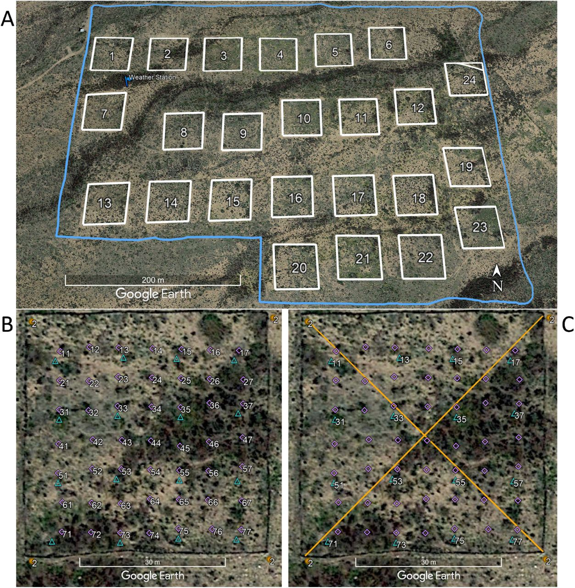
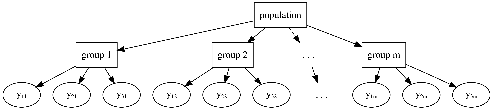

```{css, echo=FALSE}
details > summary {
  padding: 4px;
  background-color: #8F2727;
  color: white;
  border: none;
  box-shadow: 1px 1px 2px #bbbbbb;
  cursor: pointer;
}

details > summary:hover {
  background-color: #DCBCBC;
  color: #8F2727;
}

.scroll-300 {
  max-height: 300px;
  overflow-y: auto;
  background-color: inherit;
}

h1, #TOC>ul>li {
  color: #8F2727;
}

h2, #TOC>ul>ul>li {
  color: #8F2727;
}

h3, #TOC>ul>ul>li {
  color: #8F2727;
}

.list-group-item.active, .list-group-item.active:focus, .list-group-item.active:hover {
    z-index: 2;
    color: #fff;
    background-color: #DCBCBC;
    border-color: #DCBCBC;
}

a {
    color: purple;
    font-weight: bold;
}

a:hover {
    color: #C79999;
}

::selection {
  background: #DCBCBC;
  color: #8F2727;
}

.button_red {
  background-color: #8F2727;
  border: #8F2727;
  color: white;
}

.button_red:hover {
  background-color: #DCBCBC;
  color: #8F2727;
}
```

```{r klippy, echo=FALSE, include=TRUE, message = FALSE, warning = FALSE}
if(!requireNamespace('klippy')){
  remotes::install_github("rlesur/klippy")
}
klippy::klippy(position = c('top', 'right'), color = 'darkred')
```

```{r setup, include=FALSE}
knitr::opts_chunk$set(
  echo = TRUE,   
  dpi = 150,
  fig.asp = 0.8,
  fig.width = 6,
  out.width = "60%",
  fig.align = "center",
  class.source='klippy')
```

## Exercises and associated data
The data and modelling objects created in this notebook can be downloaded directly to save computational time.
```{r echo=FALSE, message = FALSE, warning = FALSE}
library(downloadthis)
download_dir(
  path = 'tutorial_1_physalia_cache/html/',
  output_name = "Tutorial1_exercise_data",
  button_label = "Click here to download all files needed for exercises",
  button_type = "success",
  has_icon = TRUE,
  icon = "fa fa-download",
  class = "button_red",
  self_contained = FALSE
)
```

<br />
Users who wish to complete the exercises can download a small template `R` script. Assuming you have already downloaded the data objects above, this script will load all data objects so that the steps used to create them are not necessary to tackle the exercises.
```{r echo=FALSE}
download_file(
  path = 'Tutorial1_exercises.R',
  output_name = "Tutorial1_exercises.R",
  button_label = "Click here to download the exercise R script",
  button_type = "success",
  has_icon = TRUE,
  icon = "fa fa-laptop-code",
  class = "button_red",
  self_contained = FALSE
)
```

## Load libraries and time series data
This tutorial relates to content covered in [Lecture 1](https://nicholasjclark.github.io/physalia-forecasting-course/day1/lecture_1_slidedeck){target="_blank"} and [Lecture 2](https://nicholasjclark.github.io/physalia-forecasting-course/day1/lecture_2_slidedeck){target="_blank"}, and relies on the following packages for manipulating data, shaping time series, fitting dynamic regression models and plotting:
```{r include = FALSE}
library(dplyr)
#remotes::install_github('nicholasjclark/mvgam',force = TRUE)
library(mvgam) 
library(gratia)
library(ggplot2); theme_set(theme_classic())
library(marginaleffects)
library(zoo)
library(viridis)
```

```{r eval = FALSE, purl = FALSE}
library(dplyr)
library(mvgam) 
library(gratia)
library(ggplot2); theme_set(theme_classic())
library(marginaleffects)
library(zoo)
library(viridis)
```

We will work with time series of rodent captures from the Portal Project, [a long-term monitoring study based near the town of Portal, Arizona](https://portal.weecology.org/){target="_blank"}. Researchers have been operating a standardized set of baited traps within 24 experimental plots at this site since the 1970's. Sampling follows the lunar monthly cycle, with observations occurring on average about 28 days apart. However, missing observations do occur due to difficulties accessing the site (weather events, COVID disruptions etc...). You can read about the sampling protocol [in this preprint by Ernest et al on the Biorxiv](https://www.biorxiv.org/content/10.1101/332783v3.full){target="_blank"}. 



<br>
All data from the Portal Project are made openly available in near real-time so that they can provide maximum benefit to scientific research and outreach ([a set of open-source software tools make data readily accessible](https://www.weecology.org/software-projects/portalr/){target="_blank"}). These data are extremely rich, containing monthly counts of rodent captures for >20 species. But rather than accessing the raw data, we will use some data that I have already processed and put into a simple, usable form
```{r Access time series data}
data("portal_data")
```

As the data come pre-loaded with `mvgam`, you can read a little about it in the help page using `?portal_data`. Before working with data, it is important to inspect how the data are structured. There are various ways to inspect data in `R`; I typically find the the `glimpse` function in `dplyr` to be useful for understanding how variables are structured
```{r}
dplyr::glimpse(portal_data)
```

We will analyse time series of captures for one specific rodent species, the Desert Pocket Mouse *Chaetodipus penicillatus*. This species is interesting in that it goes into a kind of "hibernation" during the colder months, leading to very low captures during the winter period


### Manipulating data for modelling

Manipulating the data into a 'long' format is necessary for modelling in `mvgam`, `mgcv` and `brms` (see the [formatting data for use in `mvgam` vignette for more details](https://nicholasjclark.github.io/mvgam/articles/data_in_mvgam.html){target="_blank"}). By 'long' format, we mean that each `series x time` observation needs to have its own entry in the `data.frame` or `list` object that we wish to use as data for modelling. A simple example can be viewed by simulating data using `sim_mvgam()`.
```{r}
data <- sim_mvgam(n_series = 4, T = 24)
head(data$data_train, 12)
```

Notice how we have four different time series in these simulated data, but we do not spread these out into different columns. Rather, there is only a single column for the outcome variable, labelled `y` in these simulated data. We also must supply a variable labelled `time` to ensure the modelling software knows how to arrange the time series when building models. This setup still allows us to formulate multivariate time series models, as we will see in later tutorials. Below are the steps needed to shape our `portal_data` object into the correct form. First, we create a `time` variable, select the column representing counts of our target species (`PP`), and select some predictors
```{r Wrangle data for modelling}
portal_data %>%
  
  # mvgam requires a 'time' variable be present in the data to index
  # the temporal observations. This is especially important when tracking 
  # multiple time series. In the Portal data, the 'moon' variable indexes the
  # lunar monthly timestep of the trapping sessions
  dplyr::mutate(time = moon - (min(moon)) + 1) %>%
  
  # We can also provide a more informative name for the outcome variable, which 
  # is counts of the 'PP' species (Chaetodipus penicillatus) across all control
  # plots
  dplyr::mutate(count = PP) %>%
  
  # The other requirement for mvgam is a 'series' variable, which needs to be a
  # factor variable to index which time series each row in the data belongs to.
  # Again, this is more useful when you have multiple time series in the data
  dplyr::mutate(series = as.factor('PP')) %>%
  
  # Select the variables of interest to keep in the model_data
  dplyr::select(series, year, time, count, mintemp, ndvi) -> model_data
```

The data now contain six variables:  
  `series`, a factor indexing which time series each observation belongs to  
  `year`, the year of sampling  
  `time`, the indicator of which time step each observation belongs to  
  `count`, the response variable representing the number of captures of the species `PP` in each sampling observation  
  `mintemp`, the monthly average minimum temperature at each time step  
  `ndvi`, the monthly average Normalized Difference Vegetation Index at each time step  

Check the data structure again
```{r}
dplyr::glimpse(model_data)
summary(model_data)
```

We have some `NA`s in our response variable `count`. Visualize the data as a heatmap to get a sense of where these are distributed (`NA`s are shown as red bars)
```{r}
image(is.na(t(model_data %>%
                dplyr::arrange(dplyr::desc(time)))), axes = F,
      col = c('grey80', 'darkred'))
axis(3, at = seq(0,1, len = NCOL(model_data)), labels = colnames(model_data))
```

These observations will be thrown out by most modelling packages in `R`. But as you will see when we work through the tutorials, `mvgam` keeps these in the data so that predictions can be automatically returned for the full dataset.

### Exercises
1. Plot the distributions of the `count`, `mintemp` and `ndvi` variables as histograms to get a better sense of the types of values they can take. See `?hist` for guidance
2. Calculate what proportion of observations in `count` are zeros. See `?which` and `?==` for guidance

<details>
<summary>Check here if you're having trouble calculating the proportion of zeros in `count`</summary>
```{r, eval = FALSE}
# the which function is useful for finding indices in a variable that fit a certain pattern
which(model_data$count == 0)

# to see how many zeros there are, calculate the length of this set of indices
length(which(model_data$count == 0))

# to calculate proportion of observations that are zero, divide this by the total number of observations
length(which(model_data$count == 0)) / length(model_data$count) 
```
</details>

## Time series visualizations
"*The first thing to do in any data analysis task is to plot the data. Graphs enable many features of the data to be visualised, including patterns, unusual observations, changes over time, and relationships between variables*" (Hyndman and Athanasopoulos; [Forecasting: Principles and Practice (3rd ed)](https://otexts.com/fpp3/graphics.html){target="_blank"}) 

A time series is a set of observations taken sequentially in time. When working with time series, the first step (after inspecting the data structure) is usually to plot observations over time, as either a line plot or scatterplot
```{r}
plot(x = model_data$time, y = model_data$count, type = 'l',
     xlab = 'Time', ylab = 'Counts', bty = 'l', col = 'darkred',
     lwd = 2)
```

This plot reveals several important features including: missing data, evidence of repeated seasonal cycles, lower bounding at zero and long-term undulations. Most of these features make it challenging to model series like this using conventional time series / forecasting software. But before we discuss modelling approaches, let's build some more visuals to look for other key features

### Lag and ACF plots
Lag plots are often used to inspect temporal autocorrelation at a variety of lags for a univariate time series. While correlation measures the extent of a linear relationship between two variables, autocorrelations measure linear relationships between lagged values of a time series. Ordinarily we'd want to plot our outcome of interest (`count`), but the default `lag.plot` can't handle missing values (more on that below). But we can inspect correlations among  NDVI values (using the `ndvi` variable) and lagged versions of `ndvi` to see evidence of strong positive autocorrelation at several lags
```{r Lag plots for inspecting autocorrelation}
lag.plot(model_data$ndvi, lags = 4, pch = 16)
```

This function takes differences of the variable `ndvi` and plotting the lagged value (i.e. the value of the series at time $t-lag$) vs the observed value at time $t$. We can replicate this process for a single lag so it is more obvious what is happening under the hood
```{r ndvi_lag1, include = FALSE}
ndvi_lag1 <- xfun::cache_rds(diff(model_data$ndvi, lag = 1))
```

```{r}
ndvi_lag1 <- diff(model_data$ndvi, lag = 1)
plot(ndvi_lag1, model_data$ndvi[2:NROW(model_data)],
     xlab = expression("NDVI"["t-1"]), 
     ylab = expression("NDVI"["t"]), pch = 16, bty = 'l')
```

A Pearson's correlation test confirms that there is a strong positive relationship between current `ndvi` and what `ndvi` was one month earlier
```{r Manual lag-1 correlation}
cor.test(ndvi_lag1, model_data$ndvi[2:NROW(model_data)])
```

But unfortunately the lag plot will fail when the variable of interest has missing values, which our outcome of interest (`count`) has plenty of. Rather than using a lag plot, we can instead plot the autocorrelation function at a variety of lags. These plots [are often used for deciding which moving average order to choose when building autoregressive models](https://otexts.com/fpp3/non-seasonal-arima.html){target="_blank"}
```{r ACF plot}
acf(model_data$count, 
    na.action = na.pass, 
    bty = 'l',
    lwd = 2,
    ci.col = 'darkred',
    main = 'Counts of PP trappings')
```

Several features are evident from this plot: First, we observe positive autocorrelation at small lags. When time series show a trend, autocorrelations for small lags *will often* to be large and positive because observations nearby in time have similar values. So the ACF suggests there is evidence of a trend as autocorrelations tend to slowly decrease as the lags increase. Second, we see evidence of seasonality in captures. When data are seasonal, the autocorrelations *will often* be larger for the seasonal lags (at multiples of the seasonal period) than for other lags. We know this species shows evidence of torpor in the winter months, so it is not surprising to see a strong annual pattern in these autocorrelations.

### pACF plots

The partial autocorrelation function shows something similar, but has controlled for the short-term lagged correlations. These plots [are often used for selecting orders of autoregressive models](https://otexts.com/fpp3/non-seasonal-arima.html){target="_blank"}. For example, if we choose an AR2 model then we hope our AR2 parameter will capture remaining autocorrelations at lag 2 when controlling for any autocorrelations at lag 1. 
```{r pACF plot}
pacf(model_data$count, 
     na.action = na.pass, 
     bty = 'l',
     lwd = 2,
     ci.col = 'darkred',
     main = 'Counts of PP trappings')
```

Both of these plots suggest there is temporal autocorrelation present, as well as strong seasonality. We can view the ACF and some other useful features of the data with one of `mvgam`'s primary functions, `plot_mvgam_series` (see `?plot_mvgam_series` for details):
```{r Plot time series data using mvgam}
plot_mvgam_series(data = model_data, y = 'count')
```

### STL decompositions

Another standard vizualisation is Seasonal Trend Decomposition. It is often helpful to split a time series into several components, each representing an underlying pattern, to inspect features of the data that may not be immediately apparent. STL decomposes a time series into seasonal, trend and irregular components  using `loess` smoothing (see `?stl` for details). But just to get to a point where we can use this with most ecological series, we have to deal with missing observations. The usual practice is to impute these in some way. We can use the `na.approx` function from the `zoo` package for this, which will use linear interpolation to impute missing values. This requires that we first convert the `count` observations to a time series object of class `ts`. We set the frequency to `12` as this is close enough to what we have with our lunar monthly observation intervals. We will not be using the imputed data for any modelling, so please don't worry too much if you aren't up to speed on how linear interpolation works. This is purely for visualization purposes
```{r count_ts, include = FALSE}
# First convert the counts to a time series object of class ts
count_ts <- xfun::cache_rds(ts(model_data$count, frequency = 12))
```

```{r interp_series, include = FALSE}
# Impute NAs using linear interpolation
interp_series <- xfun::cache_rds(zoo::na.approx(count_ts))
```

```{r eval=FALSE}
# First convert the counts to a time series object of class ts
count_ts <- ts(model_data$count, frequency = 12)
# Impute NAs using linear interpolation
interp_series <- zoo::na.approx(count_ts)
```

Now we can perform the decomposition. This requires us to specify the seasonal window, which controls the span in lags over which the seasonal loess will operate. Smaller values allow for more rapid changes. A key advantage of this method is that the seasonal component is allowed to change over time. But a drawback is that this parameter must be chosen by the analyst, and changing its value can give different results. We will use a 5-year seasonal window in this first example
```{r Compute and plot STL decomposition, fig.height = 7.5, fig.width = 7.5}
plot(stl(interp_series, s.window = 5))
```

The strong seasonality is obvious in this plot, as is the evidence of an undulating trend. There is also a lot of variation in the `remainder` component, which demonstrates that the seasonality and trend alone cannot capture all of the variation in the observations over time. The sizes of the bars on the right-hand side of these plots show scale to help us understand the relative magnitudes of each component. But what happens if we change the seasonal window and force it to be stable through time?
```{r STL decomposition with fixed seasonality, fig.height = 7.5, fig.width = 7.5}
plot(stl(interp_series, s.window = 'periodic'))
```

Here the `remainder` component is even more important, and the trend has become less smooth. Try varying the `s.window` argument to see how the conclusions about component contributions will change. For more information on decomposition, see this chapter in [Applied Time Series Analysis for Fisheries and Environmental Sciences, by Holmes, Scheuerell and Ward](https://atsa-es.github.io/atsa-labs/sec-ts-classical-decomposition.html){target="_blank"}

### Exercises
1. Calculate cross-correlations between our outcome variable `count` and `ndvi` at lags of 1 - 15 months. This procedure is often used to help identify lags of the x-variable that might be useful predictors of the outcome. Note, you will need to use `na.action = na.pass` so that the missing values in `count` don't cause problems. See `?ccf` for details about calculating cross-correlations using `type = 'correlation'`. Which lags of `ndvi` would you consider to be the most likely candidates for predicting our outcome `count`?
2. Plot an `STL` decomposition for the `ndvi` variable
3. How might you decompose a time series using a GAM? Take a few notes to explain what steps you would take (hint, look for inspiration from this nice blog post by Gavin Simpson on [additive time series models with GAMs](https://fromthebottomoftheheap.net/2014/05/09/modelling-seasonal-data-with-gam/){target="_blank"})

<details>
<summary>Check here for template code if you're having trouble with `ccf`</summary>
```{r, eval = FALSE}
# fill in the "?" with the correct variable / value
ccf(x = ?,
    y = ?,
    na.action = ?, 
    lag.max = ?,
    # compute correlations at each lag
    type = 'correlation',
    # not necessary but makes for a prettier plot
    bty = 'l',
    lwd = 2,
    ci.col = 'darkred',
    main = expression(paste(italic(Cor),"(",ndvi[lag],",",count, ")")))
```
</details>

## GLMs with temporal random effects

Now onto some modelling! Our first task will be to fit a Generalized Linear Model (GLM) that can capture the features of our `count` observations (integer data, lower bound at zero, missing values) while also attempting to model temporal variation. We will use a GLM with Poisson observations, a log link function and random (hierarchical) intercepts for `year`. This will allow us to capture our prior belief that, although each year is unique, having been sampled from the same population of effects, all years are connected and thus might contain valuable information about one another. This will capitalize on the partial pooling properties of hierarchical models:
  



<br>
Hierarchical (random) effects offer many advantages when modelling data with grouping structures (i.e. multiple species, locations, years etc...). But before we fit the model, we will need to convert `year` to a factor so that we can use a random effect basis in `mvgam`. See `?smooth.terms` and
`?smooth.construct.re.smooth.spec` for details about the `re` basis construction that is used by both `mvgam` and `mgcv`
```{r model_data, include = FALSE}
model_data <- xfun::cache_rds(model_data %>%
  
  # Convert 'year' to a factor variable
  dplyr::mutate(year = factor(year)))
```

```{r eval=FALSE}
model_data %>%
  
  # Convert 'year' to a factor variable
  dplyr::mutate(year = factor(year)) -> model_data
levels(model_data$year)
```

We are now ready for our first `mvgam` model. The syntax will be familiar to users who have built models with `mgcv`. But for a refresher, see `?mvgam_formulae` and the examples in `?gam.models`. Random effects can be specified using the `s()` wrapper with the `re` basis. Note that we can also suppress the primary intercept using the usual `R` formula syntax `- 1`. `mvgam` has a number of possible observation families that can be used, see `?mvgam_families` for more information. We will use `Stan` as the fitting engine, which deploys Hamiltonian Monte Carlo (HMC) for full Bayesian inference. By default, 4 HMC chains will be run using a warmup of 500 iterations and collecting 250 posterior samples from each chain. Ordinarily we would take more posterior samples per chain but 225 give us an object that will be easier to download for completing the exercises. Interested users should consult the [`Stan` user's guide](https://mc-stan.org/docs/stan-users-guide/index.html){target="_blank"} for more information about the software and the enormous variety of models that can be tackled with HMC.
```{r model1, include=FALSE}
model1 <- xfun::cache_rds(mvgam(count ~ s(year, bs = 're') - 1,
                family = poisson(),
                data = model_data, 
                samples = 225))
```

```{r eval=FALSE}
model1 <- mvgam(count ~ s(year, bs = 're') - 1,
                family = poisson(),
                data = model_data,
                samples = 250)
```

  
<details>
<summary>Check here to see a mathematical description of the model</summary>
The model can be described mathematically for each timepoint $t$ as follows:
\begin{align*}
\boldsymbol{count}_t & \sim \text{Poisson}(\lambda_t) \\
log(\lambda_t) & = \beta_{year[year_t]} \\
\beta_{year} & \sim \text{Normal}(\mu_{year}, \sigma_{year}) \\
\mu_{year} & \sim \text{Normal}(0, 1) \\ 
\sigma_{year} & \sim \text{Student}(3, 0, 2.5) \end{align*}  
Here, the $\beta_{year}$ effects are drawn from a *population* distribution that is parameterized by a common mean $(\mu_{year})$ and variance $(\sigma_{year})$.
</details>
<br>

With any model fitted in `mvgam`, the `Stan` code can be viewed using `code()`. This is helpful if you aren't sure what priors are used by default:
```{r eval = FALSE}
code(model1)
```
<details>
  <summary>Check here to see the model's `Stan` code </summary>
```{r echo = FALSE}
code(model1)
```
</details>
<br>

Once the model has finished, the first step is to inspect the `summary()` to ensure no major diagnostic warnings have been produced and to summarise posterior effects
```{r Summarise the fitted model, class.output="scroll-300"}
summary(model1)
```

### Plotting effects and residuals

We can get some sense of the variation in yearly intercepts from the summary, but it is easier to understand them by plotting. Plot posterior distributions of the temporal random effects using `plot.mvgam()` with `type = 're'`. See `?plot.mvgam` for more details
```{r Plot random effect estimates}
plot(model1, type = 're')
```

A better way, however, to quickly plot all key effects in an `mvgam` model is to use `conditional_effects()`, which can give quick overviews of estimated effects on either the link scale or the response scale (see `?conditional_effects.mvgam` for details)
```{r}
conditional_effects(model1)
```

How do these yearly intercepts translate into time-varying predictions? To understand this, we can plot posterior hindcasts from this model for the training period using `plot.mvgam` with `type = 'forecast'`
```{r Plot posterior hindcasts}
plot(model1, type = 'forecast')
```

If you wish to extract these hindcasts for other downstream analyses, the `hindcast()` function can be used. This will return an object of class `mvgam_forecast`. In the `hindcasts` slot, a matrix of predictions will be returned for each series in the data (only one series in our example): 
```{r Extract posterior hindcast}
hc <- hindcast(model1)
str(hc)
```
  
In any regression, a key question is whether the residuals show any patterns that can be indicate un-modelled variation. For GLMs, we can use a modified residual called the [Dunn-Smyth, or randomized quantile, residual](https://www.jstor.org/stable/1390802){target="_blank"}. Inspect Dunn-Smyth residuals from the model using `plot()` with `type = 'residuals'`
```{r Plot posterior residuals}
plot(model1, type = 'residuals')
```

### Exercises
1. Inspect the residual plot and make some notes about any features that stand out to you. Do these diagnostics look reasonable to you? How might you rectify these issues by modifying the model?    
2. The model contains posterior draws of Dunn-Smyth residuals that can be used for further investigations. For each series in the data (only one series in this case), residuals are in a matrix of dimension `n_draws x n_timepoints`. Calculate posterior median residuals per time point and plot these as a line plot (hint, use `?apply` and either `?median` or `?quantile` for guidance). Add a dashed horizontal line at `0` (hint, use `?abline` for guidance). Do these residuals look worrisome to you?

<details>
<summary>Check here for template code if you're having trouble plotting median residuals over time</summary>
```{r, eval = FALSE}
# fill in the "?" with the correct variable / value
# extract residuals for our rodent species of interest
model1_resids <- model1$resids$PP

# check the dimensions of the residuals matrix
dim(model1_resids)

# calculate posterior median residuals per timepoint
median_resids <- apply(model1_resids,
                       MARGIN = ?, 
                       FUN = ?)

# plot median residuals over time
plot(median_resids,
     type = 'l',
     # not necessary but makes for a prettier plot
     lwd = 2,
     col = 'darkred',
     bty = 'l',
     ylab = 'Median residual',
     xlab = 'Time')

# add a horizontal dashed line at zero
abline(? = 0, lty = 'dashed')
```
</details>

## Automatic forecasting for new data
These random effects do not have a sense of "time". Each yearly intercept is not restricted to be similar to the previous yearly intercept. This drawback is evident when we predict for a new year. To do this, we repeat the exercise above but this time split the data into training and testing sets before re-running the model. We can then supply the test set as `newdata`. For splitting, we will make use of the `filter` function from `dplyr`
```{r data_train, include = FALSE}
data_train <- xfun::cache_rds(model_data %>% 
  dplyr::filter(time <= 160))
```

```{r data_test, include = FALSE}
data_test <- xfun::cache_rds(model_data %>% 
  dplyr::filter(time > 160))
```

```{r eval = FALSE}
model_data %>% 
  dplyr::filter(time <= 160) -> data_train 
model_data %>% 
  dplyr::filter(time > 160) -> data_test
```

```{r model1b, include=FALSE}
# files not needed for exercises are cached in a separate dir
model1b <- xfun::cache_rds(mvgam(count ~ s(year, bs = 're') - 1,
                family = poisson(),
                data = data_train,
                newdata = data_test,
                samples = 500),
                dir = 'cache_not_for_upload/')
```

```{r eval=FALSE}
model1b <- mvgam(count ~ s(year, bs = 're') - 1,
                family = poisson(),
                data = data_train,
                newdata = data_test)
```

Repeating the plots above gives insight into how the model's hierarchical formulation provides all structure needed to sample values for un-modelled years
```{r}
plot(model1b, type = 'forecast')
```

Here you can see that the predictions do not capture the temporal variation in the test set.
  
As with the `hindcast()` function, we can use `forecast()` to automatically extract forecast predictions. This also returns an object of class `mvgam_forecast`, but now it will contain hindcasts and forecasts for each series in the data:
```{r Extract posterior forecasts}
fc <- forecast(model1b)
str(fc)
```

## Adding predictors as "fixed" effects
We nearly always wish to include predictor variables that may explain some variation in our observations. Here, we will update the model from above by including a parametric (fixed) effect of `ndvi`. This code also shows how you can start modifying priors, in this case by using a standard normal prior for the `ndvi` effect:
```{r model2, include=FALSE}
model2 <- xfun::cache_rds(mvgam(count ~ s(year, bs = 're') + 
                  ndvi - 1,
                family = poisson(),
                priors = prior(normal(0, 1), class = b),
                data = data_train,
                newdata = data_test,
                samples = 500),
                dir = 'cache_not_for_upload/')
```

```{r eval=FALSE}
model2 <- mvgam(count ~ s(year, bs = 're') + 
                  ndvi - 1,
                family = poisson(),
                # Standard normal prior on the NDVI coefficient
                priors = prior(normal(0, 1), class = b),
                data = data_train,
                newdata = data_test)
```

<details>
<summary>Check here to see a mathematical description of the model</summary>
The model can be described mathematically for each timepoint $t$ as follows:
\begin{align*}
\boldsymbol{count}_t & \sim \text{Poisson}(\lambda_t) \\
log(\lambda_t) & = \beta_{year[year_t]} + \beta_{ndvi} * \boldsymbol{ndvi}_t \\
\beta_{year} & \sim \text{Normal}(\mu_{year}, \sigma_{year}) \\
\mu_{year} & \sim \text{Normal}(0, 1) \\ 
\sigma_{year} & \sim \text{Student}(3, 0, 2.5) \\  
\beta_{ndvi} & \sim \text{Normal}(0, 1) \end{align*}
Where the $\beta_{year}$ effects are the same as before but we now have another predictor $(\beta_{ndvi})$ that applies to the `ndvi` value at each timepoint $t$. 
</details>
<br>

Inspect the summary
```{r, class.output="scroll-300"}
summary(model2)
```

Look again at the estimated effects, but this time on the link scale
```{r Plot NDVI effect}
conditional_effects(model2, type = 'link')
```

This plot indicates a positive effect of `ndvi` on `log(counts)`. But given that our model used a nonlinear link function, it can still be difficult to fully understand what relationship our model is estimating between a predictor and the response. We can use `conditional_effects(model2, type = 'response')` to to again see these on the response scale, or we can use `plot_predictions()` for more customisable plots:
```{r}
plot_predictions(model2, 
                 condition = "ndvi",
                 # include the observed count values
                 # as points, and show rugs for the observed
                 # ndvi and count values on the axes
                 points = 0.5, rug = TRUE) +
  labs(y = 'Predicted count', x = 'NDVI')
```

Now it is easier to get a sense of the positive effect of `ndvi`. But has this predictor made an impact on predictions?
```{r}
plot(model2, type = 'forecast', newdata = data_test)
```

These predictions certainly look different. Are the residual diagnostics improved?
```{r}
plot(model2, type = 'residuals')
```

### Exercises
1. Make a scatterplot comparing `ndvi` and our outcome `count`
2. Add `mintemp` as a second predictor. Be sure to first check whether there is a strong pairwise correlation between `mintemp` and `ndvi` (hint, use `?cor.test` for guidance)  
3. Does the model estimate any strong effect of `mintemp` on `log(counts)`? Or does inclusion of `mintemp` lead to different inference on the effect of `ndvi` compared to when `mintemp` was not in the model?

## Smooths of time

We will now incorporate a spline of `time` in place of the temporal yearly random effects. Nonlinear splines are commonly viewed as variations of random effects in which coefficients that control the shape of the spline are drawn from a joint, penalized distribution. This strategy is often used in time series analysis to capture smooth temporal variation. The lectures (particularly [lecture 2](https://nicholasjclark.github.io/physalia-forecasting-course/day1/lecture_2_slidedeck){target="_blank"}) have gone into detail about smoothing splines and basis functions, but it is worth quickly re-iterating some of this detail here. When we construct smoothing splines, the workhorse package `mgcv` will calculate a set of basis functions that will collectively control the shape and complexity of the resulting spline. It is often helpful to visualize these basis functions to get a better sense of how splines work. We'll create a set of 6 basis functions to represent possible variation in the effect of `time` on our outcome. This can easily be done using functions in the `gratia` package:
```{r Construct basis functions for splines using gratia}
basis_funs <- basis(s(time, bs = 'tp', k = 6), 
                            data = model_data)
```

Once the functions are created, the next step is to plot them
```{r Plot basis functions using gratia}
draw(basis_funs) +
  labs(y = 'Basis function value', x = 'Time')
```

Upping the potential complexity of the smooth function, by increasing `k` (to 10 in this example), leads to a larger diversity of basis functions:
```{r}
draw(basis(s(time, bs = 'tp', k = 10), 
                            data = model_data)) +
  labs(y = 'Basis function value', x = 'Time')
```

<details>
<summary>Check here for code to produce and plot basis functions using base `R` routines</summary>
```{r, eval = FALSE}

# Set up the smooth object that is needed to predict values of
# basis functions
temp_gam <- gam(count ~ s(time, bs = 'tp', k = 6),
                data = model_data,
                family = poisson(), fit = FALSE)

# We can understand how this penalty matrix is used to 
# translate values of `time` into basis functions by 
# generating a sequence of `time` values for sampling 
# prior function realisations
cov_seq <- seq(min(model_data$time),
               max(model_data$time),
               length.out = 500)
summary(cov_seq)

# Generate the linear predictor matrix for this 
# sequence of `time` values
Xp <- mgcv::PredictMat(temp_gam$smooth[[1]],
                       data.frame(time = cov_seq))
str(Xp)

# This linear predictor contains 5 columns, one for each 
# function; the sequences of values in the columns represent 
# the actual basis functions over the range of simulated 
# `time` values
par(mar = c(4,4,2,1.5))
plot(1, type = 'n',
     ylim = range(Xp),
     xlim = range(cov_seq),
     bty = 'l',
     ylab = 'Basis function value',
     xlab = 'Time')
cols <- viridis::viridis(n = NCOL(Xp), alpha = 0.8)
for(i in 1:NCOL(Xp)){
  lines(x = cov_seq, y = Xp[,i], lwd = 3, col = 'white')
  lines(x = cov_seq, y = Xp[,i], lwd = 2.5, col = cols[i])
}
box(bty = 'l', lwd = 2)

```
</details>

### Smooths in `mvgam`

In addition to constructing basis functions, `mgcv` also creates a penalty matrix $S$ that works to constrain the spline's wiggliness. When fitting a GAM, we must estimate smoothing parameters ($\lambda$) to penalize these matrices, resulting in constrained basis coefficients and smoother functions that are less likely to overfit the data. This is the key to fitting GAMs in a Bayesian framework, as we can jointly estimate the $\lambda$'s using informative priors to prevent overfitting and expand the complexity of models we can tackle. To see this in practice, we can now fit a model that replaces the yearly random effects with a smooth function of `time`. We will need a reasonably complex function (large `k`) to try and accommodate the temporal variation in our observations. Following some [useful advice by Gavin Simpson](https://fromthebottomoftheheap.net/2020/06/03/extrapolating-with-gams/){target="_blank"}, we will use a b-spline basis for the temporal smooth. Because we no longer have intercepts for each year, we also retain the primary intercept term in this model (there is no `-1` in the formula now):
```{r model3, include=FALSE}
model3 <- xfun::cache_rds(mvgam(count ~ s(time, bs = 'bs', k = 15) + 
                  ndvi + 
                  mintemp,
                family = poisson(),
                priors = prior(normal(0, 1), class = b),
                data = data_train,
                newdata = data_test,
                samples = 500),
                dir = 'cache_not_for_upload/')
```

```{r eval=FALSE}
model3 <- mvgam(count ~ s(time, bs = 'bs', k = 15) + 
                  ndvi + 
                  mintemp,
                family = poisson(),
                # Standard normal priors on all fixed effect coefficients
                priors = prior(normal(0, 1), class = b),
                data = data_train,
                newdata = data_test)
```

<details>
<summary>Check here to see a mathematical description of the model</summary>
The model can be described mathematically for each timepoint $t$ as follows:
\begin{align*}
\boldsymbol{count}_t & \sim \text{Poisson}(\lambda_t) \\
log(\lambda_t) & = \alpha + f(\boldsymbol{time})_t + \beta_{ndvi} * \boldsymbol{ndvi}_t + \beta_{mintemp} * \boldsymbol{mintemp}_t \\
\alpha & \sim \text{Student}(3, 2.6, 2.5) \\
f(\boldsymbol{time}) & = \sum_{k=1}^{K}b * \beta_{smooth} \\
\beta_{smooth} & \sim \text{MVNormal}(0, (\Omega * \lambda)^{-1}) \\
\beta_{ndvi} & \sim \text{Normal}(0, 1) \\
\beta_{mintemp} & \sim \text{Normal}(0, 1) \end{align*}
Where the smooth function $f_{time}$ is built by summing across a set of weighted basis functions. The basis functions $(b)$ are constructed using a thin plate regression basis in `mgcv`. The weights $(\beta_{smooth})$ are drawn from a penalized multivariate normal distribution where the precision matrix $(\Omega$) is multiplied by a smoothing penalty $(\lambda)$. If $\lambda$ becomes large, this acts to *squeeze* the covariances among the weights $(\beta_{smooth})$, leading to a less wiggly spline. Note that sometimes there are multiple smoothing penalties that contribute to the covariance matrix, but I am only showing one here for simplicity.
</details>
<br>

View the summary
```{r, class.output="scroll-300"}
summary(model3)
```

### EDFs and *p*-values
The summary above now contains posterior estimates for the smoothing parameters as well as basis coefficients for effect of `time`. One quick way to get a sense of how "nonlinear" a function might be is to compare the *reference degrees of freedom* (`Ref.df`) to the estimated *effective degrees of freedom* `edf` in the summary output. Larger values of `edf` indicate more wiggly terms, while the number of basis functions supplied in the `k` argument controls the `Ref.df`, i.e. the maximum possible `edf`. When the `edf` is well below the `Ref.df`, this suggests the function is being shrunk down towards a smoother shape. But if `edf` is large (approaching `Ref.df`), that suggests the model needs all of those basis functions to capture nonlinearities in the data. These values, alongside the estimate smoothing parameters, are also useful for generating an approximate significance test to ask if the function is statistically 'different' from a linear or flat function. Low *p*-values for this test also suggest the function is capturing a lot of variation in the data. You can look at the **Details** section in `?summary.gam` for more information about these tests. Clearly we can see that our function of `time` is highly nonlinear here, as it has a relatively high `edf` and a low *p*-value.
  
### Plotting smooths
Plot the effects as before, using `conditional_effects()`
```{r}
conditional_effects(model3)
```

We can also view some realizations of the underlying `time` function (here, each line is a different potential curve drawn from the posterior of all possible curves):
```{r}
plot(model3, type = 'smooths', realisations = TRUE,
     n_realisations = 30)
```

### Derivatives of smooths
A useful question when modelling using GAMs is to identify where the function is changing most rapidly. To address this, we can plot estimated 1st derivative (i.e. the slope) of the spline over a sequence of `time` values:
```{r Plot smooth term derivatives, warning = FALSE, fig.asp = 1}
plot(model3, type = 'smooths', derivatives = TRUE)
```

Here, values above `>0` indicate the function was increasing at that time point, while values `<0` indicate the function was declining. The most rapid declines appear to have been happening around timepoints 50 and again toward the end of the training period, for example. And as usual, we can use `marginaleffects` routines to get a similar plot:
```{r}
plot_slopes(model3, variables = 'time',
            condition = 'time',
            type = 'link') +
  geom_hline(yintercept = 0, linetype = 'dashed')
```

### Comparing models with `loo`
Working with `brms` or `mvgam` objects can be daunting because we don't have `anova()` or `AIC()` methods that ecologists are used to for model comparison. But we have approximate leave-one-out cross-validation, which works in a similar way. Using `loo_compare()` on multiple models will ask which model would be expected to do a better job of predicting left-out observations *within the training period*. A larger value is better
```{r, warning = FALSE}
loo_compare(model2, model3)
```

Clearly the nonlinear smooth of `time` (in `model3`) gives a better in-sample fit than the random effects of `year` (`model2`).

### Exercises
1. Change the `ndvi` effect to a smooth function of `ndvi` using the `s()` argument (hint, see `?s` for guidance on how to define smooth terms in GAM formulae using `mgcv` syntax). Inspect the resulting function estimates for both `ndvi` and `time`, and consider using some of the strategies outlined in this blog post on [interpreting nonlinear effects in GAMs with mgcv and marginaleffects](https://ecogambler.netlify.app/blog/interpreting-gams/){target="_blank"} to understand the smooths in more depth
2. Try increasing the complexity of the temporal smooth by changing `k` to a larger number, something like 50. Do you get any sense that there are problems with fitting this model? Do any of your conclusions change?
3. Inspect model residuals to look for any remaining un-modelled temporal patterns. What other steps might we take to address these?
4. Look over a nice blog post by Gavin Simpson on [strategies for fitting nonlinear interactive effects with GAMs to model changing seasonal patterns in time series](https://fromthebottomoftheheap.net/2015/11/21/climate-change-and-spline-interactions/){target="_blank"}; in particular, this post begins addressing the issue of autocorrelated errors, which will be a prominent feature of our next tutorial

## Session Info
```{r, class.output="scroll-300"}
sessionInfo()
```