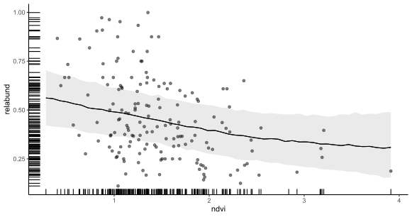
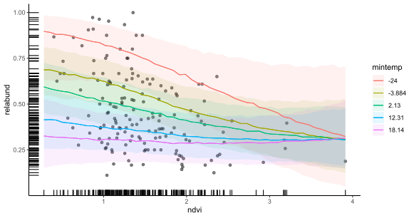
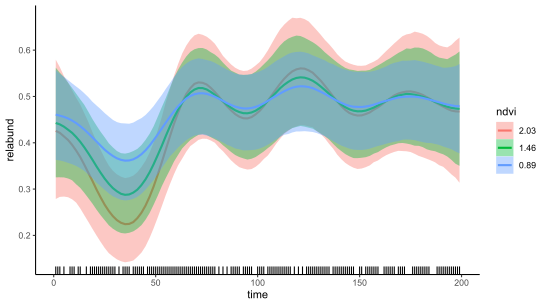

```{r setup, include=FALSE, cache=FALSE}
options(htmltools.dir.version = FALSE)
knitr::opts_chunk$set(cache = FALSE, dev = 'svg', echo = TRUE,
                      message = FALSE, warning = FALSE,
                      fig.align = 'center',
                      fig.height = 5.1, fig.width = 1.9 * 5.1)
library('mgcv')
library('mvgam')
library('gratia')
library('ggplot2')
library('ggborderline')
library('viridis')
library('gamair')
library('forecast')
library('kableExtra')
```

```{r xaringan-panelset, echo=FALSE}
xaringanExtra::use_panelset()
xaringanExtra::style_panelset_tabs(foreground = '#8F2727',
                                   inactive_opacity = 0.8)
```

```{r xaringan-animate-css, echo=FALSE}
xaringanExtra::use_animate_css()
```

```{r xaringanExtra-clipboard, echo=FALSE}
xaringanExtra::use_clipboard()
```

```{r xaringan-tile, echo=FALSE}
xaringanExtra::use_tile_view()
```


```{r setup II, echo = FALSE}
c_light <- c("#DCBCBC")
c_light_highlight <- c("#C79999")
c_mid <- c("#B97C7C")
c_mid_highlight <- c("#A25050")
c_dark <- c("#8F2727")
c_dark_highlight <- c("#7C0000")

# Define a function to simulate AR1 processes with a fixed error variance
simulate_ar1 = function(ar1 = 0.5, N = 50, shock = FALSE){
  # simulate the initial value of the series
  init <- rnorm(1, mean = 0, sd = 0.25)
  
  # create an empty vector to store the time series values
  states <- vector(length = N)
  
  # set the first value of the states as the initial value
  states[1] <- init
  
  # loop over remaining time points and fill in the AR1 process
  for(t in 2:N){
    if(shock){
      if(t == 10){
            states[t] <- rnorm(1, mean = ar1 * states[t - 1],
                       sd = 0.25) + 1.75
      } else {
            states[t] <- rnorm(1, mean = ar1 * states[t - 1],
                       sd = 0.25)
      }
    } else {
          states[t] <- rnorm(1, mean = ar1 * states[t - 1],
                       sd = 0.25)
    }
  }
  
  return(states)
}

multipar = function(...){
  par(family = "serif", 
    bty = "l", 
    cex.axis = 1.1, 
    cex.lab = 1.1, 
    cex.main = 1.3,
    xaxs = 'r',
    yaxs = 'r',
    pch = 16)
}

mypar = function(...){
  par(family = "serif", 
      las = 1, 
      mar=c(4,4.1,2,2),
      mgp = c(2,0.5,0),
      bty = "l", 
      cex.axis = 1.25, 
      cex.lab = 1.5, 
      cex.main = 1.5,
      xaxs = 'r',
      yaxs = 'r',
      pch = 16)
}

myparsmall = function(...){
  par(family = "serif", 
      las = 1, 
      mgp = c(4, 1, 0),
      mar=c(5,6,2,2),
      bty = "l", 
      cex.axis = 1.85, 
      cex.lab = 2.75, 
      cex.main = 2.75,
      xaxs = 'r',
      yaxs = 'r',
      pch = 16)
}

myhist = function(x, 
                  xlim,
                  xlab = '',
                  main = '',
                  big = TRUE){

  if(big){
      mypar()
  } else {
      myparsmall()
  }

  if(missing(xlim)){
    xlim <- range(x, na.rm = TRUE)
  }
  
  hist(x, 
       xlim = xlim,
       yaxt = 'n',
       xlab = xlab,
       ylab = '',
       col = c_mid_highlight,
       border = 'white',
       lwd = 2,
       breaks = 20,
       main = main)
}

mybar = function(x, 
                  xlab = '',
                  main = '',
                  big = TRUE){

  if(big){
      mypar()
  } else {
      myparsmall()
  }
  
  barplot(table(x),
          yaxt = 'n',
          xlab = xlab,
          border = NA,
       ylab = '',
       col = c_mid_highlight,
       lwd = 2,
       main = main)
  axis(1, labels = NA, tck=0, lwd =2)
}

mylines = function(x, xlab = '', 
                   ylim,
                   ylab = '',
                   big = TRUE){

  if(big){
      mypar()
  } else {
      myparsmall()
  }
  
  if(missing(ylim)){
      plot(x = x, 
       type = 'l',
       col = c_dark_highlight,
       lwd = 3.5,
       bty = 'l',
       xlab = xlab,
       ylab = ylab)
  } else {
      plot(x = x, 
       ylim = ylim,
       type = 'l',
       col = c_dark_highlight,
       lwd = 3.5,
       bty = 'l',
       xlab = xlab,
       ylab = ylab)
  }

  box(bty = 'l', lwd = 2)
}

myscatter = function(x, 
                     y, 
                     xlab = '', 
                     ylab = '', 
                     big = TRUE){
  
    if(big){
      mypar()
  } else {
      myparsmall()
  }

  plot(x = x, 
       y = y, 
       pch = 21,
       bg = c_dark,
       col = 'white',
       cex = 2,
       bty = 'l',
       xlab = xlab,
       ylab = ylab)
  box(bty = 'l', lwd = 2)
}
```


## Workflow

Press the "o" key on your keyboard to navigate among slides

Access the [tutorial html here](https://nicholasjclark.github.io/physalia-forecasting-course/day2/tutorial_2_physalia)
- Download the data objects and exercise `r fontawesome::fa("r-project", fill = "steelblue")` script from the html file
- Complete exercises and use Slack to ask questions

Relevant open-source materials include:
- [Introduction to Generalized Additive Models with `r fontawesome::fa("r-project", fill = "steelblue")` and `mgcv`](https://www.youtube.com/watch?v=sgw4cu8hrZM)
- [Temporal autocorrelation in Generalized Additive Models](https://ecogambler.netlify.app/blog/autocorrelated-gams/)
- [Statistical Rethinking 2023 - 16 - Gaussian Processes](https://www.youtube.com/watch?v=Y2ZLt4iOrXU)

---

## This lecture's topics

Extrapolating splines

Latent autoregressive processes

Latent Gaussian Processes

Dynamic coefficient models

---

class: inverse middle center big-subsection

# Extrapolating splines

---
## Simulated data

```{r echo = FALSE}
library(mvgam)
load('cache_not_for_upload/gausdat.rds')
multipar()
plot_mvgam_series(data = gausdat$data_train, newdata = gausdat$data_test)
```

---
## A spline of `time`
```{r eval = FALSE}
library(mvgam)
model <- mvgam(y ~ 
                 s(time, k = 20, bs = 'bs', m = 2), #<<
                data = data_train,
                newdata = data_test,
                family = gaussian())
```

A B-spline (`bs = 'bs'`) with `m = 2` sets the penalty on the second derivative

---

## A spline of `time`
```{r eval = FALSE}
library(mvgam)
model <- mvgam(y ~ 
                 s(time, k = 20, bs = 'bs', m = 2), 
                data = data_train,
                newdata = data_test,#<<
                family = gaussian())
```

A B-spline (`bs = 'bs'`) with `m = 2` sets the penalty on the second derivative

Use `newdata` argument to generate automatic probabilistic forecasts

---
## The smooth function

```{r echo = FALSE}
mypar()
plot_mvgam_smooth(splinemod, 
                  smooth = 's(time)')
```

---

## Realizations of the function

```{r echo = FALSE}
mypar()
plot_mvgam_smooth(splinemod, 
                  smooth = 's(time)',
                  realisations = TRUE)
```

---

## Hindcasts `r fontawesome::fa("face-smile-beam")`

```{r echo = FALSE, message=FALSE}
mypar()
plot(hindcast(splinemod), xlab = 'time', ylab = 'Predictions')
```

---

## Extrapolate 2-steps ahead `r fontawesome::fa("face-smile")`

```{r echo = FALSE}
mypar()
plot_mvgam_smooth(splinemod, 
                  smooth = 's(time)',
                  newdata = data.frame(time = 1:(max(gausdat$data_train$time)+2)))
abline(v = max(gausdat$data_train$time), lwd = 2, lty = 'dashed')
```

---

## 5-steps ahead `r fontawesome::fa("face-frown")`

```{r echo = FALSE}
mypar()
plot_mvgam_smooth(splinemod, 
                  smooth = 's(time)',
                  newdata = data.frame(time = 1:(max(gausdat$data_train$time)+5)))
abline(v = max(gausdat$data_train$time), lwd = 2, lty = 'dashed')
```

---

## 20-steps ahead `r fontawesome::fa("face-sad-tear")`

```{r echo = FALSE}
mypar()
plot_mvgam_smooth(splinemod, 
                  smooth = 's(time)',
                  newdata = data.frame(time = 1:(max(gausdat$data_train$time)+20)))
abline(v = max(gausdat$data_train$time), lwd = 2, lty = 'dashed')
```

---
## Forecasts `r fontawesome::fa("face-sad-cry")`

```{r echo = FALSE, message = FALSE, results='hide'}
mypar()
plot(splinemod, type = 'forecast', newdata = gausdat$data_test, xlab = 'time',
     ylab = 'Predictions')
```

---
## 2nd derivative penalty

Penalizes the overall .emphasize[*curvature*] of the spline

This is default behaviour in 📦's `mgcv`, `brms` and `mvgam`

Provides linear extrapolations
- Slope remains unchanged from the last boundary of training data
- Uncertainty grows but has no probabilistic understanding of time

This behaviour is widely known; .emphasize[*but spline extrapolation is still commonplace*]

---

background-image: url('./resources/who_extrapolate.png')
background-size: cover

---

## 1st derivative penalty?
<br>
```{r eval = FALSE}
model <- mvgam(y ~ 
                 s(time, k = 20, bs = 'bs', m = 1), #<<
               data = data_train,
               newdata = data_test,
               family = gaussian())
```

Using `m = 1` sets the penalty on the first derivative

---

## Hindcasts `r fontawesome::fa("face-smile")`

```{r echo = FALSE, message=FALSE}
mypar()
plot(hindcast(splinemod_1p), xlab = 'time', ylab = 'Predictions')
```

---

## 2-step ahead prediction `r fontawesome::fa("face-smile")`

```{r echo = FALSE}
mypar()
plot_mvgam_smooth(splinemod_1p, 
                  smooth = 's(time)',
                  newdata = data.frame(time = 1:(max(gausdat$data_train$time)+2)))
abline(v = max(gausdat$data_train$time), lwd = 2, lty = 'dashed')
```

---

## 20-steps ahead `r fontawesome::fa("face-grimace")`

```{r echo = FALSE}
mypar()
plot_mvgam_smooth(splinemod_1p, 
                  smooth = 's(time)',
                  newdata = data.frame(time = 1:(max(gausdat$data_train$time)+20)))
abline(v = max(gausdat$data_train$time), lwd = 2, lty = 'dashed')
```

---

## Forecasts `r fontawesome::fa("face-flushed")`

```{r echo = FALSE, message = FALSE, results='hide'}
mypar()
plot(splinemod_1p, type = 'forecast', newdata = gausdat$data_test, xlab = 'time',
     ylab = 'Predictions')
```

---

## 1st derivative penalty

Penalizes deviations from a flat function

Provides flat extrapolations
- Mean remains unchanged from last boundary of the training data
- Uncertainty remains unrealistically narrow

Not commonly used, though [there are exceptions](https://peerj.com/articles/6876/)

---

class: middle center

### Changing penalties when using splines will impact how they extrapolate
<br>
### Extrapolation also reacts *strongly* to what the spline is doing at the boundaries
<br>
### This is because splines only have *local knowledge*

```{r basis-functions-weights, fig.height=4.6875, fig.width = 7.5, echo=FALSE,message=FALSE,warning=FALSE,fig.show='hide'}
set.seed(7)
N <- 400
y <- mvgam::sim_mvgam(T = N, prop_missing = 0,
                      prop_train = 1,
                      family = gaussian(),
                      n_series = 1,
                      trend_model = 'GP',
                      trend_rel = 0.95)$data_train$y
x <- 1:N
data <- data.frame(x = x,
                   y = rnorm(n = N, mean = y, sd = 0.75))
theme_set(theme_classic(base_size = 17, base_family = 'serif'))
basis_funs <- basis(gam(y ~ s(x, bs = 'cr', k = 12) - 1, 
                    data = data))
ggplot(basis_funs,
       aes(x = x, y = .value, colour = .bf)) +
  geom_borderline(linewidth=1.5, bordercolour = "white") +
  scale_color_viridis(discrete = TRUE) +
  theme(legend.position = 'none',
        axis.line = element_line(size = 1),
        axis.ticks = element_line(colour = "black", size = 1)) +
  ylab('f(Time)') + xlab('Time') + 
  scale_y_continuous(breaks = c(0, 1))
```
---
background-image: url('./lecture_3_slidedeck_files/figure-html/basis-functions-weights-1.svg')
## Basis functions &#8680; local knowledge

---

## We need *global knowledge*
```{r echo = FALSE, message = FALSE, results='hide'}
mypar()
plot(gpmod, type = 'forecast', newdata = gausdat$data_test, xlab = 'time',
     ylab = 'Predictions')
```

---

## First, a few other pitfalls

`mgcv` 📦 has a heuristic checking function (`gam.check`) to inform whether a spline is *wiggly enough*

Can be useful to understand if your functions are complex enough to capture patterns in observed data

But can also be misleading when dealing with time series

`mvgam` 📦 includes an underlying object of class `gam` that can be checked with `gam.check`

---
## Simulated data

```{r echo = FALSE}
library(mvgam)
load('cache_not_for_upload/autocordat.rds')
multipar()
plot_mvgam_series(data = autocordat$data_train, 
                  newdata = autocordat$data_test)
```

---
## Restricted smooth of `time`
<br>
```{r eval = FALSE}
model <- mvgam(y ~ s(time, k = 6),
                 family = gaussian(),
               data = data_train,
               newdata = data_test)
```

Using a thin plate spline with low maximum complexity (`k = 6`)

---

## Check basis complexity

```{r eval=FALSE}
gam.check(model$mgcv_model)
```

.small[
```{r fig.show='hide', echo=FALSE}
gam.check(autogam$mgcv_model)
```
]

---

## Unmodelled variation

```{r echo = FALSE}
mypar()
plot_mvgam_smooth(autogam, 
                  smooth = 's(time)',
                  residuals = TRUE)
```

---

## Increase complexity?
```{r eval = FALSE}
model <- mvgam(y ~ s(time, k = 15), family = gaussian(),
               data = data_train, newdata = data_test)

gam.check(model$mgcv_model)
```

.small[
```{r fig.show='hide', echo=FALSE}
gam.check(autogam2$mgcv_model)
```
]
---

## Not wiggly enough

```{r echo = FALSE}
mypar()
plot_mvgam_smooth(autogam2, 
                  smooth = 's(time)',
                  residuals = TRUE)
```

---

## Even more complex?
```{r eval = FALSE}
model <- mvgam(y ~ s(time, k = 50), family = gaussian(),
               data = data_train, newdata = data_test)

gam.check(model$mgcv_model)
```

.small[
```{r fig.show='hide', echo=FALSE}
gam.check(autogam3$mgcv_model)
```
]
---

## Finally wiggly enough 

```{r echo = FALSE}
mypar()
plot_mvgam_smooth(autogam3, 
                  smooth = 's(time)',
                  residuals = TRUE)
```

---

class: middle center

### Capturing this autocorrelation is important
<br>
### Improves inferences on other parts of the model, while also giving more appropriate p-values, confidence intervals etc... in frequentist paradigms
<br>
### But what effect does this variation in wiggliness have on forecasts?

---

## Forecasts vary *hugely*
<br>
```{r echo = FALSE, results = FALSE, fig.width = 2.4 * 5.1, fig.height = 4.8}
layout(matrix(1:3, nrow = 1))
  par(family = "serif", 
      las = 1, 
      mar=c(4,4.1,2,2),
      mgp = c(2,0.5,0),
      bty = "l", 
      cex.axis = 1.5, 
      cex.lab = 2, 
      cex.main = 2,
      xaxs = 'r',
      yaxs = 'r',
      pch = 16)
plot(autogam, type = 'forecast', newdata = autocordat$data_test,
     ylab = 'Predictions', xlab = '',
     main = 'k = 6')
plot(autogam2, type = 'forecast', newdata = autocordat$data_test,
     ylab = '', xlab = 'time',
     main = 'k = 15')
plot(autogam3, type = 'forecast', newdata = autocordat$data_test,
     ylab = '', xlab = '',
     main = 'k = 50')
```

---
class: middle center inverse huge
background-image: url('./resources/too_many_wiggles.png')
background-size: cover
# TOO MANY WIGGLES

---

class: middle center

### `gam.check` is sensitive to unmodelled autocorrelation
<br>
### Raising `k` to satisfy warnings may improve inference on historical patterns, but leads to even more unpredictable extrapolation behaviour
<br>
### If the goal is to produce predictions (i.e. to forecast), we can do better with appropriate *time series models*

---

## Ok. Can we just do this?
A linear model with an autoregressive term
<br/>
<br/>
\begin{align*}
\boldsymbol{Y}_t & \sim \text{Normal}(\mu_t, \sigma) \\
\mu_t & = \alpha + \beta_1 \boldsymbol{Y}_{t-1} + \cdots
\end{align*}

Where: 
- $\alpha$ is an intercept coefficient
- $\beta_1$ is a .emphasize[*first-order autoregressive coefficient*]

Can sometimes work because of identity link; but missingness, measurement error will still cause problems
---

## What about Poisson?
A Poisson GLM with an autoregressive term
<br/>
<br/>
\begin{align*}
\boldsymbol{Y}_t & \sim \text{Poisson}(\lambda_t) \\
log(\lambda_t) & = \alpha + \beta_1 \boldsymbol{Y}_{t-1} + \cdots
\end{align*}

Where: 
- $\alpha$ is an intercept coefficient
- $\beta_1$ is a .emphasize[*first-order autoregressive coefficient*]


---

## Motivating example (skip)
```{r}
# set seed for reproducibility
set.seed(222)

# simulate an integer-valued time series with some missing observations
sim_data <- sim_mvgam(T = 100, n_series = 1, 
                      trend_model = 'RW',
                      prop_missing = 0.2)#<<
```

```{r echo=FALSE}
set.seed(222)
sim_data <- sim_mvgam(T = 100, n_series = 1, 
                      trend_model = 'RW',
                      prop_missing = 0.2)
head(sim_data$data_train, 4) %>%
  kbl() %>%
  kable_minimal(full_width = FALSE) %>%
  column_spec(1, bold = T, background = '#51247A20')
```

---
## Simulated data (skip)
```{r echo = FALSE}
set.seed(222)
sim_data <- sim_mvgam(T = 100, n_series = 1, 
                      trend_model = 'RW',
                      prop_missing = 0.2)
multipar()
plot_mvgam_series(data = sim_data$data_train)
```

---

## Use `tscount` 📦? (skip)
```{r eval=FALSE}
# attempt a tscount time series model
# which can fit autoregressive models for count time series
library(tscount)

# use the tsglm function for AR modelling
tsglm(sim_data$data_train$y, 
      
      # model using outcome at lag 1 as the predictor
      model = list(past_obs = 1))
```

```{r echo = FALSE, error = TRUE}
set.seed(222)
sim_data <- sim_mvgam(T = 100, n_series = 1, 
                      trend_model = 'RW',
                      prop_missing = 0.2)
library(tscount)
tsglm(sim_data$data_train$y, model = list(past_obs = 1))
```

`NA`s cause big problems in autoregressive models
---

## `NA`s compound (skip)

```{r echo=FALSE}
set.seed(222)
sim_data <- sim_mvgam(T = 100, n_series = 1, 
                      trend_model = 'RW',
                      prop_missing = 0.2)
sim_data$data_train %>%
  dplyr::mutate(y_lag1 = dplyr::lag(y),
                y_lag2 = dplyr::lag(y, n = 2)) %>%
  dplyr::select(time, y, y_lag1, y_lag2, season, year, series) -> mod_dat
head(mod_dat, 8) %>%
  kbl() %>%
  kable_minimal(full_width = FALSE) %>%
  column_spec(2:4, bold = T, background = '#51247A20')

```

---
## 2/8 rows complete (skip)

```{r echo=FALSE}
set.seed(222)
sim_data <- sim_mvgam(T = 100, n_series = 1, 
                      trend_model = 'RW',
                      prop_missing = 0.2)
sim_data$data_train %>%
  dplyr::mutate(y_lag1 = dplyr::lag(y),
                y_lag2 = dplyr::lag(y, n = 2)) %>%
  dplyr::select(time, y, y_lag1, y_lag2, season, year, series) -> mod_dat
head(mod_dat, 8) %>%
  kbl() %>%
  kable_minimal(full_width = FALSE) %>%
  row_spec(row = which(complete.cases(mod_dat[1:8,])),
           bold = T, background = '#51247A20')

```

---

## Other problems of AR observations
Measurement errors also compound

Difficult / impossible to ensure stability of forecasts
- Can use $log(Y_{t-lag})$ as predictors, but this doesn't always work

Challenging to link dynamics across multiple series

Not extendable to other types of dynamics 
- Smooth temporal evolution
- Changepoint models
- Stochastic variance / volatility
- etc...

---

class: inverse middle center big-subsection

# Latent autoregressive processes

---

# Dynamic Poisson GLM
A dynamic Poisson GLM can use .emphasize[*autocorrelated latent residuals*]
<br/>
<br/>
\begin{align*}
\boldsymbol{Y}_t & \sim \text{Poisson}(\lambda_t) \\
log(\lambda_t) & = \alpha + \cdots + z_t \\
z_t & \sim \text{Normal}(z_{t-1}, \sigma) \\
\sigma & \sim \text{Exponential}(2)
\end{align*}

Where: 
- $z_t$ is the value of the latent residual at time $t$
- $\sigma$ captures variation in the latent dynamic process

---

background-image: url('./resources/SS_model.svg')
background-size: contain

## Evolves *independently*
<br>
<br>
<br>
<br>
<br>
<br>
<br>
<br>
<br>
<br>
Missing observations do not impede evolution of the *latent* process

---

background-image: url('./resources/SS_model.svg')
background-size: contain

## Evolves *independently*
<br>
<br>
<br>
<br>
<br>
<br>
<br>
<br>
<br>
<br>
The latent process model can take on a *huge variety* of forms

---

## Back to the example

```{r echo = FALSE}
load('cache_not_for_upload/mod_example.rds')
```

```{r eval = FALSE}
mod_example <- mvgam(y ~ 1,
                     trend_model = AR(p = 1),#<<
                     data = sim_data$data_train,
                     newdata = sim_data$data_test,
                     family = poisson())
```

`mvgam` 📦 has no problem with these observations

Fit a model with latent AR1 dynamics and just an intercept in the observation model

---
## The latent trend
```{r echo=FALSE}
mypar()
plot(mod_example, type = 'trend', newdata = sim_data$data_test,
     ylab = 'Trend', xlab = 'time')
```

---
## Forecasts
```{r echo=FALSE, results = 'hide'}
mypar()
plot(mod_example, type = 'forecast', newdata = sim_data$data_test,
     ylab = 'Predictions', xlab = 'time')
```

---
## Residuals
```{r echo=FALSE}
multipar()
plot(mod_example, type = 'residuals')
```

---

## A tougher example?
```{r eval = FALSE}
# set seed for reproducibility
set.seed(100)

# simulate an integer-valued time series with some missing observations
sim_data2 <- sim_mvgam(T = 100, n_series = 1, 
                       mu = 1,
                      trend_model = 'RW',
                      prop_missing = 0.75) #<<
```

75% of observations missing!

---
## Same model
<br>
```{r eval = FALSE}
mod_example2 <- mvgam(y ~ 1,
                     trend_model = AR(p = 1),
                     data = sim_data2$data_train,
                     newdata = sim_data2$data_test,
                     family = poisson())
```

```{r echo=FALSE}
load('cache_not_for_upload/mod_example2.rds')
```

---
## The latent trend
```{r echo=FALSE}
mypar()
plot(mod_example2, type = 'trend', newdata = sim_data2$data_test, 
     ylab = 'Trend', xlab = 'time')
```

---
## Forecasts
```{r echo=FALSE, results='hide'}
mypar()
plot(mod_example2, type = 'forecast', newdata = sim_data2$data_test,
     ylab = 'Predictions', xlab = 'time')
```

---

class: middle center
### *Some* packages exist to model count-valued time series using autoregressive terms
<br>
### But you must not have missing data or measurement error, and you cannot handle multiple series at once
<br>
### Fine for some situations. But what if your data look like this?

---

```{r echo = FALSE, fig.cap = "Properties of Merriam's kangaroo rat relative abundance time series from a long-term monitoring study in Portal, Arizona, USA"}
data("portal_data")
multipar()
portal_data %>%
  dplyr::mutate(time = moon - (min(moon)) + 1) %>%
  dplyr::rowwise() %>%
  dplyr::mutate(total = sum(c(DM, DO, PP, OT), na.rm = TRUE)) %>%
  dplyr::mutate(`relative abundance` = DM / total) %>%
  dplyr::mutate(series = as.factor('DM')) %>%
  dplyr::select(series, year, time, `relative abundance`, mintemp, ndvi) -> model_data
  plot_mvgam_series(data = model_data, y = 'relative abundance')
```

---


class: inverse middle center big-subsection

# Live code example

---

## Dynamic Beta GAM
```{r eval = FALSE}
mod_beta <- mvgam(relabund ~ 
                    te(mintemp, ndvi),
                  trend_model = AR(p = 3),
                  family = betar(), #<<
                  data = dm_data)
```

```{r echo=FALSE}
load('cache_not_for_upload/mod_beta.rds')
```

Beta regression using the `mgcv` 📦's `betar` family

---

## Dynamic Beta GAM
```{r eval = FALSE}
mod_beta <- mvgam(relabund ~ 
                    te(mintemp, ndvi),
                  trend_model = AR(p = 3),#<<
                  family = betar(), 
                  data = dm_data)
```

```{r echo=FALSE}
load('cache_not_for_upload/mod_beta.rds')
```

Beta regression using the `mgcv` 📦's `betar` family

AR3 dynamic trend model

---

## Dynamic Beta GAM
```{r eval = FALSE}
mod_beta <- mvgam(relabund ~ 
                    te(mintemp, ndvi),#<<
                  trend_model = AR(p = 3),
                  family = betar(), 
                  data = dm_data)
```

```{r echo=FALSE}
load('cache_not_for_upload/mod_beta.rds')
```

Beta regression using the `mgcv` 📦's `betar` family

AR3 dynamic trend model

Multidimensional [tensor product smooth function for nonlinear covariate interactions (using `te`)](https://fromthebottomoftheheap.net/2015/11/21/climate-change-and-spline-interactions/)

---

## The latent trend
```{r echo=FALSE}
mypar()
plot(mod_beta, type = 'trend', ylab = 'Trend', xlab = 'time')
```

---
## Multidimensionial smooth
```{r echo=FALSE}
mypar()
plot(mod_beta, type = 'smooth')
```

---

class: animated fadeIn black-inverse
.center[.grey[.big[Huh?]]]


---

## `marginaleffects` for clarity

.panelset[
.panel[.panel-name[Code]

```{r beta_ndvi, fig.show='hide', fig.height=4.25, fig.width=1.9*4.25, message=FALSE,warning=FALSE}

# plot conditional effect of NDVI on the outcome scale
plot_predictions(mod_beta, condition = 'ndvi',
                 points = 0.5, conf_level = 0.8, rug = TRUE) +
  theme_classic()
```

]

.panel[.panel-name[Plot]
.center[]

]
]

---

## `marginaleffects` for clarity

.panelset[
.panel[.panel-name[Code]

```{r beta_mintemp, fig.show='hide', fig.height=4.25, fig.width=1.9*4.25, message=FALSE,warning=FALSE}

# plot conditional effect of Min Temp on the outcome scale
plot_predictions(mod_beta, condition = 'mintemp',
                 points = 0.5, conf_level = 0.8, rug = TRUE) +
  theme_classic()
```

]

.panel[.panel-name[Plot]
.center[]

]
]

---

## `marginaleffects` for clarity

.panelset[
.panel[.panel-name[Code]

```{r beta_both, fig.show='hide', fig.height=4.25, fig.width=1.9*4.25, message=FALSE,warning=FALSE}

# plot conditional effect of BOTH covariates on the outcome scale
plot_predictions(mod_beta, condition = c('ndvi', 'mintemp'),
                 points = 0.5, conf_level = 0.8, rug = TRUE) +
  theme_classic()
```

]

.panel[.panel-name[Plot]
.center[]

]
]

---
## Hindcasts
```{r echo=FALSE}
mypar()
plot(mod_beta, type = 'forecast', ylab = 'Predictions', xlab = 'time')
```

---

class: middle center
### We can estimate latent dynamic residuals for *many* types of GLMs / GAMs, thanks to the link function
<br>
### We do not need to regress the outcome on its own past values
<br>
### Very advantageous for ecological time series. But what kinds of dynamic processes are available in the `mvgam` and `brms` 📦's?

---

## Piecewise linear...
```{r echo=FALSE}
# set seed for reproducibility
set.seed(4321)

# simulate a piecewise linear trend
n_changes <- 7
change_times <- c(10, 18, 25, 45, 60, 63, 89)
lambda <- 0.25
deltas_new <- extraDistr::rlaplace(n_changes,
                                   mu = 0,
                                   sigma = lambda)
trend <- mvgam:::piecewise_linear(
  t = 1:100, 
  deltas = deltas_new, 
  k = 0.02,
  m = 1, 
  changepoint_ts = change_times)
series <- rnorm(100, mean = scale(trend),
                sd = 0.001)

# plot the time series as a line
mypar()
plot(series, type = 'l', bty = 'l', lwd = 2, 
     col = 'darkred', ylab = 'z', xlab = 'Time')
```


---

## ...or logistic with upper saturation
```{r echo=FALSE}
# set seed for reproducibility
set.seed(4321)

# simulate a piecewise logistic trend
n_changes <- 7
change_times <- c(10, 18, 25, 45, 60, 63, 89)
lambda <- 0.25
deltas_new <- extraDistr::rlaplace(n_changes,
                                   mu = 0,
                                   sigma = lambda)
trend <- mvgam:::piecewise_logistic(
  t = 1:100, 
  cap = 9, 
  deltas = deltas_new, 
  k = 0.02,
  m = 1, 
  changepoint_ts = change_times)
series <- rnorm(100, mean = trend - mean(trend),
                sd = 0.001)

# plot the time series as a line
mypar()
plot(series, type = 'l', bty = 'l', lwd = 2, 
     col = 'darkred', ylab = 'z', xlab = 'Time')
```

---

## Random walks
Simple stochastic processes that can fit a wide range of data
<br/>
<br/>
\begin{align*}
z_t & \sim \text{Normal}(\alpha + z_{t-1}, \sigma) \\
\end{align*}

Where: 
- $\sigma$ determines the spread (or flexibility) of the process
- $\alpha$ is an optional intercept or *drift* parameter

Process at time $t$ is centred around it's own value at time $t-1$, with spread determined by probabilistic error

---

## A Random Walk
.panelset[
.panel[.panel-name[Code]

```{r rw_sim, echo=FALSE,fig.show='hide', fig.height=4.25, fig.width=1.9*4.25,echo=FALSE}
# set seed for reproducibility
set.seed(1111)

# number of timepoints
T <- 100

# initialize first value
series <- vector(length = T)
series[1] <- rnorm(n = 1, mean = 0, sd = 1)

# compute values 2 through T
for (t in 2:T) {
    series[t] <- rnorm(n = 1, mean = series[t - 1], sd = 1)
}

# plot the time series as a line
mypar()
plot(series, type = 'l', bty = 'l', lwd = 2, 
     col = 'darkred', ylab = 'x', xlab = 'Time')
```

```{r eval=FALSE}
# set seed and number of timepoints
set.seed(1111); T <- 100

# initialize first value
series <- vector(length = T); series[1] <- rnorm(n = 1, mean = 0, sd = 1)

# compute values 2 through T
for (t in 2:T) {
    series[t] <- rnorm(n = 1, mean = series[t - 1], sd = 1)
}

# plot the time series as a line
plot(series, type = 'l', bty = 'l', lwd = 2, 
     col = 'darkred', ylab = 'x', xlab = 'Time')
```
]

.panel[.panel-name[Plot]
.center[]

]
]

---

## AR1
Similar to a Random Walk and can fit a wide range of data
<br/>
<br/>
\begin{align*}
z_t & \sim \text{Normal}( \alpha + \phi * z_{t-1}, \sigma) \\
\end{align*}

Where: 
- $\sigma$ determines the spread (or flexibility) of the process
- $\alpha$ is an optional intercept or *drift* parameter
- $\phi$ is a coefficient estimating correlation between $z_t$ and $z_{t-1}$

Process at time $t$ is *a function* of it's own value at time $t-1$

---

## AR2 and AR3
As with AR1, but with additional autoregressive terms
<br/>
<br/>
\begin{align*}
z_t & \sim \text{Normal}( \alpha + \phi_1 * z_{t-1} + \phi_2 * z_{t-2} + \phi_3 * z_{t-3}, \sigma) \\
\end{align*}

---

## An AR1
.panelset[
.panel[.panel-name[Code]

```{r ar_sim, echo=FALSE,fig.show='hide', fig.height=4.25, fig.width=1.9*4.25,echo=FALSE}
# set seed for reproducibility
set.seed(1111)

# number of timepoints
T <- 100

# initialize first value
series <- vector(length = T)
series[1] <- rnorm(n = 1, mean = 0, sd = 1)

# compute values 2 through T, with phi = 0.7
for (t in 2:T) {
    series[t] <- rnorm(n = 1, mean = 0.7 * series[t - 1], sd = 1)
}

# plot the time series as a line
mypar()
plot(series, type = 'l', bty = 'l', lwd = 2, 
     col = 'darkred', ylab = 'x', xlab = 'Time')
```

```{r eval=FALSE}
# set seed and number of timepoints
set.seed(1111); T <- 100

# initialize first value
series <- vector(length = T); series[1] <- rnorm(n = 1, mean = 0, sd = 1)

# compute values 2 through T, with phi = 0.7
for (t in 2:T) {
    series[t] <- rnorm(n = 1, mean = 0.7 * series[t - 1], sd = 1)
}

# plot the time series as a line
plot(series, type = 'l', bty = 'l', lwd = 2, 
     col = 'darkred', ylab = 'x', xlab = 'Time')
```
]

.panel[.panel-name[Plot]
.center[]

]
]

---
## Properties of an AR1
$\phi = 0$ and $\alpha = 0$, process is white noise

$\phi = 1$ and $\alpha = 0$, process is a Random Walk

$\phi = 1$ and $\alpha \neq 0$, process is a Random Walk with drift

$|\phi| < 1$, process oscillates around $\alpha$ and is .emphasize[*stationary*]

---

## Stationarity

"*A stationary time series is one whose statistical properties do not depend on the time at which the series is observed*" ([Hyndman and Athanasopoulos, Forecasting Principles and Practice](https://otexts.com/fpp3/stationarity.html))

Non-stationary series are more difficult to predict
- Either mean, variance, and/or autocorrelation structure can change over time
- Random Walk is nonstationary because it has no long-term mean

Stationary time series are useful for inferring properties of .emphasize[*stability*]

---

## Stationarity &#8680; stability
```{r echo = FALSE, fig.height = 4.6, fig.width = 2.1 * 5.1}
par(  family = 'serif',
      mar=c(3,4,1,1),
      mgp = c(2,0.75,0),
      cex.axis = 1.5, 
      cex.lab = 1.5, 
      cex.main = 1.7)
layout(matrix(1:3, ncol = 3))
plot(x = 1:50, y = simulate_ar1(ar1 = 0.65, N = 50, shock = TRUE), 
     type = 'l',
     lwd = 2, col = 'darkred',
     ylab = expression(f(Time)),
     xlab = '', bty = 'l',
     ylim = c(-2,3),
     main = expression(phi~'='~0.65))

for(i in 1:20){
  lines(simulate_ar1(ar1 = 0.65, N = 50, shock = TRUE),
        col = sample(c("#DCBCBC",
                       "#C79999",
                       "#B97C7C",
                       "#A25050",
                       "#7C0000"), 1),
        lwd = 2)
}
abline(v = 10, lwd = 2, lty = 'dashed')
text(x = 11, adj = 0, y = -1.5, labels = 'A system shock', cex = 1.5)
box(bty = 'l', lwd = 2)

plot(x = 1:50, y = simulate_ar1(ar1 = -0.65, N = 50, shock = TRUE), 
     type = 'l',
     lwd = 2, col = 'darkred',
     ylab = '',
     xlab = 'Time', bty = 'l',
     ylim = c(-2,3),
     main = expression(phi~'='~'-0.65'))

for(i in 1:20){
  lines(simulate_ar1(ar1 = -0.65, N = 50, shock = TRUE),
        col = sample(c("#DCBCBC",
                       "#C79999",
                       "#B97C7C",
                       "#A25050",
                       "#7C0000"), 1),
        lwd = 2)
}
abline(v = 10, lwd = 2, lty = 'dashed')
box(bty = 'l', lwd = 2)

plot(x = 1:50, y = simulate_ar1(ar1 = 0.9, N = 50, shock = TRUE), 
     type = 'l',
     lwd = 2, col = 'darkred',
     ylab = '',
     xlab = '', bty = 'l',
     ylim = c(-2,3),
     main = expression(phi~'='~0.9))

for(i in 1:20){
  lines(simulate_ar1(ar1 = 0.9, N = 50, shock = TRUE),
        col = sample(c("#DCBCBC",
                       "#C79999",
                       "#B97C7C",
                       "#A25050",
                       "#7C0000"), 1),
        lwd = 2)
}
abline(v = 10, lwd = 2, lty = 'dashed')
box(bty = 'l', lwd = 2)
```

---
class: middle center

### It is straightforward to fit latent dynamic models with RW or AR models up to order 3 in `mvgam`. Bayesian regularization helps shrink un-needed AR coefficients toward 0
<br>
### In `brms`, only AR1 can be fit for non-Gaussian observations (though can also handle ARMA(1,1)) models. However, implementation is different and much slower
<br>
### But what if we think the latent dynamic process is *smooth*?
---

class: inverse middle center big-subsection

# Gaussian Processes

---

## Gaussian Processes
"*A Gaussian Process defines a probability distribution over functions; in other words every sample from a Gaussian Process is an entire function from the covariate space X to the real-valued output space.*" (Betancourt; [Robust Gaussian Process Modeling](https://betanalpha.github.io/assets/case_studies/gaussian_processes.html)) 

\begin{align*}
z & \sim \text{MVNormal}(0, \Sigma) \\
\Sigma_{t_i, t_j} & = \alpha^2 * exp(-0.5 * ((|t_i - t_j| / \rho))^2)
\end{align*}

Where: 
- $\alpha$ controls the marginal variability (magnitude) of the function
- $\rho$ controls how correlations decay as a function of time lag
- $\Sigma$ is the kernel, in this case a squared exponential kernel

---

## Random *functions*
```{r echo=FALSE}
# set a seed for reproducibility
set.seed(2222)

# simulate from a fairly large length-scale parameter
rho <- 16

# set the alpha parameter to 1 for all simulations
alpha <- 1

# simulate functions that span 50 time points
times <- 1:50

# generate a sequence of prediction values
draw_seq <- seq(min(times), max(times), length.out = 100)

# construct the temporal covariance matrix
Sigma <- alpha^2 * 
  exp(-0.5 * ((outer(draw_seq, draw_seq, "-") / rho) ^ 2)) +
  diag(1e-12, length(draw_seq))

# draw a single realization from the GP distribution
gp_vals <- MASS::mvrnorm(n = 1, 
                         mu = rep(0, length(draw_seq)),
                         Sigma = Sigma)
mypar()
# plot the single GP draw
plot(x = draw_seq, y = gp_vals, type = 'l',
     lwd = 2, col = 'darkred',
     ylab = expression(f(Time)),
     xlab = 'Time', bty = 'l',
     ylim = c(-3,3),
     main = expression(alpha~'='~1*'; '~rho~'='~16))
# overlay an additional 15 possible functions using different colours
for(i in 1:15){
  draw <- MASS::mvrnorm(n = 1, mu = rep(0, length(draw_seq)),
                        Sigma = Sigma)
  lines(x = draw_seq, y = draw, lwd = 3.5, col = 'white')
  lines(x = draw_seq, y = draw,
        col = sample(c("#DCBCBC",
                       "#C79999",
                       "#B97C7C",
                       "#A25050",
                       "#7C0000"), 1),
        lwd = 2.5)
}
box(bty = 'l', lwd = 2)
```

---
## Length scale  &#8680; *memory*
```{r echo=FALSE}
# set a seed for reproducibility
set.seed(2222)

# simulate from a short length-scale parameter
rho <- 4

# set the alpha parameter to 1 for all simulations
alpha <- 1

# simulate functions that span 50 time points
times <- 1:50

# generate a sequence of prediction values
draw_seq <- seq(min(times), max(times), length.out = 100)

# construct the temporal covariance matrix
Sigma <- alpha^2 * 
  exp(-0.5 * ((outer(draw_seq, draw_seq, "-") / rho) ^ 2)) +
  diag(1e-12, length(draw_seq))

# draw a single realization from the GP distribution
gp_vals <- MASS::mvrnorm(n = 1, 
                         mu = rep(0, length(draw_seq)),
                         Sigma = Sigma)
mypar()
# plot the single GP draw
plot(x = draw_seq, y = gp_vals, type = 'l',
     lwd = 2, col = 'darkred',
     ylab = expression(f(Time)),
     xlab = 'Time', bty = 'l',
     ylim = c(-3,3),
     main = expression(alpha~'='~1*'; '~rho~'='~4))
# overlay an additional 15 possible functions using different colours
for(i in 1:15){
  draw <- MASS::mvrnorm(n = 1, mu = rep(0, length(draw_seq)),
                        Sigma = Sigma)
  lines(x = draw_seq, y = draw, lwd = 3.5, col = 'white')
  lines(x = draw_seq, y = draw,
        col = sample(c("#DCBCBC",
                       "#C79999",
                       "#B97C7C",
                       "#A25050",
                       "#7C0000"), 1),
        lwd = 2.5)
}
box(bty = 'l', lwd = 2)

```

---

## Kernel &#8680; covariance decay

```{r echo = FALSE}
# Compute the covariance kernel for a given draw
# of GP alpha and rho parameters
quad_kernel = function(rho, alpha, times){
  covs <- alpha ^ 2 * 
    exp(-0.5 * ((times / rho) ^ 2))
  return(covs)
}

# Compute kernels for each posterior draw
plot_kernels = function(gp_ests, max_time = 50){
  # set up an empty matrix to store the kernel estimates 
  # for each posterior draw
  draw_seq <- seq(0, max_time, length.out = 100)
  kernels <- matrix(NA, nrow = NROW(gp_ests), ncol = 100)
  
  # use a for-loop to estimate the kernel for each draw using
  # our custom quad_kernel() function
  for(i in 1:NROW(gp_ests)){
    kernels[i,] <- quad_kernel(rho = gp_ests$`rho_gp[1]`[i],
                               alpha = gp_ests$`alpha_gp[1]`[i],
                               times = draw_seq)
  }
  
  # Calculate posterior empirical quantiles of the kernels
  probs <- c(0.05, 0.2, 0.5, 0.8, 0.95)
  cred <- sapply(1:NCOL(kernels),
                 function(n) quantile(kernels[,n],
                                      probs = probs))
  
  # Plot the kernel uncertainty estimates
  pred_vals <- draw_seq
  plot(1, xlim = c(0, max_time), ylim = c(0, max(cred)), type = 'n',
       xlab = 'Time difference', ylab = 'Covariance',
       bty = 'L')
  box(bty = 'L', lwd = 2)
  polygon(c(pred_vals, rev(pred_vals)), c(cred[1,], rev(cred[5,])),
          col = "#DCBCBC", border = NA)
  polygon(c(pred_vals, rev(pred_vals)), c(cred[2,], rev(cred[4,])),
          col = "#B97C7C", border = NA)
  lines(pred_vals, cred[3,], col = "#7C0000", lwd = 2.5)
}

gp_ests <- data.frame(`rho_gp[1]` = runif(1000, 2, 4),
                      `alpha_gp[1]` = 1)
colnames(gp_ests) <- c('rho_gp[1]', 'alpha_gp[1]')
mypar()
plot_kernels(gp_ests = gp_ests, max_time = 40)
title(main = expression(alpha~'='~1*'; '~rho~'~'~'Uniform(2,4)'))
```

---
## Kernel &#8680; covariance decay
```{r echo=FALSE}
gp_ests <- data.frame(`rho_gp[1]` = runif(1000, 14, 16),
                      `alpha_gp[1]` = 1)
colnames(gp_ests) <- c('rho_gp[1]', 'alpha_gp[1]')
mypar()
plot_kernels(gp_ests = gp_ests, max_time = 40)
title(main = expression(alpha~'='~1*'; '~rho~'~'~'Uniform(14,16)'))
```

---

## Kernel &#8680; covariance decay
```{r echo=FALSE}
gp_ests <- data.frame(`rho_gp[1]` = runif(1000, 14, 16),
                      `alpha_gp[1]` = runif(1000, 0.6, 1))
colnames(gp_ests) <- c('rho_gp[1]', 'alpha_gp[1]')
mypar()
plot_kernels(gp_ests = gp_ests, max_time = 40)
title(main = expression(alpha~'='~'Uniform(0.6,1)'*'; '~rho~'~'~'Uniform(14,16)'))
```

---

background-image: url('./resources/gp_kernel.gif')
## Kernel smoothing in action
<br>
<br>
<br>
<br>
<br>
<br>
<br>
<br>
<br>
<br>
<br>
<br>
.small[[McElreath 2023](https://www.youtube.com/watch?v=Y2ZLt4iOrXU)]

---

class: middle center
### A latent GP allows prediction for *any* time point because all we need is the distance to each training time point
<br>
### The cross-covariance for prediction vs training time points provides the kernel used to extend functions forward in time
<br>
### Allows GPs to make much better predictions than splines, but at a high computational cost
---

## Global knowledge `r fontawesome::fa("check")`
```{r echo = FALSE, message = FALSE, results='hide'}
mypar()
plot(gpmod, type = 'forecast', newdata = gausdat$data_test, xlab = 'time',
     ylab = 'Predictions')
```
---

## Approximating GPs
A quick note that both the `mvgam` and `brms` 📦's can employ an approximation method to improve computational efficiency for estimating Gaussian Process parameters

Relies on basis expansions to reduce dimensionality of the problem

Details not focus of this lecture, but can be found in this reference
- Riutort-Mayol et al 2023; [Practical Hilbert space approximate Bayesian Gaussian processes for probabilistic programming](https://link.springer.com/article/10.1007/s11222-022-10167-2)

Both packages use automatic, [informative priors for length scales $\rho$](https://betanalpha.github.io/assets/case_studies/gaussian_processes.html#323_Informative_Prior_Model), but these can be changed (more on this in [Tutorial 2](https://nicholasjclark.github.io/physalia-forecasting-course/day2/tutorial_2_physalia#Gaussian_Processes))
---

## Estimation in `brms` and `mvgam`
Use the [`gp` function](https://paul-buerkner.github.io/brms/reference/gp.html) with `time` as the covariate

```{r eval = FALSE}
brm(y ~ x + ... +
      gp(time, c = 5/4, k = 20, scale = FALSE), #<<
    family = poisson(),
    data = data)

mvgam(y ~ x + ... +
        gp(time, c = 5/4, k = 20, scale = FALSE), #<<
      family = poisson(),
      data = data)
```

Requires arguments to determine behaviour of the approximation (`c` and `k`). Good defaults are `5/4` and `20`, but depends on number of timepoints and expected smoothness
---
class: middle center
### No examples here as we will go deeper into GPs in the tutorial
<br>
### But if you want extra detail, watch this lecture: - [Statistical Rethinking 2023 - 16 - Gaussian Processes](https://www.youtube.com/watch?v=Y2ZLt4iOrXU)

---


class: inverse middle center big-subsection

# Live code example

---

class: inverse middle center big-subsection

# Dynamic coefficient models

---
## Dynamic coefficients
Major advantage of flexible interfaces such as `brms`, `mgcv` and `mvgam`📦's is ability to handle many types of nonlinear effects

These can include smooth functions of covariates, as we have been using so far

But they can also include other types of nonlinearities
- Spatial autocorrelation functions
- Distributed lag functions
- .emphasize[*Time-varying effects*]

---
## Smooth time-varying effects
If a covariate effect changes over time, we'd usually expect this change to be .emphasize[*smooth*]

Splines and Gaussian Processes provide useful tools to estimate these effects

But as we've seen previously, splines will often give poor predictions about how effects will change in the future

---
## In `mvgam`
In `mvgam`📦, use `dynamic` to set up time-varying effects

```{r eval = FALSE}
mod_beta_dyn <- mvgam(relabund ~ s(mintemp, k = 6) +
                        dynamic(ndvi, scale = FALSE, k = 20), #<<
                      family = betar(),
                      data = dm_data)
```

Requires user to set $k$, as the function is approximated using a low-rank GP smooth from the `brms`📦

Estimates full uncertainty in GP parameters to yield a squared exponential GP

---

## Estimated smooths
```{r echo = FALSE}
load('cache_not_for_upload/mod_beta_dyn.rds')
multipar()
plot(mod_beta_dyn, type = 'smooths')
```

---

## Predicted effects
.panelset[
.panel[.panel-name[Code]

```{r ndvi_time, echo=FALSE,fig.show='hide', fig.height=4.25, fig.width=1.9*4, warning=FALSE, message=FALSE}

# use mvgam's plot utility
mypar()
plot_mvgam_smooth(mod_beta_dyn, smooth = 2,
                  newdata = datagrid(time = 1:230,
                                     model = mod_beta_dyn))
abline(v = max(dm_data$time), lwd = 2, lty = 'dashed')
```

```{r eval=FALSE,message=FALSE}

# use mvgam's plot_mvgam_smooth to view predicted effects
plot_mvgam_smooth(mod_beta_dyn, smooth = 2,
                  # datagrid from marginaleffects is useful
                  # to set up prediction scenarios
                  newdata = datagrid(time = 1:230,
                                     model = mod_beta_dyn))
abline(v = max(dm_data$time), lwd = 2, lty = 'dashed')
```
]

.panel[.panel-name[Plot]
.center[]

]
]

---
## In `brms`
In `brms`📦, use `gp` with the `by` argument
```{r eval=FALSE}
brm_beta_dyn <- brm(relabund ~ s(mintemp, k = 6) +
                      gp(time, by = ndvi, c = 5/4, k = 20),#<<
                    family = Beta(),
                    data = dm_data,
                    chains = 4,
                    cores = 4,
                    backend = 'cmdstanr')
```

```{r echo=FALSE}
library(brms)
```

A GP specifying time-varying effects of `ndvi`

---

## Time-vaying effect
.panelset[
.panel[.panel-name[Code]

```{r ndvi_time_brm,fig.show='hide', fig.height=4.25, fig.width=1.9*4, warning=FALSE, message=FALSE}

# use brms' conditional_effects to view predictions
plot(conditional_effects(brm_beta_dyn, effects = c('time:ndvi')),
                    theme = theme_classic(),
                    mean = FALSE,
                    rug = TRUE)
```
]

.panel[.panel-name[Plot]
.center[]

]
]

---
class: middle center
### We have seen many ways to handle dynamic components in Bayesian regression models
<br>
### These flexible processes can capture time-varying effects and give realistic forecasts, while also allowing us to respect the properties of the observations
<br>
### But how do we evaluate and compare dynamic GAMs / GLMs?

---

## In the next lecture, we will cover

Forecasting from dynamic models

Bayesian posterior predictive checks

Point-based forecast evaluation

Probabilistic forecast evaluation

