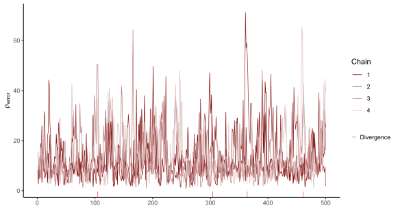
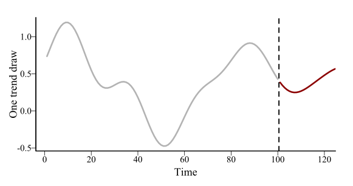
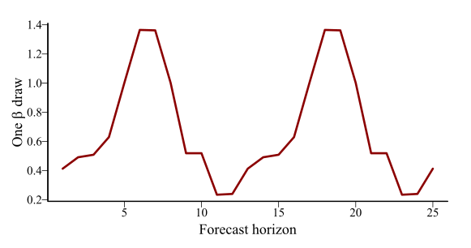
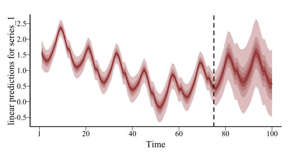
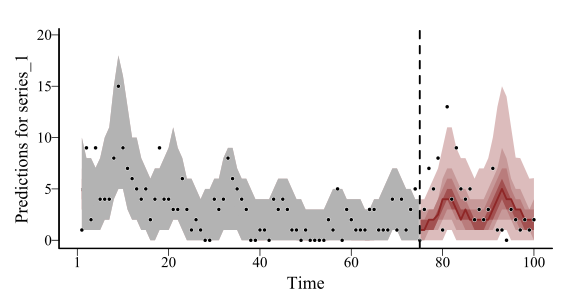
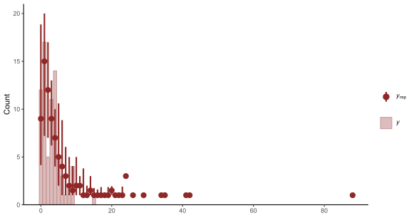
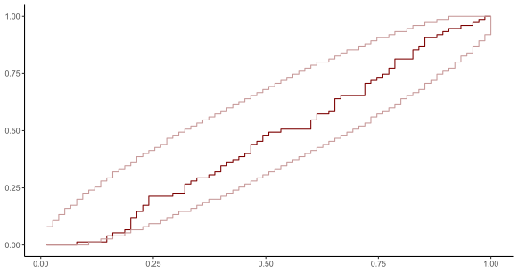
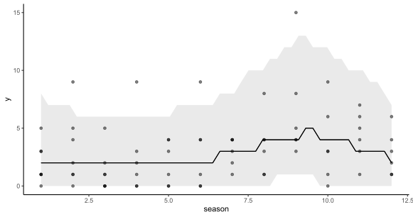
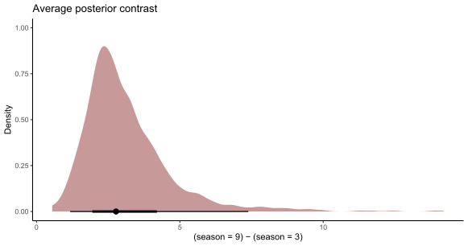

```{r setup, include=FALSE, cache=FALSE}
options(htmltools.dir.version = FALSE)
knitr::opts_chunk$set(cache = FALSE, dev = 'svg', echo = TRUE,
                      message = FALSE, warning = FALSE,
                      fig.align = 'center',
                      fig.height = 5.1, fig.width = 1.9 * 5.1)
library('mgcv')
library('mvgam')
library('gratia')
library('ggplot2')
library('ggborderline')
library('viridis')
library('gamair')
library('kableExtra')
```

```{r xaringan-panelset, echo=FALSE}
xaringanExtra::use_panelset()
xaringanExtra::style_panelset_tabs(foreground = '#8F2727',
                                   inactive_opacity = 0.8)
```

```{r xaringan-animate-css, echo=FALSE}
xaringanExtra::use_animate_css()
```

```{r xaringanExtra-clipboard, echo=FALSE}
xaringanExtra::use_clipboard()
```

```{r xaringan-tile, echo=FALSE}
xaringanExtra::use_tile_view()
```


```{r setup II, echo = FALSE}
c_light <- c("#DCBCBC")
c_light_highlight <- c("#C79999")
c_mid <- c("#B97C7C")
c_mid_highlight <- c("#A25050")
c_dark <- c("#8F2727")
c_dark_highlight <- c("#7C0000")

# Calculate Mean Scaled Interval Score
interval_score <- function(true_values,
                           lower,
                           upper,
                           interval_range) {
  
  if (any(interval_range < 0, na.rm = TRUE)) {
    stop("interval ranges must be positive")
  }
  
  # calculate alpha from the interval range
  alpha <- (100 - interval_range) / 100
  
  # calculate three components of WIS
  dispersion <- (upper - lower)
  overprediction <-
    2 / alpha * (lower - true_values) * as.numeric(true_values < lower)
  underprediction <-
    2 / alpha * (true_values - upper) * as.numeric(true_values > upper)
  
  score <- dispersion + underprediction + overprediction

  return(score)
}

# Define a function to simulate AR1 processes with a fixed error variance
simulate_ar1 = function(ar1 = 0.5, N = 50, shock = FALSE){
  # simulate the initial value of the series
  init <- rnorm(1, mean = 0, sd = 0.25)
  
  # create an empty vector to store the time series values
  states <- vector(length = N)
  
  # set the first value of the states as the initial value
  states[1] <- init
  
  # loop over remaining time points and fill in the AR1 process
  for(t in 2:N){
    if(shock){
      if(t == 10){
            states[t] <- rnorm(1, mean = ar1 * states[t - 1],
                       sd = 0.25) + 1.75
      } else {
            states[t] <- rnorm(1, mean = ar1 * states[t - 1],
                       sd = 0.25)
      }
    } else {
          states[t] <- rnorm(1, mean = ar1 * states[t - 1],
                       sd = 0.25)
    }
  }
  
  return(states)
}

multipar = function(...){
  par(family = "serif", 
    bty = "l", 
    cex.axis = 1.1, 
    cex.lab = 1.1, 
    cex.main = 1.3,
    xaxs = 'r',
    yaxs = 'r',
    pch = 16)
}

mypar = function(...){
  par(family = "serif", 
      las = 1, 
      mar=c(4,4.1,2,2),
      mgp = c(2,0.5,0),
      bty = "l", 
      cex.axis = 1.25, 
      cex.lab = 1.5, 
      cex.main = 1.5,
      xaxs = 'r',
      yaxs = 'r',
      pch = 16)
}

myparsmall = function(...){
  par(family = "serif", 
      las = 1, 
      mgp = c(4, 1, 0),
      mar=c(5,6,2,2),
      bty = "l", 
      cex.axis = 1.85, 
      cex.lab = 2.75, 
      cex.main = 2.75,
      xaxs = 'r',
      yaxs = 'r',
      pch = 16)
}

myhist = function(x, 
                  xlim,
                  xlab = '',
                  main = '',
                  big = TRUE){

  if(big){
      mypar()
  } else {
      myparsmall()
  }

  if(missing(xlim)){
    xlim <- range(x, na.rm = TRUE)
  }
  
  hist(x, 
       xlim = xlim,
       yaxt = 'n',
       xlab = xlab,
       ylab = '',
       col = c_mid_highlight,
       border = 'white',
       lwd = 2,
       breaks = 20,
       main = main)
}

mybar = function(x, 
                  xlab = '',
                  main = '',
                  big = TRUE){

  if(big){
      mypar()
  } else {
      myparsmall()
  }
  
  barplot(table(x),
          yaxt = 'n',
          xlab = xlab,
          border = NA,
       ylab = '',
       col = c_mid_highlight,
       lwd = 2,
       main = main)
  axis(1, labels = NA, tck=0, lwd =2)
}

mylines = function(x, xlab = '', 
                   ylim,
                   ylab = '',
                   big = TRUE){

  if(big){
      mypar()
  } else {
      myparsmall()
  }
  
  if(missing(ylim)){
      plot(x = x, 
       type = 'l',
       col = c_dark_highlight,
       lwd = 3.5,
       bty = 'l',
       xlab = xlab,
       ylab = ylab)
  } else {
      plot(x = x, 
       ylim = ylim,
       type = 'l',
       col = c_dark_highlight,
       lwd = 3.5,
       bty = 'l',
       xlab = xlab,
       ylab = ylab)
  }

  box(bty = 'l', lwd = 2)
}

myscatter = function(x, 
                     y, 
                     xlab = '', 
                     ylab = '', 
                     big = TRUE){
  
    if(big){
      mypar()
  } else {
      myparsmall()
  }

  plot(x = x, 
       y = y, 
       pch = 21,
       bg = c_dark,
       col = 'white',
       cex = 2,
       bty = 'l',
       xlab = xlab,
       ylab = ylab)
  box(bty = 'l', lwd = 2)
}
```


## Workflow

Press the "o" key on your keyboard to navigate among slides

Access the [tutorial html here](https://nicholasjclark.github.io/physalia-forecasting-course/day3/tutorial_3_physalia)
- Download the data objects and exercise `r fontawesome::fa("r-project", fill = "steelblue")` script from the html file
- Complete exercises and use Slack to ask questions

Relevant open-source materials include:
- [Evaluating distributional forecasts](https://www.youtube.com/watch?v=prZH2TyrRYs&t=1s)
- [Approximate leave-future-out cross-validation for Bayesian time series models](https://cran.r-project.org/web/packages/loo/vignettes/loo2-lfo.html)
- [The Marginal Effects Zoo (0.14.0)](https://marginaleffects.com/)

---

## This lecture's topics

Forecasting from dynamic models

Bayesian posterior predictive checks

Point-based forecast evaluation

Probabilistic forecast evaluation

---

class: inverse middle center big-subsection

# Forecasting from dynamic models

---

## Forecasting in `mvgam`
Two options
- Feed `newdata` into the `mvgam` function for automatic probabilistic forecasts through `Stan`
- Produce forecasts outside of `Stan` by feeding `newdata` and the fitted model into the `forecast.mvgam` function

Both require any out-of-sample covariates to be supplied

Both should give equivalent results

---
## Simulated data

```{r echo = FALSE}
load('cache_not_for_upload/poisdat.rds')
multipar()
plot_mvgam_series(data = poisdat$data_train, newdata = poisdat$data_test)
```

---
## The model

```{r eval = FALSE}
library(mvgam)
model <- mvgam(y ~ 
                 s(season, bs = 'cc', k = 8), #<<
                data = data_train,
                newdata = data_test, 
                trend_model = 'GP', 
                family = poisson())
```

A cyclic smooth of `season` to capture repeated periodic variation

---

## The model

```{r eval = FALSE}
library(mvgam)
model <- mvgam(y ~ 
                 s(season, bs = 'cc', k = 8), 
                data = data_train,
                newdata = data_test, 
                trend_model = 'GP', #<<
                family = poisson())
```

A Gaussian Process trend (approximated with [Hilbert basis functions](https://link.springer.com/article/10.1007/s11222-022-10167-2))

---
## The model
```{r eval = FALSE}
library(mvgam)
model <- mvgam(y ~ 
                 s(season, bs = 'cc', k = 8), 
                data = data_train,
                newdata = data_test, #<<
                trend_model = 'GP',
                family = poisson())
```

Forecasts will be computed automatically using the [`generated quantities` block in `Stan`](https://mc-stan.org/docs/reference-manual/program-block-generated-quantities.html)

---

## Dropping `newdata`
```{r eval = FALSE}
model2 <- mvgam(y ~ 
                 s(season, bs = 'cc', k = 8), 
                data = data_train,
                trend_model = 'GP',
                family = poisson())
```

Predictions will only be calculated for the training data if no testing data (i.e. `newdata`) are supplied

---

`plot(model, type = 'forecast')`
```{r echo = FALSE}
mypar()
plot(model, type = 'forecast')
```
Automatic forecasts because `newdata` were supplied
---

`plot(model, type = 'trend', newdata = data_test)`
```{r echo = FALSE, message=FALSE, results='hide'}
mypar()
plot(model, type = 'trend', newdata = poisdat$data_test)
```
Trend extends into the future
---

`plot(model, type = 'forecast', newdata = data_test)`
```{r echo = FALSE, message=FALSE, results='hide'}
mypar()
plot(model, type = 'forecast', newdata = poisdat$data_test)
```
Forecasts can be compared to truths quickly
---

`plot(model2, type = 'forecast')`
```{r echo = FALSE}
mypar()
plot(model2, type = 'forecast')
```
No forecasts in this case. Now what?
---

## Posterior draws
dynamic `mvgam` models contain draws for many quantities
- $\beta$ coefficients for linear predictor terms (called `b`)
- Any family-specific shape / scale parameters (i.e. $\phi$ for Negative Binomial; $\sigma_{obs}$ for Normal / LogNormal etc...)
- Any trend-specific parameters (i.e. $\alpha$ and $\rho$ for GP trends; $\sigma$ and $ar1$ for AR trends etc...)
- In-sample posterior predictions (called `ypred`)
- In-sample posterior trend estimates (called `trend`)

All stored as MCMC draws in an object of class `stanfit` in the `model_output` slot

---
# The `stanfit` object
```{r}
summary(model2$model_output)
```

```{r}
model2$model_output@model_pars
```

```{r}
model2$model_output@sim$chains
```

```{r}
model2$model_output@sim$iter
```
---

## Visualising chains

.panelset[
.panel[.panel-name[Code]

```{r alpha, fig.show='hide', fig.height=4.25, fig.width=1.9*4.25, message=FALSE,warning=FALSE}
# use bayesplot to visualise posterior draws
library(ggplot2)
mcmc_plot(model2, 
           
           # view draws of the GP length scale
           variable = 'rho_gp[1]',
          
          # visualise as a traceploit
          type = 'trace') +
  
  # use ggplot2 to add informative labels
  ylab(expression(rho[error]))
```

]

.panel[.panel-name[Plot]
.center[]

]
]

---
## Draws of `trend`
.panelset[
.panel[.panel-name[Code]

```{r trend_draws, fig.show='hide', fig.height=4.25, fig.width=1.9*4.25, echo=FALSE}

# view posterior draws of the trend
mypar()
plot(model2, type = 'trend', realisations = TRUE, 
     n_realisations = 10)
```

```{r eval=FALSE}

# view posterior draws of the trend
plot(model2, type = 'trend', realisations = TRUE, 
     n_realisations = 10)
```

]

.panel[.panel-name[Plot]
.center[]

]
]

---

class: middle center
### But how can we extrapolate these to the future?
<br>
### Ready for some multivariate statistical .multicolor[wizardry]?

---

class: black-inverse
.center[.grey[.big[Ready]]]


---

## `r fontawesome::fa("wand-magic-sparkles")`

```{r}
sim_gp = function(trend_draw, h, rho, alpha){
  # extract training and testing times
  t <- 1:length(trend_draw); t_new <- 1:(length(trend_draw) + h)
  # calculate training covariance
  Sigma <- alpha^2 * exp(-0.5 * ((outer(t, t, "-") / rho) ^ 2)) +
    diag(1e-9, length(t))
  # calculate training vs testing cross-covariance
  Sigma_new <- alpha^2 * exp(-0.5 * ((outer(t, t_new, "-") / rho) ^ 2))
  # calculate testing covariance
  Sigma_star <- alpha^2 * exp(-0.5 * ((outer(t_new, t_new, "-") / rho) ^ 2)) +
    diag(1e-9, length(t_new))
  # draw one function realization of the stochastic Gaussian Process
  t(Sigma_new) %*% solve(Sigma, trend_draw) +
    MASS::mvrnorm(1, mu = rep(0, length(t_new)),
                  Sigma = Sigma_star - t(Sigma_new) %*% solve(Sigma, Sigma_new))
}
```

---

## .multicolor[Wizardize] one trend draw
.panelset[
.panel[.panel-name[Wizardry]

```{r trend_extrap, fig.show='hide', fig.height=4.25, fig.width=1.9*4.25, echo=FALSE}

# view posterior draws of the trend
mypar()
trend_draws <- as.matrix(model, variable = 'trend', regex = TRUE)
alpha_draws <- as.matrix(model, variable = 'alpha_gp', regex = TRUE)
rho_draws <- as.matrix(model, variable = 'rho_gp', regex = TRUE)
plot(1, type = 'n', bty = 'l',
     xlim = c(1, 120), ylim = range(trend_draws[1,]),
     ylab = 'One trend draw', xlab = 'Time')
lines(trend_draws[1,], col = 'gray70', lwd = 3.5)
forecast_draw = sim_gp(trend_draw = trend_draws[1,],
                       alpha = alpha_draws[1,],
                       rho = rho_draws[1,],
                       h = 30)
lines(x = 101:130, y = forecast_draw[101:130], 
      lwd = 3.5, col = 'darkred')
abline(v = 100.5, lty = 'dashed', lwd = 2.5)
box(bty = 'l', lwd = 2)
```

```{r eval=FALSE}
# extract trend parameter draws and plot one draw
trend_draws <- as.matrix(model2, variable = 'trend', regex = TRUE)
alpha_draws <- as.matrix(model2, variable = 'alpha_gp', regex = TRUE)
rho_draws <- as.matrix(model2, variable = 'rho_gp', regex = TRUE)
plot(1, type = 'n', bty = 'l',
     xlim = c(1, 130), ylim = range(trend_draws[1,]),
     ylab = 'One trend draw', xlab = 'Time')
lines(trend_draws[1,], col = 'gray70', lwd = 3.5)
# wizardize to extend draw forward 30 timesteps and plot
forecast_draw = sim_gp(trend_draw = trend_draws[1,], h = 30
                       alpha = alpha_draws[1,], rho = rho_draws[1,])
lines(x = 101:130, y = forecast_draw[101:130], lwd = 3.5, col = 'darkred')
abline(v = 100.5, lty = 'dashed', lwd = 2.5)
```

]

.panel[.panel-name[Plot]
.center[]

]
]

---

class: black-inverse
.center[.grey[.big[Piece of cake?]]]


---

class: middle center
### There is no wizardry `r fontawesome::fa("face-sad-tear")`. Rather, each kind of trend (AR, GP etc...) has an underlying stochastic equation that can be used to extrapolate draws to the future
<br>
### But doing this manually is slow and error-prone. `mvgam` does this *automatically* using `newdata`

---
`plot(model2, type = 'trend', newdata = data_test, realisations = TRUE, n_realisations = 4)`
```{r echo = FALSE}
mypar()
set.seed(20)
plot(model, type = 'trend', newdata = poisdat$data_test,
     realisations = TRUE, n_realisations = 4)
```

---

`plot(model2, type = 'trend', newdata = data_test, realisations = TRUE, n_realisations = 8)`
```{r echo = FALSE}
mypar()
set.seed(20)
plot(model, type = 'trend', newdata = poisdat$data_test,
     realisations = TRUE, n_realisations = 8)
```

---

`plot(model2, type = 'trend', newdata = data_test, realisations = TRUE, n_realisations = 30)`
```{r echo = FALSE}
mypar()
set.seed(20)
plot(model, type = 'trend', newdata = poisdat$data_test,
     realisations = TRUE, n_realisations = 30)
```

---

`plot(model2, type = 'trend', newdata = data_test, realisations = TRUE, n_realisations = 60)`
```{r echo = FALSE}
mypar()
set.seed(20)
plot(model, type = 'trend', newdata = poisdat$data_test,
     realisations = TRUE, n_realisations = 60)
```

---

`plot(model2, type = 'trend', newdata = data_test, realisations = FALSE)`
```{r echo = FALSE}
mypar()
set.seed(20)
plot(model, type = 'trend', newdata = poisdat$data_test,
     realisations = FALSE)
```

---
`Or: plot(forecast(model2, type = 'trend', newdata = data_test), realisations = FALSE)`
```{r echo = FALSE}
mypar()
library(mvgam)
plot(forecast(model, type = 'trend', newdata = poisdat$data_test))
```

---

class: middle center
### Once dynamic trend is extrapolated, computing forecasts is easy
<br>
### We only need to supply any remaining "future" predictor values from covariates

---
## GAM covariate predictions
.panelset[
.panel[.panel-name[Code]

```{r linpred_extrap, fig.show='hide', fig.height=4.25, fig.width=1.9*4.25, echo=FALSE}
mypar()
# extract beta regression coefficient draws
beta_draws <- as.matrix(model2, variable = 'betas')
# calculate the linear predictor matrix for the GAM component
lpmatrix <- mvgam:::obs_Xp_matrix(newdata = poisdat$data_test,
                                  mgcv_model = model$mgcv_model)
# calculate linear predictor (link-scale) predictions for one draw
linkpreds <- lpmatrix %*% beta_draws[1,] + attr(lpmatrix, 'model.offset')
# plot the linear predictor values
plot(1, type = 'n', bty = 'l',
     xlim = c(1, length(linkpreds)), 
     ylim = range(linkpreds),
     ylab = expression(One~beta~draw), xlab = 'Forecast horizon')
lines(linkpreds, col = 'darkred', lwd = 3.5)
  
box(bty = 'l', lwd = 2)
```

```{r eval=FALSE}
# extract beta regression coefficient draws
beta_draws <- as.matrix(model2, variable = 'betas')
# calculate the linear predictor matrix for the GAM component
lpmatrix <- mvgam:::obs_Xp_matrix(newdata = poisdat$data_test,
                                  mgcv_model = model$mgcv_model)
# calculate linear predictor (link-scale) predictions for one draw
linkpreds <- lpmatrix %*% beta_draws[1,] + attr(lpmatrix, 'model.offset')
# plot the linear predictor values
plot(1, type = 'n', bty = 'l',
     xlim = c(1, length(linkpreds)), 
     ylim = range(linkpreds),
     ylab = expression(One~beta~draw), xlab = 'Forecast horizon')
lines(linkpreds, col = 'darkred', lwd = 3.5)
```

]

.panel[.panel-name[Plot]
.center[]

]
]
---

class: middle center
### These covariate predictions are added to the trend predictions to give the full predictions *on the link scale*
<br>
### Once again, `mvgam` does this *automatically* using the `forecast` function

---

`plot(forecast(model2, type = 'link', newdata = data_test), realisations = TRUE)`
```{r echo = FALSE}
mypar()
library(mvgam)
plot(forecast(model, type = 'link', newdata = poisdat$data_test), realisations = TRUE)
```

---
class: middle center
### Forecasting is easier if `newdata` are fed to `mvgam()`, but this results in a larger model object and requires test data be available now
<br>
### When testing data not available, you can generate forecasts for new data later using `forecast.mvgam` (note, `time` values in `newdata` must follow immediately from `time` values in original training data)
<br>
### But there are multiple *types* of predictions available. What are they?

---


background-image: url('./resources/response_types.svg')
background-size: contain

## Types of `mvgam` predictions
<br>
<br>
<br>
<br>
<br>
<br>
<br>
<br>
<br>
<br>
<br>
<br>
.small[modified from [Heiss 2022](https://www.andrewheiss.com/blog/2022/09/26/guide-visualizing-types-posteriors/)]

---
`predict(object, type = 'link')`

Gives the real-valued, unconstrained linear predictor
- Takes into account uncertainty in GAM regression coefficients
- Can include uncertainty in any dynamic trend components
- Can be extracted from the fitted model as parameter `mus`

```{r eval = FALSE}
range(predict(model, type = 'link', process_error = FALSE))
```

```{r echo = FALSE}
c(-0.02145857, 2.22647337)
```

```{r eval = FALSE}
range(predict(model, type = 'link', process_error = TRUE))
```

```{r echo = FALSE}
c(-3.801796, 5.165899)
```

```{r}
range(as.matrix(model, variable = 'mus', regex = TRUE))
```
---
## Hang on. Why do these differ?
```{r eval = FALSE}
range(predict(model, type = 'link', process_error = TRUE))
```

```{r echo = FALSE}
c(-3.801796, 5.165899)
```

```{r}
range(as.matrix(model, variable = 'mus', regex = TRUE))
```

`predict` assumes the dynamic process has reached stationarity to tell us what we might expect if we see these same covariate values .emphasize[*sometime in the future*]

`mus` includes estimates for where the trend was .emphasize[*at each point in the training data*] (hindcasts), so it is has less uncertainty

---
## `link` predictions
.panelset[
.panel[.panel-name[Code]

```{r linkpreds, fig.show='hide', fig.height=4.25, fig.width=1.9*4.25, echo=FALSE, results='hide'}
mypar()
fc <- forecast(model, type = 'link')
plot(fc)
```

```{r eval=FALSE}
# extract link-scale forecasts from the model
fc <- forecast(model, type = 'link')

# plot using the available S3 plotting function
plot(fc)
```

]

.panel[.panel-name[Plot]
.center[]

]
]

---

`predict(object, type = 'expected')`

Gives the .emphasize[*average*] prediction on the observation (response) scale
- Useful as we often want to get a sense of long-term averages for guiding scenario analyses
- .emphasize[*Usually*] it is just the inverse link function applied to a prediction from `type = link`
- But not always!

This is probably the most confusing type of prediction

---
## Normal distribution

\begin{align*}
\boldsymbol{Y}_t & \sim \text{Normal}(\mu_t, \sigma) \\
\mu_t & = \alpha + \boldsymbol{X}_t\beta + z_t &&\color{darkred}{\leftarrow} \color{darkred}{\text{type = 'link'}}  \\
\mathbb{E}(\boldsymbol{Y}_t|\mu_t, \sigma) & = \mu_t &&\color{darkred}{\leftarrow} \color{darkred}{\text{type = 'expected'}}
\end{align*}

---
## Normal distribution
```{r echo=FALSE}
myhist(rnorm(10000, mean = 5, sd = 2))
abline(v = 5, lwd = 5, col = 'white')
abline(v = 5, lwd = 4)
title(main = 'Y ~ Normal(5, 2); Mean(Y) = 5')
```
---

## Poisson distribution

\begin{align*}
\boldsymbol{Y}_t & \sim \text{Poisson}(\lambda_t) \\
log(\lambda_t) & =  \alpha + \boldsymbol{X}_t\beta + z_t &&\color{darkred}{\leftarrow} \color{darkred}{\text{type = 'link'}}  \\
\mathbb{E}(\boldsymbol{Y}_t|\lambda_t) & =  \lambda_t  &&\color{darkred}{\leftarrow} \color{darkred}{\text{type = 'expected'}}  
\end{align*}
---

## Poisson distribution

```{r echo=FALSE}
vals <- rpois(10000, lambda = 5)
mybar(vals)
abline(v = 6.68, lwd = 5, col = 'white')
abline(v = 6.68, lwd = 4)
title(main = 'Y ~ Poisson(5); Mean(Y) = 5')
```
---


## LogNormal distribution

\begin{align*}
\boldsymbol{Y}_t & \sim \text{LogNormal}(\mu_t, \sigma) \\
\mu_t &= \alpha + \boldsymbol{X}_t\beta + z_t  &&\color{darkred}{\leftarrow} \color{darkred}{\text{type = 'link'}} \\
\mathbb{E}(\boldsymbol{Y}_t|\mu_t, \sigma) &= exp(\mu_t + \frac{\sigma^2}{2}) &&\color{darkred}{\leftarrow} \color{darkred}{\text{type = 'expected'}}
\end{align*}

---

## LogNormal distribution
```{r echo=FALSE}
set.seed(222)
vals <- rlnorm(1000, log(exp(5)), log(exp(0.75)))
myhist(vals)
abline(v = mean(vals), lwd = 5, col = 'white')
abline(v = mean(vals), lwd = 4)
title(main = 'Y ~ LogNormal(5, 0.75); Mean(Y) = 195')
```
---

## `expected` predictions
.panelset[
.panel[.panel-name[Code]

```{r exppreds, fig.show='hide', fig.height=4.25, fig.width=1.9*4.25, echo=FALSE, results='hide'}
mypar()
fc <- forecast(model, type = 'expected')
plot(fc)
```

```{r eval=FALSE}
# extract expectation-scale forecasts from the model
fc <- forecast(model, type = 'expected')

# plot using the available S3 plotting function
plot(fc)
```

]

.panel[.panel-name[Plot]
.center[]

]
]

---
`predict(object, type = 'response')`

Gives the predictions on the observation (response) scale
- Includes uncertainty in the linear predictor .emphasize[*and*] any uncertainty arising from the observation process
- Some distributions only depend on the inverse link of the linear predictor (i.e. $Poisson(\lambda)$ or $Bernoulli(\pi)$))
- Others depend on additional shape / scale parameters (i.e. $Normal(\mu,\sigma)$ or $StudentT(\nu,\mu,\sigma)$)

These are the most often used type of predictions for evaluating forecasts

---

## `response` predictions
.panelset[
.panel[.panel-name[Code]

```{r resppreds, fig.show='hide', fig.height=4.25, fig.width=1.9*4.25, echo=FALSE, results='hide'}
mypar()
fc <- forecast(model, type = 'response')
plot(fc)
```

```{r eval=FALSE}
# extract response-scale forecasts from the model
fc <- forecast(model, type = 'response')

# plot using the available S3 plotting function
plot(fc)
```

]

.panel[.panel-name[Plot]
.center[]

]
]

---

## `mvgam` and `brms` 📦's
<br>

|  Type   | `mvgam` | `brms` |
|--------------------|----------------|------------------------------|
| link         | `predict(type = 'link')` | `posterior_linpred()` |
| expected          | `predict(type = 'expected')`       | `posterior_epred()` |
| response         | `predict(type = 'response')` | `posterior_predict()`  |

For all `mvgam` predictions, whether to include error in the dynamic process can be controlled using `process_error = TRUE` or `process_error = FALSE`

---

class: inverse middle center big-subsection

# Posterior predictive checks

---

## Fitted models yield coefficients
```{r}
coef(model)
```

---
## Interpret coefficients?
These coefficients are acting on the .emphasize[*link scale*]
- Often result in nonlinear relationships on response scale
- Very often, the coefficients are .emphasize[*correlated somehow*]
- This is especially the case in GAMs!
- Don't worry about *p*-values or intervals, use .emphasize[*posterior predictions*] instead

Start with .emphasize[*partial effects*] on link scale
- These are conditional on all other effects being zero
- negative values &#8680; covariate reduces the response
- positive values &#8680; covariate increases the response

---
`plot(model, type = 'smooths')`
```{r echo=FALSE}
multipar()
plot(model, type = 'smooths')
```

---

## Look at partial residuals
Partial effect residuals can be thought of as .emphasize[*residuals that would be obtained*] by dropping a specific term from the model

$$\hat{\epsilon}^{partial}=\hat{f}(x) + \hat{\epsilon}^{DS}$$
Where: 
- $\hat{f}(x)$ is estimated smooth function for the effect of covariate $x$
- $\hat{\epsilon}^{DS}$ is a draw of randomized quantile (Dunn-Smyth) residuals

We would expect these to be scattered evenly around the smooth for a well fitting model
---

`plot(model, type = 'smooths', residuals = TRUE)`
```{r echo=FALSE}
multipar()
plot(model, type = 'smooths', residuals = TRUE)
```

---

class: middle center
### Ok. but what do these things actually, really *mean*?

---

class: black-inverse

<br>
<br>
<br>
<br>
<br>
<br>
<br>
<br>
<br>
<br>
<br>
<br>
<br>
<br>
<br>
.small[[Credit @stephenjwild](https://twitter.com/stephenjwild/status/1687499914794643456?s=20)]

---
## Interpreting on the *response* scale

Some key questions you should ask of a fitted model
- Can the model simulate realistic data?
- Does the model capture salient features of the data that you'd like to predict?
- What criteria would you use to determine whether one model is more suitable than another?

Very often, these questions can only be answered by looking at what kinds of predictions a model makes .emphasize[*on the response scale*]

---

## Posterior predictive checks
Statistical models can be used to generate (i.e. simulate) new outcome data 
- Can either use the same covariates used to train the model
- Or can use `newdata` for scenario modelling (including forecasting)

To generate new outcome data we can simulate from the model's posterior predictive distribution

"*The idea is simple: if a model is a good fit then we should be able to use it to generate data that looks a lot like the data we observed*" [Gabry & Mahr](https://mc-stan.org/bayesplot/reference/PPC-overview.html)

---
## All `mvgams` use simulations

Uses the extremely efficient [`generated quantities` block](https://mc-stan.org/docs/reference-manual/program-block-generated-quantities.html)

```{r echo=FALSE}
model$model_file[grep('generated quantities {', model$model_file, fixed = TRUE):
                   (length(model$model_file)-1)]
```

---
## A PPC histogram
.panelset[
.panel[.panel-name[Code]

```{r ppc1, fig.show='hide', fig.height=4.25, fig.width=1.9*4.25, echo=FALSE, results='hide'}
mypar()
ppc(model, type = 'hist')
title(expression('Predictions ('*hat(y)*') vs true observations (y)'))
```

```{r eval=FALSE}
# view a histogram of true data vs simulated predictions
ppc(model, type = 'hist')
title(expression('Predictions ('*hat(y)*') vs true observations (y)'))
```

]

.panel[.panel-name[Plot]
.center[]

]
]

---

## A PPC cumulative distribution
.panelset[
.panel[.panel-name[Code]

```{r ppc2, fig.show='hide', fig.height=4.25, fig.width=1.9*4.25, echo=FALSE, results='hide'}
mypar()
ppc(model, type = 'cdf')
title(expression('Predicted distribution ('*hat(y)*') vs true distribution (y)'))
title(xlab = 'Count')
```

```{r eval=FALSE}
# view the simulated vs true cumulative distribution functions
ppc(model, type = 'cdf')
title(expression('Predicted distribution ('*hat(y)*') vs true distribution (y)'))
title(xlab = 'Count')
```

]

.panel[.panel-name[Plot]
.center[]

]
]

---

## A PPC rootogram
.panelset[
.panel[.panel-name[Code]

```{r ppc3, fig.show='hide', fig.height=4.25, fig.width=1.9*4.25, echo=FALSE, results='hide'}
mypar()
ppc(model, type = 'rootogram')
title('True frequencies (grey) hanging from predicted frequencies (red)')
```

```{r eval=FALSE}
# view the simulated vs true count frequencies
ppc(model, type = 'rootogram')
title('True frequencies (grey) hanging from predicted frequencies (red)')
```

]

.panel[.panel-name[Plot]
.center[]

]
]

---
class: middle center
### PPCs using the training covariates are a great first step to check model validity
<br>
### But they can be misleading (very flexible dynamic processes mean predictions may be nearly perfect)
<br>
### How else can we verify models? Using `newdata` for response predictions &#8680; counterfactual .emphasize[*scenarios*]

---

## Marginal & conditional predictions
"*Applied researchers are keen to report simple quantities that carry clear scientific meaning*" ([Arel-Bundock 2023](https://marginaleffects.com/))

This is often challenging because:
- Intuitive estimands and uncertainties are tedious to compute
- Nonlinear terms, nonlinear link functions, interaction effects and observation parameters all make these effects nearly impossible to gain from looking at coefficients alone
- Most software emphasizes coefficients and *p*-values over meaningful interpretations

---
## `predict.mvgam`
Feed `newdata` consisting of particular covariate values that represent scenarios you'd like to explore
- Can be simple: predict a smooth function along a fine-spaced grid to explore the smooth's shape and / or derivatives
- Or can be complex: integrate over a high-dimensional grid of predictors to understand the average impact of a predictor on the response

Users can implement the wonderful `datagrid` function from `marginaleffects` 📦 to effortlessly generate a `data.frame` of covariate values for scenario predictions

---

## Conditional smooths
.panelset[
.panel[.panel-name[Code]

```{r condsmooth, fig.show='hide', fig.height=4.25, fig.width=1.9*4.25, results='hide'}
# use plot_predictions to visualise conditional effects 
# on the scale of the response
library(ggplot2)
plot_predictions(model, condition = 'season',
                 points = 0.5, process_error = FALSE) +
  theme_classic()
```

]

.panel[.panel-name[Plot]
.center[]

]
]

---

## Posterior contrasts

.panelset[
.panel[.panel-name[Code]

```{r contrast, fig.show='hide', fig.height=4.25, fig.width=1.9*4.25, results='hide'}
# take draws of average comparison between season = 9 vs season = 3
post_contrasts <- avg_comparisons(model, 
                                  variables = list(season = c(9, 3)),
                                  proces_error = FALSE) %>%
  posteriordraws() 

# use the resulting posterior draw object to plot a density of the 
# posterior contrasts
library(tidybayes)
post_contrasts %>% ggplot(aes(x = draw)) +
  # use the stat_halfeye function from tidybayes for a nice visual
  stat_halfeye(fill = "#C79999") +
  labs(x = "(season = 9) − (season = 3)", y = "Density", 
       title = "Average posterior contrast") + theme_classic()
```

]

.panel[.panel-name[Plot]
.center[]

]
]


---
class: middle center
### The ability to readily interpret models from `mvgam` and `brms` 📦's is a .emphasize[*huge advantage*] over traditional time series models
<br>
### But this is a forecasting course. So how can we evaluate forecast distributions?

---
## The forecasting workflow
"*The accuracy of forecasts can only be determined by considering how well a model performs on new data that were not used when fitting the model.*" [Hyndman and Athanasopoulos](https://otexts.com/fpp3/accuracy.html)

We must evaluate on data that was not used to train the model (i.e. .emphasize[*leave-future-out cross-validation*]) because:
- Models that fit training data well do not always provide good forecasts
- We can easily engineer a model that perfectly fits the training data, leading to overfitting

---
## Leave-future-out CV
Important to train the model on some portion of data and use a hold-out portion (test data) to evaluate forecasts:

$$p(y_{T+H}|y_{1:T})$$
Some points to consider:
- The test set should ideally be at least as large as the maximum forecast horizon required for decision-making
- Ideally, this process would be repeated many times to incorporate variation in forecast performance
- Usually good to compare models against simpler .emphasize[*benchmark*] models to ensure added complexity improves forecasts

---
## Approximate leave-future-out CV
Re-fitting Bayesian models to obtain exact forecasts on different training sets can be computationally infeasible
- Some models fit with `mvgam` and `brms` 📦's can take several hours to compute posterior distributions
- Doing this even 5 or 6 times may be impractical, especially when comparing multiple models

There are ways we can .emphasize[*approximate*] the leave-future-out forecast distribution using importance sampling of the posterior distribution
- Won't discuss details here, but see [Bürkner et al 2020](https://www.tandfonline.com/doi/full/10.1080/00949655.2020.1783262) for in-depth information

---
class: middle center
### We must obtain leave-future-out forecasts (ideally for many different training / testing splits) to compare ecological forecasting models
<br>
### But how do we *evaluate* forecasts?
<br>
### The most common evaluation practice in forecasting tasks is to evaluate point predictions

---
class: inverse middle center big-subsection

# Point-based forecast evaluation

---

## Forecast errors
A forecast error (or forecast residual) is the difference between the true value in an out-of-sample set and the predicted response value:

$$\epsilon_{T+H}=\boldsymbol{y}_{T+H} - \hat{y}_{T+H}$$
Where:
- $T$ is the total length of the training set
- $H$ is the forecast horizon
- $\hat{y}_{T+H}$ is the prediction at time $T+H$

Point-based measures use these errors in different ways

---
## Common point-based measures
Scale-dependent measures
- Mean Absolute Error: $mean(|\epsilon_t|)$
- Root Mean Squared Error: $\sqrt{mean(\epsilon_t^2)}$

Scale-independent measures
- Mean Absolute Percentage Error: $mean(|p_t|)$, where $p_t=100\epsilon_t/y_t$
- Mean Absolute Scaled Error: $mean(|q_t|)$, where $q_t$ is the error scaled against errors from an appropriate .emphasize[*benchmark*] forecast

Lower values are better for all these measures

---

class: middle center
### We won't dwell much on point-based measures because ecological predictions and their associated management decisions are inherently *uncertain* ([but see this video for more details](https://www.youtube.com/watch?v=ek5xLEoQN3E&t=5s))
<br>
### Point-based measures ignore far too much information in the forecast distribution
<br>
### It is better to evaluate the *entire forecast distribution*
---

class: inverse middle center big-subsection

# Probabilistic forecast evaluation

---
## Scaled Interval Score
A common step to evaluate a forecast distribution is to [compute how well it's prediction intervals perform](https://journals.plos.org/ploscompbiol/article?id=10.1371/journal.pcbi.1008618):

$$SIS = (U_{t} - L_{t}) + \frac{2}{\alpha}(L_{t} - y_{t})\mathcal{1}(y_{t} < L_{t}) + \frac{2}{\alpha}(y_{t} - U_{t})\mathcal{1}(y_{t} > U_{t})$$
Where:
- $y_{t}$ is the true observed value at horizon $H$
- $\alpha$ is $1-\text{interval width}$
- The $100(1−\alpha)\%$ interval for horizon $H$ is $[L_{t}, U_{t}|$
- $1$ is a binary indicator function

---
## Penalize *overly precise* forecasts

```{r echo=FALSE}
fc <- forecast(model)
layout(matrix(1:2, ncol = 2))
multipar()
# Plot points
plot(1, type = 'n',
     xlim = c(1, NROW(poisdat$data_test)),
     ylim = c(0, 30),
     bty = 'l',
     ylab = '80% interval',
     xlab = '')

# plot 80% intervals
pred_vals = 1:NROW(poisdat$data_test)
cred <- apply(fc$forecasts$series_1, 2, function(x) 
  quantile(x, probs = c(0.15, 0.85)))
polygon(c(pred_vals, rev(pred_vals)), c(cred[1,], rev(cred[2,])),
        col = "#C79999", border = NA)
points(fc$test_observations$series_1, pch = 16, 
       col = 'white', cex = 0.8)
points(fc$test_observations$series_1, pch = 16,cex = 0.65)
box(bty = 'l', lwd = 2)

# Calculate MSIS
msis <- round(mean(interval_score(true_values = fc$test_observations$series_1,
                                  lower = cred[1,],
                                  upper = cred[2,],
                                  interval_range = 80)), 2)

title(main = bquote(Mean~SIS[80]~'= '~.(msis)))

# fake a tighter fit
plot(1, type = 'n',
     xlim = c(1, NROW(poisdat$data_test)),
     ylim = c(0, 30),
     bty = 'l',
     ylab = '',
     xlab = '')

cred <- predict(gam(y ~ s(time, k = 25, bs = 'bs'),
                    data = data.frame(y = fc$test_observations$series_1,
                                      time = 1:NROW(poisdat$data_test)),
                    family = nb()),
                type = 'response',
                se.fit = TRUE)
polygon(c(pred_vals, rev(pred_vals)), 
        c(cred$fit - cred$se.fit,
          rev(cred$fit + cred$se.fit)),
        col = "#C79999", border = NA)
points(fc$test_observations$series_1, pch = 16, 
       col = 'white', cex = 0.8)
points(fc$test_observations$series_1, pch = 16,cex = 0.65)
box(bty = 'l', lwd = 2)
msis <- round(mean(interval_score(true_values = fc$test_observations$series_1,
                                  lower = cred$fit - cred$se.fit,
                                  upper = cred$fit + cred$se.fit,
                                  interval_range = 80)), 2)
title(main = bquote(Mean~SIS[80]~'= '~.(msis)))
mtext('Forecast horizon', side = 1, outer = TRUE, line = -2)
```

---

## Evaluating the full distribution
Interval scores are very useful when we want to target a particular interval or if we don't have the full distribution
- Allows different teams to submit a few intervals rather than thousands of posterior samples
- Can compare forecasts from many different algorithms / models

But if we do have a full distribution, we have other options

"*Scoring rules provide summary measures for the evaluation of probabilistic forecasts, by assigning a numerical score based on the predictive distribution and on the event or value that materializes*" ([Gneiting and Raftery 2007](https://sites.stat.washington.edu/raftery/Research/PDF/Gneiting2007jasa.pdf))

---
## What is a good forecast?


Reliable: good probabilistic calibration

Sharp: informative, with tight enough intervals to guide decisions

Skilled: performs better overall than simpler benchmark forecasts

Proper scoring rules attempt to address each of these goals using the full forecast distribution

---
background-image: url('./resources/dnorm.svg')

## Predictive density


---

## Log predictive density
Compute *log(probability)* of a given truth given distributional assumptions:

$$log~p(y_{T+H}|y_{t:T},\theta)$$
Use density functions in `r fontawesome::fa("r-project", fill = "steelblue")`, such as `dnorm` or `dnbinom`; higher values are better

$\theta$ captures all unknown parameters:
- Regression coefficients $\beta$
- Dynamic parameters; $\alpha$ or $\rho$ for GP; $\sigma_{error}$ for RW
- Observation parameters; $\nu$ for StudentT or $\sigma_{obs}$ for Normal

---

class: middle center
### logging brings numerical stability and makes joint calculations easier
<br>
### But the log score can severly penalize over-confidence and is sensitive to outliers
<br>
### Other proper scoring rules can provide more robust comparisons, without needing to rely on distributional assumptions

---

## CRPS

Continuous Ranked Probability Score compares true Cumulative Distribution Function (CDF) to forecast CDF
$$ CRPS(F,y)=\int_{-\infty}^{\infty}(F(\hat{y}) - \mathcal{1}(\hat{y}\geq y))^2dy$$ 
Where:
- $F(\hat{y})$ is the forecast CDF evaluated at many points
- $\mathcal{1}(\hat{y}\geq y)$ gives the true observed CDF

SIS converges to CRPS when evaluating an increasing number of equally spaced intervals

---
## CRPS
```{r echo=FALSE}
mypar()
cdf <- ecdf(rnorm(1000))
plot(cdf,
     bty = 'l', col.01line = "white",
     lwd = 4, main = '', col = 'darkred',
     ylab = 'Cumulative probability',
     xlab = 'Forecast distribution')

lines(x = c(-0.2, -0.2), y = c(0, 1), col = 'white',
      lwd = 3.5)
lines(x = c(-0.2, -0.2), y = c(0, 1), col = 'black',
      lwd = 3)

lines(x = c(-6, -0.2), y = c(0, 0), col = 'white',
      lwd = 3.5)
lines(x = c(-6, -0.2), y = c(0, 0), col = 'black',
      lwd = 3)

lines(x = c(-0.2, 6), y = c(1, 1), col = 'white',
      lwd = 3.5)
lines(x = c(-0.2, 6), y = c(1, 1), col = 'black',
      lwd = 3)
box(bty = 'l', lwd = 2)

text(x = 0, y = 1.05, 
     labels = expression(y[T+H]), 
     xpd = TRUE, cex = 1.1)
text(x = 0.85, y = 0.6, 
     labels = expression(hat(y)[T+H]), 
     xpd = TRUE,
     col = 'darkred', cex = 1.1)
```
---

class: middle center
### CRPS useful for both parametric and non-parametric predictions because we just need to calculate the CDF of the forecast distribution
<br>
### Penalises over- and under-confidence similarly, and gives more stable handling of outliers
<br>
### Score is on the scale of the outcome variable being forecasted, so is somewhat intuitive (a lower score is better)
---

## DRPS
Similar to CRPS, the discrete version (DRPS) can be used to evaluate a forecast that is composed only of integers

Uses an approximation of the forecast and true CDFs at a range of possible count values

Interpretation is similar

---
## `score.mvgam_forecast`
Once forecasts are computed and stored in an object of class `mvgam_forecast`, scores can be directly applied

User chooses among the Scaled Interval Score (`sis`), log score (`elpd`), CRPS (`crps`), DRPS (`drps`) and two multivariate scores (`energy` or `variogram`; more on this in the next lecture)

User also specifies an interval for calculating coverage and/or which interval to use for the Scaled Interval Score

`return` is a `list` with scores for each series in the data and an overall score (usually just the sum of series-level scores)

---
```{r }
sc <- score(forecast(model), 
            score = 'crps', #<<
            interval = 0.90)
sc$series_1[1:10,]
```

Calculating the CRPS using the previously generated forecasts
---
```{r }
sc <- score(forecast(model), 
            score = 'sis', #<<
            interval = 0.90)
sc$series_1[1:10,]
```

Calculating the SIS using the previously generated forecasts; values outside interval are more heavily penalized
---

class: middle center
### We have seen how to produce out-of-sample forecasts from `mvgam` models and evaluate them against new observations
<br>
### We have also investigated other ways that models can be critiqued, particularly making use of conditional predictions using `newdata`
<br>
### But so far we have only considered univariate investigations. What happens if we want to forecast *multiple time series*?

---

## In the next lecture, we will cover

Multivariate ecological time series

Vector autoregressive processes

Dynamic factor models

Multivariate forecast evaluation
