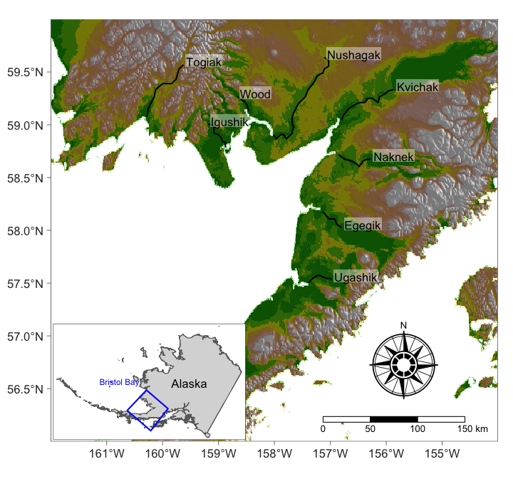

```{r setup1, echo=FALSE}
mypar = function(...){
  par(mar = c(4,4.1,2,2),
      mgp = c(2,0.5,0),
      bty = "l", 
      cex.axis = 1, 
      cex.lab = 1.25, 
      cex.main = 1.25,
      xaxs = 'r',
      yaxs = 'r',
      pch = 16)
}
```

```{css, echo=FALSE}
details > summary {
  padding: 4px;
  background-color: #8F2727;
  color: white;
  border: none;
  box-shadow: 1px 1px 2px #bbbbbb;
  cursor: pointer;
}

details > summary:hover {
  background-color: #DCBCBC;
  color: #8F2727;
}

.scroll-300 {
  max-height: 300px;
  overflow-y: auto;
  background-color: inherit;
}

h1, #TOC>ul>li {
  color: #8F2727;
}

h2, #TOC>ul>ul>li {
  color: #8F2727;
}

h3, #TOC>ul>ul>li {
  color: #8F2727;
}

.list-group-item.active, .list-group-item.active:focus, .list-group-item.active:hover {
    z-index: 2;
    color: #fff;
    background-color: #DCBCBC;
    border-color: #DCBCBC;
}

a {
    color: purple;
    font-weight: bold;
}

a:hover {
    color: #C79999;
}

::selection {
  background: #DCBCBC;
  color: #8F2727;
}

.button_red {
  background-color: #8F2727;
  border: #8F2727;
  color: white;
}

.button_red:hover {
  background-color: #DCBCBC;
  color: #8F2727;
}
```

```{r klippy, echo=FALSE, include=TRUE, message = FALSE, warning = FALSE}
if(!requireNamespace('klippy')){
  remotes::install_github("rlesur/klippy")
}
klippy::klippy(position = c('top', 'right'), color = 'darkred')
```

```{r setup2, include=FALSE}
knitr::opts_chunk$set(
  echo = TRUE,   
  dpi = 150,
  fig.asp = 0.8,
  fig.width = 6,
  out.width = "60%",
  fig.align = "center",
  class.source='klippy')
```

## Exercises and associated data
The data and modelling objects created in this notebook can be downloaded directly to save computational time.
```{r echo=FALSE, message = FALSE, warning = FALSE}
library(downloadthis)
download_dir(
  path = 'tutorial_3_physalia_cache/html/',
  output_name = "Tutorial3_exercise_data",
  button_label = "Click here to download all files needed for exercises",
  button_type = "success",
  has_icon = TRUE,
  icon = "fa fa-download",
  class = "button_red",
  self_contained = FALSE
)
```

<br />
Users who wish to complete the exercises can download a small template `R` script. Assuming you have already downloaded the data objects above, this script will load all data objects so that the steps used to create them are not necessary to tackle the exercises.
```{r echo=FALSE}
download_file(
  path = 'Tutorial3_exercises.R',
  output_name = "Tutorial3_exercises",
  button_label = "Click here to download the exercise R script",
  button_type = "success",
  has_icon = TRUE,
  icon = "fa fa-laptop-code",
  class = "button_red",
  self_contained = FALSE
)
```

## Load libraries and time series data
This tutorial relates to content covered in [Lecture 4](https://nicholasjclark.github.io/physalia-forecasting-course/day3/lecture_4_slidedeck){target="_blank"}, and relies on the following packages for manipulating data, shaping time series, fitting dynamic regression models and plotting:
```{r include = FALSE}
library(dplyr)
library(mvgam) 
library(marginaleffects)
library(tidybayes)
library(ggplot2); theme_set(theme_classic())
```

```{r eval = FALSE, purl = FALSE}
library(dplyr)
library(mvgam) 
library(marginaleffects)
library(tidybayes)
library(ggplot2); theme_set(theme_classic())
```


<br>
The data we will use for this tutorial is spawner-recruit data for sockeye salmon (*Oncorhynchus nerka*) from the Bristol Bay region in Southwest Alaska. Commercial fishermen in Alaska target this important species using seines and gillnets for fresh or frozen fillet sales and canning. Records for the rivers in Bristol Bay span the years 1952-2005, and are maintained within the [RAM Legacy Stock Assessment Database](DOI:10.5281/zenodo.2542919){target="_blank"}. Spawner estimates originated from Bristol Bay Area Annual Management Reports from the Alaska Department of Fish and Game, and are based on in-river spawner counts (including both tower counts and aerial surveys). Age-specific catch rates were calculated from records of catch and escapement according to age class. These data were used to determine the number of recruits in each year. 




### Manipulating data for modelling
Below we process the data, keeping observations for a single river and taking $log(spawners_{t})$ to use as the offset in our models. We also retain two possibly important covariates, `pdo_winter_t2` and `pdo_summer_t2`. These variables, representing the Pacific Decadal Oscillation (PDO) during the salmon’s first year in the ocean (i.e. 2 years prior to sampling), are widely believed to reflect “bottlenecks” to salmon survival in their first year.

```{r model_data, echo=FALSE}
# access the data from the ATSA Github site
load(url('https://github.com/atsa-es/atsalibrary/raw/master/data/sockeye.RData'))
model_data <- xfun::cache_rds(sockeye %>%
  
  # Remove any previous grouping structures
  dplyr::ungroup() %>%
  
  # select the target river
  dplyr::filter(region == "KVICHAK") %>%
  
  # filter the data to only include years when number of spawners
  # was estimated, as this will be used as the offset
  dplyr::filter(!is.na(spawners)) %>%
  
  # log the spawners variable to use as an appropriate offset
  dplyr::mutate(log_spawners = log(spawners)) %>%
  
  # add a 'time' variable
  dplyr::mutate(time = dplyr::row_number()) %>%
  
  # add a series variable (as a factor)
  dplyr::mutate(series = as.factor('sockeye')) %>%
  
  # keep variables of interest
  dplyr::select(time, series, log_spawners, 
                recruits, pdo_summer_t2, pdo_winter_t2))
```

```{r eval=FALSE}
# access the data from the ATSA Github site
load(url('https://github.com/atsa-es/atsalibrary/raw/master/data/sockeye.RData'))
sockeye %>%
  
  # Remove any previous grouping structures
  dplyr::ungroup() %>%
  
  # select the target river
  dplyr::filter(region == "KVICHAK") %>%
  
  # filter the data to only include years when number of spawners
  # was estimated, as this will be used as the offset
  dplyr::filter(!is.na(spawners)) %>%
  
  # log the spawners variable to use as an appropriate offset
  dplyr::mutate(log_spawners = log(spawners)) %>%
  
  # add a 'time' variable
  dplyr::mutate(time = dplyr::row_number()) %>%
  
  # add a series variable (as a factor)
  dplyr::mutate(series = as.factor('sockeye')) %>%
  
  # keep variables of interest
  dplyr::select(time, series, log_spawners, 
                recruits, pdo_summer_t2, pdo_winter_t2) -> model_data
```

The data now contain four variables: 
  `time`, the indicator of which time step each observation belongs to 
  `series`, a factor indexing which time series each observation belongs to  
  `log_spawners`, the logged number of recorded sockeye spawners (in thousands), measured as the number of returning spawners minus catch at each timepoint, which will be used as an offset in models
  `recruits`, the response variable representing the number of estimated sockeye recruits at each timepoint (in thousands)  

Check the data structure
```{r}
head(model_data)
```

```{r}
dplyr::glimpse(model_data)
```

Visualize the data as a heatmap to get a sense of where any `NA`s are distributed (`NA`s are shown as red bars in the below plot)
```{r}
image(
  is.na(t(model_data %>%
            dplyr::arrange(dplyr::desc(time)))), axes = F,
  col = c('grey80', 'darkred')
)
axis(3, 
     at = seq(0,1, len = NCOL(model_data)), 
     labels = colnames(model_data))
```

Plot properties of the time series, which indicate some overdispersion in the recruit count values that we'll have to address
```{r, echo=FALSE, warning=FALSE}
plot_mvgam_series(data = model_data, y = 'recruits')
```

## Posterior simulation in `mvgam`
We will fit a number of models to these data to showcase the various methods that are available to us for evaluating and comparing dynamic GLMs / GAMs. We begin with a model that does not include a dynamic component, as this is always a useful starting point. It also allows us to highlight another useful feature of GLMs / GAMs when modelling count data, as we can include an offset variable that allows us to model *rates of interest*.   
  
Sometimes it is more relevant to model the rate an event occurs per some underlying unit. For example, in epidemiological modelling the interest is often in understanding the number of disease cases per population. But we never get to *observe* this rate directly. An offset allows us to model the underlying rate by [algebraically accounting for variation in the number of possible counts in each observation unit](https://stats.stackexchange.com/questions/11182/when-to-use-an-offset-in-a-poisson-regression){target="_blank"}. This works naturally in models that use a log link function, such as the Poisson and Negative Binomial models. Including an offset is usually straightforward in most `R` modelling software, and indeed this is the case in `mvgam` as well. Here we fit a model with no trend and Poisson observations, including an offset of the `log_spawners` variable that we calculated above so we can estimate the *rate of recruitment per spawner*. Our first model includes smooth functions of `pdo_winter_t2` and `pdo_summer_t2` (including an interaction among the two), along with an offset of `log_spawners` in the linear predictor. As in previous tutorials, only 250 samples per chain are used to keep the size of the resulting object small (though we'd always want to use more samples in a real analysis). Note that this is not a classic density-dependent stock-recruitment model such as the [Ricker or Beverton Holt models](http://derekogle.com/fishR/examples/oldFishRVignettes/StockRecruit.pdf){target="_blank"}. Rather, this model very simplistically assumes recruits can increase without bound as a function of the number of spawners.
```{r model1, include = FALSE}
model1 <- xfun::cache_rds(mvgam(
  recruits ~ offset(log_spawners) +
    s(pdo_winter_t2, 
      k = 3, 
      bs = 'cr') +
    s(pdo_summer_t2, 
      k = 3, 
      bs = 'cr') +
    ti(pdo_winter_t2,
       pdo_summer_t2,
       k = 3,
       bs = 'cr'),
  family = poisson(),
  trend_model = 'None',
  data = model_data,
  burnin = 750,
  samples = 250
))
```

```{r eval = FALSE}
model1 <- mvgam(
  recruits ~ offset(log_spawners) +
    s(pdo_winter_t2, 
      k = 3, 
      bs = 'cr') +
    s(pdo_summer_t2, 
      k = 3, 
      bs = 'cr') +
    ti(pdo_winter_t2,
       pdo_summer_t2,
       k = 3,
       bs = 'cr'),
  family = poisson(),
  trend_model = 'None',
  data = model_data,
  samples = 250
)
```

The model summary is shown below, which indicates there are no major sampling issues to worry about. It also suggests that the interaction among the two covariates is highly wiggly and important in the model (as are the main effects)
```{r Summarise the fitted model, class.output="scroll-300"}
summary(model1)
```
  
The inclusion of the offset is important if we wish to make predictions on the scale of the observations. This is because there will be no regression coefficient assigned to this variable (it's coefficient is fixed at 1). If you wish to manually make predictions, you'll need to take care to include the offset. This is returned as an attribute of the linear predictor matrix when we call `predict.gam` on the underlying `mgcv` model:
```{r}
lpmatrix <- predict(model1$mgcv_model, type = 'lpmatrix')
attr(lpmatrix, 'model.offset')
```

`mvgam` makes this process straightforward using the `predict.mvgam()`, which is then used by many other functions in the package including `plot_predictions()`, `draw()`, `hindcast()` and `forecast()`. It is also used by `conditional_effects()`, which is one of the first functions you will likely use after fitting a model in `mvgam`. This function acts as a wrapper to the more flexible `plot_predictions()` and can give a quick overview of the "main" effects in a model's regression formulae. It displays all combinations up to two-way interactions. See `?conditional_effects.mvgam` for guidance.
```{r}
conditional_effects(
  model1, 
  type = 'link'
)
```

I usually recommend you use `type = 'link'` or `type = 'expected'` when plotting these, as the default `type = 'response'` can sometimes make it hard to see patterns for certain response families. But because we used a Poisson family, the patterns won't change too much between the default `type = 'response'` and `type = 'expected'` (apart from wider uncertainty bands):
```{r}
conditional_effects(
  model1, 
  type = 'expected'
)
```

```{r}
conditional_effects(
  model1, 
  type = 'response'
)
```

Although `conditional_effects()` is great for getting a quick overview, you will often need to move to `plot_predictions()`, `plot_slopes()`, and various `comparisons()` functions so that you can get the key combinations of predictor values that you are after. For example, we can plot the *conditional* effects of the two covariates using `plot_predictions()`. This function will internally call the `datagrid()` function from `marginaleffects` to generate a data grid of user-specified values to be supplied as `newdata` to `mvgam`'s `predict()` function. By defauls, any other numeric covariates will be set to `0`, and any other factor variables will be set to their first levels. To get a sense of what this looks like, let's generate a few grids. First, we will make a grid using the minimum and maximum values of `pdo_winter_t2`. Notice how all other values in the grid are identical across the rows of the grid:
```{r}
datagrid(
  pdo_winter_t2 = range,
  model = model1
)
```

We can make this grid as simple or as fancy as we want. Here we will provide a set sequence of values for `pdo_winter_t2`:
```{r}
datagrid(
  pdo_winter_t2 = c(-2, -1, 0, 1, 2),
  model = model1
)
```

This same logic can easily be extended to multiple predictors:
```{r}
datagrid(
  pdo_winter_t2 = c(-2, -1, 0, 1, 2),
  pdo_summer_t2 = c(-3, 3),
  model = model1
)
```

In the above, you can see how we get a grid with every possible *combination* of predictors. See `?marginaleffects::datagrid` for details of some of the other things you can do when making these fake data grids. When we call `plot_predictions()` and pass variables to the `condition` or `by` arguments, a `datagrid` is being created internally to automatically allow us to inspect the kinds of effects we'd like to look at. For example, supplying one of the two covariates to the `condition` argument will set up a grid using a fine sequence of fake values for the covariate of interest, while setting the other covariate to zero. This allows us to produce a smooth plot of predictions across the range of observed values for the specified covariate:
```{r}
plot_predictions(
  model1,
  condition = 'pdo_winter_t2',
  type = 'expected'
)
plot_predictions(
  model1,
  condition = 'pdo_summer_t2',
  type = 'expected'
)
```

Supplying more than one covariate to the `condition` argument will set up more in-depth visualisations:
```{r}
plot_predictions(
  model1,
  condition = c('pdo_summer_t2',
                'pdo_winter_t2'),
  type = 'expected'
)
```

Alternatively, we can supply covariates to the `by` argument. This will only used those values that were actually observed in the original data, rather than making a sequence of fake values. This can be very handy for looking at hindcast distributions from some of our models by passing `time` to the `by` argument. Adding a non-zero value for the `points` argument will show the observed data points
```{r, warning=FALSE}
plot_predictions(
  model1,
  by = 'time',
  points = 0.5
)
```

The `plot_slopes()` function is also highly useful, in this case for understanding how a nonlinear effect changes over the space of a covariate (i.e. what is the first derivative of the function over a grid of covariate values).
```{r}
plot_slopes(
  model1,
  variables = 'pdo_summer_t2',
  condition = 'pdo_summer_t2',
  type = 'link'
) +
  geom_hline(yintercept = 0,
             linetype = 'dashed')
```

There are many more extended uses of `predict.mvgam()`. For example, we can compute how many *more* recruits this model would expect to see if there were 5,000 spawners recorded vs if there were only 3,000 spawners recorded. We will full advantage of the `avg_comparisons()` function from `marginaleffects` to do this. As with `plot_predictions()`, this function will internally set up a `datagrid` that will be passed to `predict.mvgam()` to capture exactly what we are after. Specifically, this `datagrid` will fix the covariates to zero so that the two scenarios (3,000 spawners vs 5,000 spawners) are directly comparable. It will then make a *comparison* between these predictions, and it will do this many times using draws from the model's Bayesian posterior distribution. The default comparison is to take the difference between the two scenarios. See `?marginaleffects::avg_comparisons` for details.
```{r}
# take draws from the model that compute the average comparison between
# spawners recorded at 5,000 vs 3,000 (be sure to log first!)
post_contrasts <- avg_comparisons(
  model1, 
  variables = list(log_spawners = log(c(3000, 5000))),
  type = 'expected'
) %>%
  posterior_draws() 
head(post_contrasts)
```

Each row of the returned object gives us one posterior draw of this comparison. We can plot the distribution of these comparisons using the `tidybayes` package:
```{r}
# use the resulting posterior draw object to plot a density of the 
# posterior contrasts
post_contrasts %>%
  ggplot(aes(x = draw)) +
  
  # use the stat_halfeye function from tidybayes for a nice visual
  stat_halfeye(fill = "#C79999") +
  labs(
    x = "(spawners = 5,000) − (spawners = 3,000)", 
    y = "Density", 
    title = "Average posterior contrast"
  ) +
  theme_classic()
```

### Posterior predictive checks
Posterior predictive checks are useful for understanding how well your model can capture particular features of your observed data. In `mvgam`, the `pp_check()` function is particularly helpful as it relies on the very broad range of checking functions that are available in `bayesplot`. For example, we can plot a density kernel of our observed counts and overlay simulated kernels from our model. These simulated kernels are generated using `predict.mvgam()`, so they are informative for all `mvgam` models (regardless of whether or not the model included dynamic components).
```{r, warning=FALSE}
pp_check(
  model1, 
  type = 'dens_overlay', 
  ndraws = 100
)
```

This model is not really capturing the shape of the observed data. We can confirm this behaviour by comparing observed vs simulated CDFs. What else might we need to do to improve this model?
```{r, warning=FALSE}
pp_check(
  model1, 
  type = 'ecdf_overlay', 
  ndraws = 100
)
```

There are many other types of posterior predictive checks that can be implemented, and it is highly recommended that you design some to suit your own specific needs (i.e., what aspect(s) of the data are you most concerned with your model being able to adequately capture?). See `?mvgam::ppc_check` for details of other kinds of plots you can make.

Of course we should look more closely at the residuals for any unmodelled temporal autocorrelation
```{r}
plot(
  model1,
  type = 'residuals'
)
```


### Model expansion

Back to the modelling strategy. There are still some patterns in the residuals, including substantial autocorrelation and an apparent mis-specification of the dispersion in the data. We need a dynamic model to capture this autocorrelation, so we will add an AR1 model for the residuals. But we also need to think about the dispersion in the data. A Negative Binomial may be better here, as it can handle count values that distribute beyond what a Poisson can handle.
```{r model2, include = FALSE}
model2 <- xfun::cache_rds(mvgam(
  recruits ~ 
    offset(log_spawners) +
    s(pdo_winter_t2, 
      k = 3, 
      bs = 'cr') +
    s(pdo_summer_t2, 
      k = 3, 
      bs = 'cr') +
    ti(pdo_winter_t2,
       pdo_summer_t2,
       k = 3,
       bs = 'cr'),,
  family = nb(),
  trend_model = AR(),
  noncentred = TRUE,
  data = model_data
),dir = 'cache_not_for_upload/')
```

```{r eval = FALSE}
model2 <- mvgam(
  recruits ~ 
    offset(log_spawners) +
    s(pdo_winter_t2, 
      k = 3, 
      bs = 'cr') +
    s(pdo_summer_t2, 
      k = 3, 
      bs = 'cr') +
    ti(pdo_winter_t2,
       pdo_summer_t2,
       k = 3,
       bs = 'cr'),,
  family = nb(),
  trend_model = AR(),
  noncentred = TRUE,
  data = model_data
)
```

Because this model has a dynamic trend component, it is worth quickly revisiting the differences between the `predict.mvgam()` function and the `hindcast.mvgam()` / `forecast.mvgam()` functions. First, we investigate how ignoring the uncertainty in the trend component changes the predictions. In this step, we calculate predictions for the observed time period in two ways: first we average over the uncertainty from the latent trend (using `process_error = TRUE`). This will essentially give us a prediction where we include the random effect of the latent process model, but assume that we have a different possible sample from that random effect distribution at each time point. Second, we use `process_error = FALSE` to give predictions that essentially ignore the random effects from the latent process. Plotting both of these together shows how our prediction uncertainty changes when we include the uncertainty in the dynamic trend component. A crucial detail to understand here is that the `predict.mvgam()` only uses the covariates from the model formulae, so in this case it does not account for the actual 'times' of the data. Rather it assumes the dynamic process has reached stationarity and simply samples from the following distribution for the trend: $z_t \sim Normal(0, \sigma_{error})$
```{r fig.asp = 0.6}
# calculate predictions for the training data by including 
# the dynamic process uncertainty without estimating the actual
# latent states
ypreds <- predict(
  model2, 
  type = 'response', 
  process_error = TRUE, 
  summary = FALSE
)

# calculate 95% empirical quantiles of predictions
cred <- sapply(
  1:NCOL(ypreds),
  function(n) 
    quantile(ypreds[,n],
             probs = c(0.025, 0.975), 
             na.rm = T)
)
pred_vals <- 1:NCOL(ypreds)

# graphical plotting parameters
layout(matrix(1:2, ncol = 2))
par(mar = c(2.5, 2.3, 2, 2),
    oma = c(1, 1, 0, 0),
    mgp = c(1.5, 0.5, 0))

# plot credible intervals    
plot(
  1, 
  type = "n", 
  bty = 'L',
  xlab = 'Time',
  ylab = 'predict() predictions',
  xlim = c(min(pred_vals), 
           max(pred_vals)),
  ylim = c(min(cred, na.rm = T),
           max(cred, na.rm = T))
)
polygon(
  c(pred_vals, rev(pred_vals)), 
  c(cred[1,], rev(cred[2,])),
  col = 'darkred', 
  border = NA
)

# now repeat, but this time ignore uncertainty in the dynamic component
ypreds2 <- predict(
  model2, 
  type = 'response', 
  process_error = FALSE, 
  summary = FALSE
)
cred2 <- sapply(
  1:NCOL(ypreds),
  function(n) 
    quantile(ypreds2[,n],
             probs = c(0.025, 0.975), 
             na.rm = T)
)

# overlay these predictions as a lighter colour
polygon(
  c(pred_vals, rev(pred_vals)), 
  c(cred2[1,], rev(cred2[2,])),
  col = "#DCBCBC", 
  border = NA
)

# overlay the actual observations as well
points(
  model_data$recruits, 
  pch = 16, 
  cex = 0.8, 
  col = 'white'
)
points(
  model_data$recruits, 
  pch = 16, cex = 0.65
)
box(bty = 'l', lwd = 2)

# now plot the actual hindcasts, which did not assume the process was 
# stationary but instead modelled the latent states over the training time.
# use the same y-axis limits to see how these plots differ
plot_mvgam_fc(
  model2, 
  ylim = c(min(cred, na.rm = T),
           max(cred, na.rm = T)),
  ylab = 'hindcast() predictions'
)
layout(1)
```

As you can see, the predictions differ. The `plot_mvgam_fc()` function, which uses the same prediction steps as `hindcast()` and `forecast()` functions, *uses the actual estimates of the latent temporal states*. These predictions will nearly always "fit the data better", but they might not be as useful for scenario-planning. Sometimes we'd rather get a sense of how predictions might change *on average* if some external conditions changed, for example if temperature were to increase by x degrees or if we were to sample from a new group for a random effect. For exploring these types of scenarios, the prediction-based functions (i.e. `predict()`, `plot_predictions()`, `conditional_effects()`, `pp_check()` etc...) are more useful because they *do not use the actual estimates of the latent states*.  
  

### Exercises
1. Plot a histogram of `model1`'s posterior intercept coefficients $\alpha$. Use `?mvgam::as.data.frame.mvgam` for guidance
2. Plot a scatterplot of `recruits` vs `log_spawners` using the supplies `model_data`. Take a few notes on whether you think our primary modelling assumption, that the number of log(`recruits`) scales linearly with number of `log_spawners`, is justified.

<details>
<summary>Check here if you're having trouble extracting the intercept posterior</summary>
```{r, eval = FALSE}
# Replace the ? with the correct value(s)
# check names of variables that can be extracted
vars_available <- variables(model1)

# we are interested in the observation model coefficients
vars_available$observation_betas

# extract the intercepts using the as.data.frame.mvgam function
# you will have two options for extracting this variable. first, you
# can use the alias
alphas <- as.data.frame(model1, variable = ?)

# alternatively, use the original name
alphas <- as.data.frame(model1, variable = ?)

# plot a histogram
hist(alphas[,1], xlab = expression(alpha),
     main = '', col = 'darkred', border = 'white')
```
</details>

## Comparing dynamic models

Now on to the topic of model comparisons. Plot Dunn-Smyth residuals for this dynamic model to see that there is no more autocorrelation
```{r}
plot(
  model2, 
  type = 'residuals'
)
```

However we must be cautious interpreting these residuals because the AR1 trend model is extremely flexible. The in-sample fits can sometimes be nearly perfect, meaning the residuals will very often look excellent! We can confirm this behaviour by inspecting hindcasts
```{r, warning=FALSE}
hcs <- hindcast(model2)
plot(hcs)
```

But PPCs can still give valid insights into model inadequacy:
```{r, warning=FALSE}
pp_check(
  model2, 
  type = 'dens_overlay',
  ndraws = 100
)
```

```{r, warning=FALSE}
pp_check(
  model2, 
  type = 'ecdf_overlay',
  ndraws = 100
)
```

These plots show that the model clearly gives a better fit to the data compared to the Poisson model above. But there are some more worrying and pressing matters we can address with this model. Inspect the summary to see what I mean:
```{r class.output="scroll-300"}
summary(model2)
```

The HMC sampler is telling us there are some issues when trying to implement both a flexible latent dynamic process AND an overdispersion parameter. Both of these components are competing to capture the extra dispersion in the observations, leading to low effective sample sizes and poor convergence for the overdispersion parameter $\phi$. As the `summary()` suggests, it is useful to look at estimates for these parameters using the diagnostic functions `pairs()` and `mcmc_plot()`:
```{r}
pairs(
  model2,
  variable = c('phi',
               'sigma'),
  regex = TRUE
)
```

The "funnel" shape in the top-right shows that $\sigma$ can only be estimated freely when $\phi$ gets a bit larger. As $\phi$ becomes small, the Negative Binomial distribution has more flexibility to capture dispersion and so there is less need for a flexible latent process model. But when $\phi$ becomes large, the Negative Binomial starts to behave like a Poisson and there is more need for a flexible latent process, hence the need for a larger $\sigma$. This makes it challenging to estimate both simultaneously:
```{r}
mcmc_plot(
  model2,
  variable = c('phi',
               'sigma'),
  regex = TRUE,
  type = 'combo'
)
```

We now have several options:   
    
1. Use containment priors to restrict one or both of the processes (i.e. pull the overdispersion parameter towards very large values to make the observations behave like a Poisson a priori)   
  
2. Keep the Negative Binomial observation model and use a smooth trend, such as a Gaussian Process or a Piecewise Logistic  
  
3. Drop the Negative Binomial observation model (using a Poisson instead) and use a flexible Autoregressive trend    

Here we will illustrate the latter two options. First, we try the Negative Binomial observation model with a smooth Piecewise Logistic function for the trend. This trend model can be useful for population dynamics as it follows one of ecology's classic population growth models. However, we must supply a value for the carrying capacity of the trend process. Here we will assume the maximum value the logistic growth trend could take is the same as the maximum value that the latent AR1 process from `model2` took. Note that we also must suppress the intercept in the formula because piecewise trends have their own intercept parameters.
```{r}
model_data$cap <- exp(
  max(hindcast(model2, 
               type = 'trend')$hindcasts$sockeye)
)
```

```{r model3, include = FALSE}
model3 <- xfun::cache_rds(mvgam(
  recruits ~ 
    offset(log_spawners) +
    s(pdo_winter_t2, 
      k = 3, 
      bs = 'cr') +
    s(pdo_summer_t2, 
      k = 3, 
      bs = 'cr') +
    ti(pdo_winter_t2,
       pdo_summer_t2,
       k = 3,
       bs = 'cr') - 1,
  family = nb(),
  priors = c(prior(std_normal(),
                   class = m_trend)),
  trend_model = PW(growth = 'logistic'),
  data = model_data
),dir = 'cache_not_for_upload/')
```

```{r eval = FALSE}
model3 <- mvgam(
  recruits ~ 
    offset(log_spawners) +
    s(pdo_winter_t2, 
      k = 3, 
      bs = 'cr') +
    s(pdo_summer_t2, 
      k = 3, 
      bs = 'cr') +
    ti(pdo_winter_t2,
       pdo_summer_t2,
       k = 3,
       bs = 'cr') - 1,
  family = nb(),
  trend_model = PW(growth = 'logistic'),
  data = model_data
)
```

Next we use a Poisson observation model with a AR1 trend
```{r model4, include = FALSE}
model4 <- xfun::cache_rds(mvgam(
  recruits ~ 
    offset(log_spawners) +
    s(pdo_winter_t2, 
      k = 3, 
      bs = 'cr') +
    s(pdo_summer_t2, 
      k = 3, 
      bs = 'cr') +
    ti(pdo_winter_t2,
       pdo_summer_t2,
       k = 3,
       bs = 'cr'),
  family = poisson(),
  # use explicit prior on intercept to avoid
  # recompilation during lfo_cv()
  priors = prior(normal(0.5, 0.5),
                 class = Intercept),
  trend_model = AR(),
  noncentred = TRUE,
  data = model_data
), dir = 'cache_not_for_upload/')
```

```{r eval = FALSE}
model4 <- mvgam(
  recruits ~ 
    offset(log_spawners) +
    s(pdo_winter_t2, 
      k = 3, 
      bs = 'cr') +
    s(pdo_summer_t2, 
      k = 3, 
      bs = 'cr') +
    ti(pdo_winter_t2,
       pdo_summer_t2,
       k = 3,
       bs = 'cr'),
  family = poisson(),
  trend_model = AR(),
  noncentred = TRUE,
  data = model_data
)
```

Neither of these models has any major issues with sampling, which is a good sign!
```{r class.output="scroll-300"}
summary(model3)
```

```{r class.output="scroll-300"}
summary(model4)
```

But hindcasts and trend estimates are very different for the two models:
```{r}
plot(
  model3, 
  type = 'trend'
)
```

```{r}
plot(
  model4, 
  type = 'trend'
)
```

```{r, warning=FALSE}
plot(
  hindcast(model3)
)
```

```{r, warning=FALSE}
plot(
  hindcast(model4)
)
```

### Approximate Leave-One-Out CV
Here the extreme flexibility of the AR1 trend is apparent in the hindcasts for `model4`. Hopefully this gives you more of an idea about why we can't put too much faith in residual or fitted value diagnostics for these flexible dynamic models. Ok so we cannot use in-sample fits or residual diagnostics to guide reasonable comparisons of these two models. It would be more appropriate to use 1-step ahead residuals for interrogation. But computing these is extremely computationally demanding. How then can we compare models? Using `loo_compare()`, we can ask which model would likely give better predictions for new data *within the training set*. This method of approximating leave-one-out prediction error (using a method called Pareto Smoothed Importance Sampling (PSIS)) is widely-used for comparing Bayesian models, and is generally interpreted in the same way that AIC comparisons can be interpreted:

```{r message=FALSE, warning=FALSE}
loo_compare(
  model3,
  model4
)
```

The AR1 / Poisson model is strongly favoured here, yielding much higher values of the [Expected Log Predictive Density (ELPD; also known as the log score)](https://link.springer.com/article/10.1007/s11222-016-9696-4){target="_blank"}. This is one useful metric for choosing among models, but we'd also like to compare them on their abilities to predict *future* out of sample data. 

### Approximate Leave-Future-Out CV
`mvgam` includes functions that facilitate leave-future-out comparisons. Time series models are often evaluated using an expanding window training technique, where the model is initially trained on some subset of data from $t = 1$ to $t = n_{train}$, and then is used to produce forecasts for the next $h$ time steps $(t = n_{train} + h)$. In the next iteration, the size of training data is expanded by a single time point and the process repeated. This is obviously computationally challenging for Bayesian time series models, as the number of refits can be very large. `mvgam` uses an approximation based on importance sampling. Briefly, we refit the model using the first $min_t$ observations to perform a single exact $h~ahead$ forecast step. This forecast is evaluated against the $min_t + h$ out of sample observations using the ELPD as with the LOO comparisons above. Next, we approximate each successive round of expanding window forecasts by moving forward one step at a time $for~i~in~1:N_{evaluations}$ and re-weighting draws from the model’s posterior predictive distribution using PSIS. In each iteration $i$, PSIS weights are obtained for all observations that would have been included in the model if we had re-fit. If these importance ratios are stable, we consider the approximation adequate and use the re-weighted posterior’s forecast for evaluating the next holdout set of testing observations $((min_t + i + 1):(min_t + i + h))$. This is similar to the process of particle filtering to update forecasts in light of new data by re-weighting the posterior draws using importance weights. But at some point the importance ratio variability will become too large and importance sampling will be unreliable. This is indicated by the estimated shape parameter k of the generalized Pareto distribution crossing a certain threshold `pareto_k_threshold`. Only then do we refit the model using all of the observations up to the time of the failure. We then restart the process and iterate forward until the next refit is triggered. The process, which is implemented using the `lfo_cv()` function, is computationally much more efficient, as only a fraction of the evaluations typically requires refits (the algorithm is described in detail by [Bürkner et al. 2020](https://www.tandfonline.com/doi/full/10.1080/00949655.2020.1783262){target="_blank"}).  
  
Run the approximator for the first model, setting `min_t = 20` and using a forecast horizon of `fc_horizon = 2`
```{r lfo_gp, include = FALSE}
lfo_pw <- xfun::cache_rds(lfo_cv(model3, 
                                 min_t = 20, 
                 fc_horizon = 2, 
                 n_cores = 4),
                dir = 'cache_not_for_upload/')
```

```{r eval = FALSE}
lfo_pw <- lfo_cv(
  model3, 
  min_t = 20, 
  fc_horizon = 2, 
  n_cores = 4
)
```

The `S3` plotting function for these `lfo_cv` objects will show the Pareto-k values and ELPD values over the evaluation time points. For the Pareto k plot, a dashed red line indicates the specified threshold chosen for triggering model refits. For the ELPD plot, a dashed red line indicates the bottom 10% quantile of ELPD values. Points below this threshold may represent outliers that were more difficult to forecast
```{r}
plot(lfo_pw)
```

The top plot (the Pareto k plot) indicates that we only needed one additional refit to give good approximate predictions for the Piecewise / Negative Binomial model
```{r lfo_rw, include = FALSE}
lfo_ar <- xfun::cache_rds(lfo_cv(model4, min_t = 20,
                 fc_horizon = 2, n_cores = 4),
                dir = 'cache_not_for_upload/')
```

```{r eval = FALSE}
lfo_ar <- lfo_cv(
  model4, 
  min_t = 20, 
  fc_horizon = 2, 
  n_cores = 4
)
```

```{r}
plot(lfo_ar)
```

The Poisson / AR model, in contrast, needed to be refit many times to ensure the stability of importance-weighted predictions. We would generally expect more refits for this model as the underlying trend has less "memory" than the piecewise trend, so its forecasts could become irrelevant more quickly as a result.
   
Compare ELPDs for the two models using all nonmissing evaluation timepoints by plotting the differences in their scores. This plot will give us an indication if one model is consistently giving better h-step ahead forecasts when trained on successively more data
```{r}
# determine which timepoints were not missing in the evaluation set
nonmiss_evalpoints <- which(
  !is.na(model_data$recruits[22:NROW(model_data)])
)

# plot the PW ELPD values minus the AR ELPD values
# values will be > 0 if the PW model gave better predictions
# (ELPD is better when larger)
pw_minus_ar <- lfo_pw$elpds[nonmiss_evalpoints] - 
  lfo_ar$elpds[nonmiss_evalpoints]
plot(
  pw_minus_ar,
  ylab = 'PW - AR ELPD',
  xlab = 'Time point',
  pch = 16, 
  bty = 'l',
  cex = 1,
  col = 'white',
  xaxt = 'n'
)
axis(
  side = 1, 
  at = nonmiss_evalpoints,
  labels = lfo_pw$eval_timepoints[nonmiss_evalpoints]
)
abline(
  h = 0, 
  lty = 'dashed', 
  lwd = 2
)

# show all ELPD comparisons in black
points(
  pw_minus_ar, 
  pch = 16, 
  cex = 0.95
)

# highlight the comparisons for when the PW predictions were better
points(
  ifelse(pw_minus_ar > 0, pw_minus_ar, NA), 
  pch = 16, 
  cex = 0.95, 
  col = 'darkred'
)
```

The Piecewise / Negative Binomial model tends to give better probabilistic predictions throughout the leave-future-out exercise. This result disagrees with results from the in-sample comparison using `loo()` above. This can often happen when comparing models based on in-sample fits vs out-of-sample prediction performance, but I would tend to favour the out-of-sample metrics more given that we are working with a time series here.

### Exact Leave-Future-Out CV

If we have enough computational power and our model is simple / small enough, it can often be worthwhile to compute exact leave-future-out forecasts. The `update.mvgam()` function makes this relatively simple to do in `mvgam()`, as all we need to do is supply the new testing and training datasets and the model will be updated. Below I show how to do this for our chosen model (`model3`) by splitting on timepoint 36 to create training and testing data.
```{r data_train, echo = FALSE}
data_train <- xfun::cache_rds(model_data %>%
  dplyr::filter(time <= 36))
```

```{r data_test, echo = FALSE}
data_test <- xfun::cache_rds(model_data %>%
  dplyr::filter(time > 36))
```

```{r eval=FALSE}
data_train = model_data %>%
  dplyr::filter(time <= 36)
data_test = model_data %>%
  dplyr::filter(time > 36)
```

Now refit the model using the `update.mvgam()` function. Note that you can supply an argument to state `lfo = TRUE` if you wish to ignore the computation of residuals and lighten the final model. This can be helpful if all you plan to do is compare forecasts, as it will make repeated calls to the `update()` function faster. See `?mvgam::update.mvgam` for more details
```{r model3_exact, include = FALSE}
model3_exact <- xfun::cache_rds(update(model3, 
                       data = data_train,
                       newdata = data_test,
                       lfo = TRUE))
```

```{r eval=FALSE}
model3_exact <- update(
  model3, 
  data = data_train,
  newdata = data_test,
  lfo = TRUE
)
```

Once this model is finished, we are ready to compute exact forecast evaluations. The first step in this process is to create an object of class `mvgam_forecast` using the `forecast.mvgam()` function:
```{r fc, include = FALSE}
fc <- xfun::cache_rds(forecast(model3_exact))
```

```{r eval = FALSE}
fc <- forecast(model3_exact)
```

We've seen this class before when calling the `hindcast.mvgam()` or `forecast.mvgam()` functions. But we haven't looked in-depth at the other ways we can use objects of this class. A primary purpose is to readily allow forecast evalutions for each series in the data, using a variety of possible scoring functions. See `?mvgam::score.mvgam_forecast` to view the types of scores that are available. For these data, which have very large counts, a useful scoring metric is the [Continuous Rank Probability Score (CRPS)](https://www.annualreviews.org/doi/10.1146/annurev-statistics-062713-085831){target="_blank"}. A CRPS value is similar to what we might get if we calculated a weighted absolute error using the full forecast distribution.
```{r}
scores <- score(
  fc, 
  score = 'crps'
)
scores$sockeye
```

The returned `data.frame` now shows the CRPS score for each evaluation in the testing data, along with some other useful information about the fit of the forecast distribution. In particular, we are given a logical value (1s and 0s) telling us whether the true value was within a pre-specified credible interval (i.e. the coverage of the forecast distribution). The default interval width is 0.9, so we would hope that the values in the `in_interval` column take a 1 approximately 90% of the time. This value can be changed if you wish to compute different coverages, say using a 60% interval:
```{r}
scores <- score(
  fc, 
  score = 'crps', 
  interval_width = 0.6
)
scores$sockeye
```

Although we would prefer to use distributional forecast evaluations, point evaluations are also possible using outputs from the `forecast.mvgam()` function. For example, we can calculate the Mean Absolute Percentage Error (MAPE), which is a commonly used metric to evaluate point forecasts when the scales of the time series vary quite a lot:
```{r}
# exctract the true values from the test set
truth <- fc$test_observations$sockeye

# calculate mean prediction values for each column in the forecast matrix
mean_fc <- apply(
  fc$forecasts$sockeye, 
  2, 
  mean
)

# calculate the absolute percentage errors, which are scaled by the 
# value of the truths. Note that we only use the first 7 observations
# in the test set because the rest are NA
p <- abs(
  100 * (
    (truth[1:7] - mean_fc[1:7]) / 
      mean_fc[1:7]
  )
)

# take the mean of the absolute percentage errors
mean(p)
```

As I always recommend, it is so helpful to the developers that dedicate much of their time to bringing us this software if we acknowledge them through appropriate citations. The piecewise models in particular deserve to be properly cited because they build on contributions from a number of helpful sources. Use `how_to_cite()` to make this task easier:
```{r}
how_to_cite(model3)
```

### Exercises
1. Calculate the Root Mean Squared Error (RMSE) for posterior mean predictions from the `fc` object using the formula provided by [Hyndman and Athanasopoulos](https://otexts.com/fpp3/accuracy.html){target="_blank"}
2. Roll the training data one timepoint forward and refit `model3` (i.e. split the data on timepoint 37 rather than 36). Compare CRPS values from this model to the previous refit to see whether the scores for timepoints 38-43 have changed when conditioning on the extra information in timepoint 37 
3. Consider watching the below video by [Rob Hyndman](https://research.monash.edu/en/persons/rob-hyndman){target="_blank"} on evaluating distributional forecasts

<center>
<div style="display: flex; justify-content: center;">
<iframe style="aspect-ratio: 16 / 9; width: 100% !important;" src="https://www.youtube.com/embed/prZH2TyrRYs?start=1" data-external = "1" title="YouTube video player" frameborder="0" allow="accelerometer; autoplay; clipboard-write; encrypted-media; gyroscope; picture-in-picture; web-share" referrerpolicy="strict-origin-when-cross-origin" allowfullscreen></iframe>
</div>
</center>

## Session Info
```{r, class.output="scroll-300"}
sessionInfo()
```


