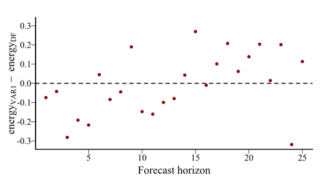

```{r setup, include=FALSE, cache=FALSE}
options(htmltools.dir.version = FALSE)
knitr::opts_chunk$set(cache = FALSE, dev = 'svg', echo = TRUE,
                      message = FALSE, warning = FALSE,
                      fig.align = 'center',
                      fig.height = 5.1, fig.width = 1.9 * 5.1)
library('mgcv')
library('mvgam')
library('gratia')
library('ggplot2')
library('ggborderline')
library('viridis')
library('gamair')
library('kableExtra')
```

```{r xaringan-panelset, echo=FALSE}
xaringanExtra::use_panelset()
xaringanExtra::style_panelset_tabs(foreground = '#8F2727',
                                   inactive_opacity = 0.8)
```

```{r xaringan-animate-css, echo=FALSE}
xaringanExtra::use_animate_css()
```

```{r xaringanExtra-clipboard, echo=FALSE}
xaringanExtra::use_clipboard()
```

```{r xaringan-tile, echo=FALSE}
xaringanExtra::use_tile_view()
```


```{r setup II, echo = FALSE}
c_light <- c("#DCBCBC")
c_light_highlight <- c("#C79999")
c_mid <- c("#B97C7C")
c_mid_highlight <- c("#A25050")
c_dark <- c("#8F2727")
c_dark_highlight <- c("#7C0000")

theme_set(theme_bw(base_size = 12, base_family = 'serif'))
options(ggplot2.discrete.colour = c("#B97C7C",
                              "#A25050",
                              "#8F2727",
                              "#630000"),
        ggplot2.discrete.fill = c("#B97C7C",
                            "#A25050",
                            "#8F2727",
                            "#630000"))

multipar = function(...){
  par(family = "serif", 
    bty = "l", 
    cex.axis = 1.1, 
    cex.lab = 1.1, 
    cex.main = 1.3,
    xaxs = 'r',
    yaxs = 'r',
    pch = 16)
}

mypar = function(...){
  par(family = "serif", 
      las = 1, 
      mar=c(4,4.1,2,2),
      mgp = c(2,0.5,0),
      bty = "l", 
      cex.axis = 1.25, 
      cex.lab = 1.5, 
      cex.main = 1.5,
      xaxs = 'r',
      yaxs = 'r',
      pch = 16)
}

myparsmall = function(...){
  par(family = "serif", 
      las = 1, 
      mgp = c(4, 1, 0),
      mar=c(5,6,2,2),
      bty = "l", 
      cex.axis = 1.85, 
      cex.lab = 2.75, 
      cex.main = 2.75,
      xaxs = 'r',
      yaxs = 'r',
      pch = 16)
}

myhist = function(x, 
                  xlim,
                  xlab = '',
                  main = '',
                  big = TRUE){

  if(big){
      mypar()
  } else {
      myparsmall()
  }

  if(missing(xlim)){
    xlim <- range(x, na.rm = TRUE)
  }
  
  hist(x, 
       xlim = xlim,
       yaxt = 'n',
       xlab = xlab,
       ylab = '',
       col = c_mid_highlight,
       border = 'white',
       lwd = 2,
       breaks = 20,
       main = main)
}

mybar = function(x, 
                  xlab = '',
                  main = '',
                  big = TRUE){

  if(big){
      mypar()
  } else {
      myparsmall()
  }
  
  barplot(table(x),
          yaxt = 'n',
          xlab = xlab,
          border = NA,
       ylab = '',
       col = c_mid_highlight,
       lwd = 2,
       main = main)
  axis(1, labels = NA, tck=0, lwd =2)
}

mylines = function(x, xlab = '', 
                   ylim,
                   ylab = '',
                   big = TRUE){

  if(big){
      mypar()
  } else {
      myparsmall()
  }
  
  if(missing(ylim)){
      plot(x = x, 
       type = 'l',
       col = c_dark_highlight,
       lwd = 3.5,
       bty = 'l',
       xlab = xlab,
       ylab = ylab)
  } else {
      plot(x = x, 
       ylim = ylim,
       type = 'l',
       col = c_dark_highlight,
       lwd = 3.5,
       bty = 'l',
       xlab = xlab,
       ylab = ylab)
  }

  box(bty = 'l', lwd = 2)
}

myscatter = function(x, 
                     y, 
                     xlab = '', 
                     ylab = '', 
                     big = TRUE){
  
    if(big){
      mypar()
  } else {
      myparsmall()
  }

  plot(x = x, 
       y = y, 
       pch = 21,
       bg = c_dark,
       col = 'white',
       cex = 2,
       bty = 'l',
       xlab = xlab,
       ylab = ylab)
  box(bty = 'l', lwd = 2)
}
```


## Workflow

Press the "o" key on your keyboard to navigate among slides

Access the [tutorial html here](https://nicholasjclark.github.io/physalia-forecasting-course/day4/tutorial_4_physalia)
- Download the data objects and exercise `r fontawesome::fa("r-project", fill = "steelblue")` script from the html file
- Complete exercises and use Slack to ask questions

Relevant open-source materials include:
- [GAMs for time series](https://youtu.be/Ukfvd8akfco?si=tlmSm2-51ZZ1wQf6)
- [Smoothed dynamic factor analysis for identifying trends in multivariate time series](https://besjournals.onlinelibrary.wiley.com/doi/full/10.1111/2041-210X.13788)
- [Multivariate State-Space models](https://youtu.be/4nrZZGMY1bc?si=VuKYtJVKKaMBliI6)

---

## This lecture's topics

Multivariate ecological time series

Vector autoregressive processes

Dynamic factor models

Multivariate forecast evaluation

---

class: inverse middle center big-subsection

# Multivariate ecological time series

---

## We often measure *multiple* series
```{r,fig.height = 6, fig.width = 2.2 * 6, echo=FALSE}
set.seed(55)
N = 50
par(family = "serif", 
    las = 1, 
    mar=c(4,4.1,2,2),
    mgp = c(2,0.5,0),
    bty = "l", 
    cex.axis = 1.25, 
    cex.lab = 1.5, 
    cex.main = 1.5,
    col.lab = 'white',
    xaxs = 'r',
    yaxs = 'r',
    pch = 16)
beta_temp <- mvgam::sim_mvgam(T = N, 
                              n_series = 4,
                              family = poisson(), 
                              prop_train = 1,
                              prop_missing = 0.1,
                              trend_rel = 0.6,
                              mu = c(0, 1, 1.5, 1.7))
beta_temp$data_train$Count <- beta_temp$data_train$y
beta_temp$data_train %>%
  dplyr::mutate(series = gsub('series_', 'Species ', series)) -> beta_temp$data_train 
beta_temp$data_train$series <- as.factor(beta_temp$data_train$series)

mvgam::plot_mvgam_series(data = beta_temp$data_train, series = 'all',
                         y = 'Count')
par(las = 0)
mtext('Time', outer = TRUE, side = 1, line = -1.5, cex = 1.5)
mtext('Count', outer = TRUE, side = 2, line = -1.5, cex = 1.5)
```

---
## Applicable for many situations

Multivariate time series arise when we have:
- Multiple species in one site
- Same species in multiple sites
- Multiple subjects in an experiment
- Multiple plots within a site
- etc...

Often the structure of the data is grouped in some way (i.e. .emphasize[*hierarchical*])

Both `mvgam` and `brms` 📦's were designed to handle this kind of data

---


class: middle center
### Hierarchical models *learn from all groups at once* to inform group-level estimates
<br>
### This induces *regularization*, where noisy estimates are pulled towards the overall mean
<br>
### The regularization is known as [partial pooling](https://www.jstor.org/stable/25471160)

---
background-image: url('./resources/partial_pool.gif')
## Partial pooling in action
<br>
<br>
<br>
<br>
<br>
<br>
<br>
<br>
<br>
<br>
<br>
<br>
.small[[McElreath 2023](https://www.youtube.com/watch?v=SocRgsf202M)]

---

## Noisy estimates *pulled* to the mean
<br>
.center[]

.small[[Johnson *et al* 2021](https://www.bayesrulesbook.com/)]

---

## What about *nonlinear* effects?

<br>
<br>
<br>
<br>
<br>
<br>
<br>
<br>
<br>
<br>
<br>
<br>
<br>
.small[[Whittaker et al 2022](https://royalsocietypublishing.org/doi/10.1098/rspb.2022.0089)]

---

## What about *nonlinear* effects?
We very often expect to encounter nonlinear effects in ecology

But if we measure multiple species / plots / individuals etc.. through time, we can also encounter hierarchical nonlinear effects
- Same species may respond similarly to environmental change over different sites
- Different species may respond similarly in the same site

Our data may not be rich enough to estimate all effects individually; so what can we do?
---

## Simulate some hierarchical data

.panelset[
.panel[.panel-name[Code]

```{r eval=FALSE}
library(mvgam)

# set a seed for reproducibility
set.seed(650)

# simulate four time series with very little 
# trend and with hierarchical seasonality
simdat <- sim_mvgam(seasonality = 'hierarchical',
                   trend_rel = 0.05,
                   n_series = 4, 
                   mu = c(1, 1, 2, 1.2))
```
]

.panel[.panel-name[Data]
```{r echo=FALSE}
load('cache_not_for_upload/simdat.rda')
head(simdat$data_train, 6) %>%
  kbl() %>%
  kable_minimal(full_width = FALSE)
```

]
]

---
## The series
```{r echo=FALSE}
multipar()
plot_mvgam_series(data = simdat$data_train, series = 'all')
```

---
## Similar seasonal patterns
```{r echo=FALSE}
ggplot(simdat$data_train, aes(x = season, y = y, col = series,
                       fill = series)) +
  geom_smooth(se = FALSE, size = 1.2,
              method = 'gam', formula = y ~ s(x, bs = 'cc')) +
  geom_point(shape = 21, col = 'white', size = 2.5) +
  facet_wrap(~series, scales = 'free_y') +
  labs(y = 'Average count', x = 'Season') +
  annotate("segment", x=-Inf, xend=Inf, y=-Inf, yend=-Inf, size = 1.1)+
  annotate("segment", x=-Inf, xend=-Inf, y=-Inf, yend=Inf, size = 1.1)+
  theme(legend.position = 'none',
        axis.line.x.bottom = element_line(colour = "black"),
        axis.line.x.top = element_blank(),
        strip.background = element_blank(),
        panel.grid.major = element_blank(),
        panel.grid.minor = element_blank(),
        panel.border = element_blank(),
        panel.background = element_blank(),
        strip.text.x = element_text(size = 14, face = 'bold'),
        axis.ticks = element_line(colour = "black", size = 1))
```

---

class: middle center
### Can we somehow estimate the average population smooth *and* a smooth to determine how each series deviates from the population?
<br>
### Yes! We can use .multicolor[hierarchical GAMs]

---

## Decomposing seasonality
```{r echo=FALSE}
mod <- gam(y ~ s(season, bs = 'cc', k = 12) +
             s(season, series, k = 4, bs = 'fs'),
           data = simdat$data_train, family = poisson())
preds <- predict(mod, newdata = data.frame(series = 'series_1',
                                  season = seq(1, 12, length.out = 200)),
        type = 'terms', se.fit = TRUE)

simdat$data_train %>%
  dplyr::filter(series == 'series_1') -> filterdat


par(family = "serif", 
      mar=c(3.8,3.8,1,1),
      mgp = c(2,0.5,0),
      bty = "l", 
      xaxs = 'r',
      yaxs = 'r',
      pch = 16)
layout(matrix(1:4, nrow = 2, byrow = TRUE))

plot(y = exp(preds$fit[,1] + attr(preds, "constant")),
     x = seq(1, 12, length.out = 200),
     ylim = c(0, 18),
     type = 'l',
     lwd = 3,
     col = '#C79999',
     ylab = '',
     xlab = '',
     main = 'Shared smooth')
box(bty = 'l', lwd = 2)

plot(y = exp(preds$fit[,2] + attr(preds, "constant")),
     x = seq(1, 12, length.out = 200),
     ylim = c(0, 18),
     type = 'l',
     lwd = 3.5,
     col = '#8F2727',
     ylab = '',
     xlab = '',
     main = 'Deviation smooth')
box(bty = 'l', lwd = 2)

plot(y = exp(preds$fit[,1] + attr(preds, "constant")),
     x = seq(1, 12, length.out = 200),
     ylim = c(0, 18),
     type = 'l',
     lwd = 3.5,
     col = '#C79999',
     ylab = '',
     xlab = '',
     main = 'Shared smooth + deviation smooth')
box(bty = 'l', lwd = 2)

lines(x = seq(1, 12, length.out = 200),
      y = exp(preds$fit[,2] + attr(preds, "constant")),
      col = 'white',
      lwd = 4)
lines(x = seq(1, 12, length.out = 200),
      y = exp(preds$fit[,2] + attr(preds, "constant")),
      col = '#8F2727',
      lwd = 3.5)

plot(y = exp(preds$fit[,1] + preds$fit[,2] + attr(preds, "constant")),
     x = seq(1, 12, length.out = 200),
     ylim = c(0, 18),
     type = 'l',
     lwd = 3.5,
     col = 'black',
     ylab = '',
     xlab = '',
     main = 'Final smooth')
box(bty = 'l', lwd = 2)
points(x = filterdat$season,
       y = filterdat$y,
       pch = 16,
       cex = 0.9, 
       col = 'white')
points(x = filterdat$season,
       y = filterdat$y,
       pch = 16,
       cex = 0.75)
mtext(outer = TRUE, side = 1, 'Season', line = -1.5)
mtext(outer = TRUE, side = 2, 'Series 1 counts', line = -1.5)
```

---

## How did we model this?

```{r eval=FALSE}
mod <- mvgam(y ~ 
               s(season, bs = 'cc', k = 12) +
               s(season, series, k = 6, bs = 'fs'),
             data = data, 
             family = poisson())
```

---

## How did we model this?

```{r eval=FALSE}
mod <- mvgam(y ~ 
               s(season, bs = 'cc', k = 12) + #<<
               s(season, series, k = 6, bs = 'fs'),
             data = data, 
             family = poisson())
```

A .emphasize[*shared*] smooth of seasonality

This is a group-level smooth, similar to what we might expect the average seasonal function to be in this set of series
---

## How did we model this?

```{r eval=FALSE}
mod <- mvgam(y ~ 
               s(season, bs = 'cc', k = 12) + 
               s(season, series, k = 6, bs = 'fs'), #<<
             data = data, 
             family = poisson())
```

Series-level .emphasize[*deviation*] smooths of seasonality, which all share a common smoothing penalty

These are individual-level smooths that capture how each series' seasonal pattern differs from the shared smooth
- There are a number of ways to do this using splines
- See [Pedersen et al 2019](https://peerj.com/articles/6876/) for useful guidance

---
## Conditional predictions
```{r echo=FALSE}
plot_predictions(hiermod,
                 condition = c('season', 'series', 'series'),
                 conf_level = 0.8, 
                 points = 0.5)  +
  annotate("segment", x=-Inf, xend=Inf, y=-Inf, yend=-Inf, size = 1.1)+
  annotate("segment", x=-Inf, xend=-Inf, y=-Inf, yend=Inf, size = 1.1)+
  theme(legend.position = 'none',
        axis.line.x.bottom = element_line(colour = "black"),
        axis.line.x.top = element_blank(),
        strip.background = element_blank(),
        panel.grid.major = element_blank(),
        panel.grid.minor = element_blank(),
        panel.border = element_blank(),
        panel.background = element_blank(),
        strip.text.x = element_text(size = 14, face = 'bold'),
        axis.ticks = element_line(colour = "black", size = 1))
```

---

## Hierarchical GAMs (HGAMs)
By decomposing the linear predictor into a set of additive smooths, HGAMs offer a number of very useful ways to model multivariate data

Each of these strategies allows us to:
- Learn smooth functions for each series using data from .emphasize[*all series in the data*]
- Regularize functions when using noisy and/or sparse data
- Make predictions for .emphasize[*new series that haven't been measured yet*]

See [`?mgcv::factor.smooth.interaction`](https://stat.ethz.ch/R-manual/R-devel/library/mgcv/html/factor.smooth.html) for more details 

---

class: middle center
### But what if we have smooths of two or more covariates? Can we still learn these hierarchically?

---
## Hierarchical smooth interactions

```{r eval=FALSE}
mvgam(y ~ 
        te(temp, month, k = c(4, 4)) + #<<
        te(temp, month, k = c(4, 4), by = series), #<<
      family = gaussian(),
      data = plankton_train,
      newdata = plankton_test,
      trend_model = 'None')
```

Here each series is given a [tensor product smooth](https://onlinelibrary.wiley.com/doi/10.1111/j.1541-0420.2006.00574.x) of two covariates

But we learn the series-specific smooth as a deviation from the "shared" smooth

More on this example in [Tutorial 4](https://nicholasjclark.github.io/physalia-forecasting-course/day4/tutorial_4_physalia)

---

## Hierarchical distributed lags

```{r eval=FALSE}
mvgam(y ~  s(ndvi_ma12, trend, bs = 're') +
        te(mintemp, lag, k = c(3, 4), bs = c('tp', 'cr')) + #<<
        te(mintemp, lag, by = weights_dm, k = c(3, 4), bs = c('tp', 'cr')) + #<<
        te(mintemp, lag, by = weights_do, k = c(3, 4), bs = c('tp', 'cr')) + #<<
        te(mintemp, lag, by = weights_ot, k = c(3, 4), bs = c('tp', 'cr')) + #<<
        te(mintemp, lag, by = weights_pp, k = c(3, 4), bs = c('tp', 'cr')), #<<
      ...)
```

Here the effect of minimum temperature changes smoothly over lags for each series, using the `by` argument with a set of series-specific weights for deviations

More on this type of example [in this recent blogpost](https://ecogambler.netlify.app/blog/distributed-lags-mgcv/)

---

class: middle center
### HGAMs offer a solution to estimate the hierarchical, nonlinear effects that we think are common in ecology
<br>
### This is a huge advantage over traditional time series models
<br>
### But how can we handle multivariate *dynamic components*?

---


class: inverse middle center big-subsection

# Live code example

---

class: inverse middle center big-subsection

# Vector autoregressive processes

---

## VAR1
Similar to an AR1, but the response is now a .emphasize[*vector*]
<br/>
<br/>
\begin{align*}
x_t & \sim \text{Normal}(A * x_{t-1}, \Sigma) \\
\end{align*}

Where: 
- $x_t$ is a vector of time series observations at time $t$
- $\Sigma$ determines the spread (or flexibility) of the process and any correlations among time series errors
- $A$ is a matrix of coefficients estimating lagged dependence and cross-dependence between the elements of $x$

---

background-image: url('./resources/VAR.svg')
background-size: contain
## VAR1

---

## Properties of a VAR1
If off-diagonals in both $A$ and $\Sigma$ = 0, process is an AR1

If off-diagonals in $A$, but not in $\Sigma$, = 0, process is an AR1 with correlated errors

If $A$ has no zero entries, the process can quickly become .emphasize[*nonstationary*], leading to explosive forecasts

---

## Advantages of VARs

They allow us to explore whether one response variable can be useful in predicting another, giving us a means to tackle .emphasize[*interactions*]

They allow for impulse response analyses, where the response of one variable to a sudden but temporary change in another variable can be predicted

They allow us to identify which other responses are most influential in driving our uncertainty in a focal response

---
## Some simulated data
```{r include=FALSE}
load('cache_not_for_upload/vardat.rda')
```

```{r echo=FALSE}
multipar()
plot_mvgam_series(data = vardat$data_train, series = 'all')
```

---
## Latent VAR1s in `mvgam` 📦

```{r eval = FALSE}
varmod <- mvgam(y ~ 1,
                trend_model = VAR(), #<<
                data = data_train,
                newdata = data_test,
                family = gaussian())
```

If multiple series are included in the data, we can use a VAR1 to estimate latent dynamics
- `trend_model = VAR()`: a VAR1 with uncorrelated process errors (off-diagonals in $\Sigma$ set to zero)
- `trend_model = VAR(cor = TRUE)`: a VAR1 with possibly correlated process errors

---
## Enforcing stationarity
Forecasts from VAR models, especially those with many series, can very quickly become nonstationary

Not only will forecast variance increase indefinitely, but dynamics can become unstable and forecasts can .emphasize[*explode*]

`mvgam` 📦 enforces stationarity in all VAR1 models using careful prior choices
- Maps the process to unconstrained partial autocorrelations, which can be constrained to preserve stationarity
- Derived and explained in detail by Sarah Heaps [here](https://www.youtube.com/watch?v=W7rUEvQKyus) and [here](https://www.tandfonline.com/doi/full/10.1080/10618600.2022.2079648)

---
## Trend estimates
```{r echo=FALSE}
par(family = "serif", 
    mar=c(4,4,1,1),
    mgp = c(2,0.5,0),
    bty = "l", 
    xaxs = 'r',
    yaxs = 'r',
    pch = 16)
layout(matrix(1:4, nrow = 2, byrow = TRUE))
for(i in 1:4){
  plot(varmod, type = 'trend', series = i,
       newdata = vardat$data_test,
       main = paste0('Series ', i),
       ylab = '', 
       xlab = '')
}
mtext(outer = TRUE, side = 1, 'Time', line = -1.5)
mtext(outer = TRUE, side = 2, 'Posterior trend estimates', line = -1.5)
```

---
## Hindasts / forecasts
```{r echo=FALSE, results='hide'}
par(family = "serif", 
    mar=c(4,4,1,1),
    mgp = c(2,0.5,0),
    bty = "l", 
    xaxs = 'r',
    yaxs = 'r',
    pch = 16)
layout(matrix(1:4, nrow = 2, byrow = TRUE))
for(i in 1:4){
  plot(varmod, type = 'forecast', series = i,
       newdata = vardat$data_test,
       main = paste0('Series ', i),
       ylab = '', 
       xlab = '')
}
mtext(outer = TRUE, side = 1, 'Time', line = -1.5)
mtext(outer = TRUE, side = 2, 'Posterior predictions', line = -1.5)

```

---
class: middle center
### VAR models give us a tool to capture complex multi-series dynamics while providing sensible forecasts
<br>
### But often we have enough series that estimating VAR parameters becomes intractible
<br>
### How can we achieve dimension reduction when forecasting multiple series?

---

class: inverse middle center big-subsection

# Dynamic factor models

---

background-image: url('./resources/df_with_series.gif')
## Inducing multiseries correlations
---

## Dynamic factors
Propagate a set of latent factors and allow each observed series to .emphasize[*depend*] on these factors with a set of weights
<br/>
<br/>
\begin{align*}
x_t & = \theta*z_t \\
\end{align*}

Where: 
- $x_t$ is a vector of time series observations at time $t$
- $z_t$ is a vector of dynamic factor estimates at time $t$
- $\theta$ is a matrix of loading coefficients that control how each series in $x$ depends on the factors in $z$

---
class: middle center
### Dynamic factor models are hugely flexible
<br>
### The factors can take on a number of possible time series dynamics (RW, AR, GP)
<br>
### Similar loadings &#8680; correlated trends
---

## Dynamic factors in `mvgam` 📦

```{r eval = FALSE}
dfmod <- mvgam(y ~ 1,
                use_lv = TRUE,#<<
                n_lv = 2,#<<
                trend_model = AR(), 
                data = data_train,
                newdata = data_test,
                family = gaussian())
```

If multiple series are included in the data, we can use a dynamic factor model to estimate latent dynamics
- `n_lv`: the number of latent factors to estimate
- `trend_model`: can be `RW()`, `AR(p = 1, 2, or 3)` or `GP()`
- variance parameters for all factors fixed to ensure identifiability

---

## Trend estimates
```{r echo=FALSE}
par(family = "serif", 
    mar=c(4,4,1,1),
    mgp = c(2,0.5,0),
    bty = "l", 
    xaxs = 'r',
    yaxs = 'r',
    pch = 16)
layout(matrix(1:4, nrow = 2, byrow = TRUE))
for(i in 1:4){
  plot(dfmod, type = 'trend', series = i,
       newdata = vardat$data_test,
       main = paste0('Series ', i),
       ylab = '', 
       xlab = '')
}
mtext(outer = TRUE, side = 1, 'Time', line = -1.5)
mtext(outer = TRUE, side = 2, 'Posterior trend estimates', line = -1.5)
```
---

## Hindasts / forecasts
```{r echo=FALSE, results='hide'}
par(family = "serif", 
    mar=c(4,4,1,1),
    mgp = c(2,0.5,0),
    bty = "l", 
    xaxs = 'r',
    yaxs = 'r',
    pch = 16)
layout(matrix(1:4, nrow = 2, byrow = TRUE))
for(i in 1:4){
  plot(dfmod, type = 'forecast', series = i,
       newdata = vardat$data_test,
       main = paste0('Series ', i),
       ylab = '', 
       xlab = '')
}
mtext(outer = TRUE, side = 1, 'Time', line = -1.5)
mtext(outer = TRUE, side = 2, 'Posterior predictions', line = -1.5)
```

---

`plot_mvgam_factors(dfmod)`
```{r echo = FALSE, results='hide'}
plot_mvgam_factors(dfmod)
```

---

`mcmc_hist(dfmod$model_output, regex_pars = 'lv_coefs')`
```{r echo = FALSE, message=FALSE,warning=FALSE}
library(bayesplot)
bayesplot::color_scheme_set('red')
mcmc_hist(dfmod$model_output, regex_pars = 'lv_coefs')
```

---

## Induced correlations
```{r eval=FALSE}
mean_corrs <- lv_correlations(object = dfmod)$mean_correlations
mean_corrs
```

```{r echo=FALSE}
correlations <- lv_correlations(object = dfmod)
round(correlations$mean_correlations, 2) %>%
  kbl() %>%
  kable_minimal(full_width = FALSE)
```

---

`heatmap(mean_corrs, distfun = function(c) as.dist(1 - c))`

```{r echo=FALSE}
heatmap(correlations$mean_correlations, 
        Colv = NA, Rowv = NA,
        cexRow = 1, cexCol = 1, symm = TRUE,
        distfun = function(c) as.dist(1 - c))
```

---
class: middle center
### We have many ways to estimate multivariate dynamic components in the `mvgam` framework
<br>
### VARs can approximate Granger causality and allow for targeted hypotheses about interactions to be evaluated; Dynamic factors can capture time series correlations with fewer parameters
<br>
### But how do we go about *evaluating* forecasts to choose among models?
---


class: inverse middle center big-subsection

# Live code example

---

class: inverse middle center big-subsection

# Multivariate forecast evaluation

---

## Energy score
Generalizes the CRPS for multivariate forecasts

$$ES(F,y)= \frac{1}{m}\sum_{i=1}^{m}||F_i - y||-\frac{1}{2m^2}\sum_{i=1}^{m}\sum_{j=1}^{m}||F_i-F_j||$$ 

Where:
- $F(\hat{y})$ is a set of $m$ samples from the forecast distribution
- $||\cdot||$ is the Euclidean norm

Essentially a weighted distance between the forecast distribution and distribution of observations

---

## Compare energy scores

.panelset[
.panel[.panel-name[Code]

```{r energy_comp, echo=FALSE,fig.show='hide', fig.height=4.25, fig.width=1.9*4, warning=FALSE, message=FALSE}
mypar()
fc_var <- forecast(varmod)
fc_df <- forecast(dfmod)
diff_scores <- score(fc_var, score = 'energy')$all_series$score -
  score(fc_df, score = 'energy')$all_series$score
plot(diff_scores, pch = 16, col = 'darkred', 
     ylim = c(-1*max(abs(diff_scores), na.rm = TRUE),
              max(abs(diff_scores), na.rm = TRUE)),
     bty = 'l',
     xlab = 'Forecast horizon',
     ylab = expression(energy[VAR1]~-~energy[DF]))
box(bty = 'L', lwd = 2)
abline(h = 0, lty = 'dashed', lwd = 2)
```

```{r eval=FALSE}
# score forecasts from each model and 
# compute differences (VAR scores - DF scores)
fc_var <- forecast(varmod); fc_df <- forecast(dfmod)
diff_scores <- score(fc_var, score = 'energy')$all_series$score -
  score(fc_df, score = 'energy')$all_series$score

# plot the differences (negative means VAR1 was better; 
# positive means DF was better)
plot(diff_scores, pch = 16, col = 'darkred', 
     ylim = c(-1*max(abs(diff_scores), na.rm = TRUE),
              max(abs(diff_scores), na.rm = TRUE)),
     bty = 'l', xlab = 'Forecast horizon',
     ylab = expression(energy[VAR1]~-~energy[DF]))
abline(h = 0, lty = 'dashed', lwd = 2)
```

]

.panel[.panel-name[Plot]
.center[]
]
]

---

class: middle center
### Energy score gernealizes to the univariate CRPS; is readily applicable to a variety of forecasts (ensemble, samples)
<br>
### May not be able to tell us whether a forecast misses correlation structures that are evident in out of sample observations
<br>
### We may also need a score that penalizes forecasts which do not replicate the observed correlation structure

---

## Variogram score
Asks if forecast distribution captures .emphasize[*correlation structure*] evident in observations

$$Variogram(F,y)= \sum_{i,j=1}^{d}w_{ij}(\sqrt{|y_i-y_j|}-\sqrt{|F_i-F_j|})^2$$ 

Where:
- $F(\hat{y})$ is the mean (or median) forecast for the $d$ series
- $w$ is a set of non-negative weights

Penalizes forecasts whose variograms don't match the observed variogram

---

## Compare variogram scores

.panelset[
.panel[.panel-name[Code]

```{r var_comp, echo=FALSE,fig.show='hide', fig.height=4.25, fig.width=1.9*4, warning=FALSE, message=FALSE}
mypar()
fc_var <- forecast(varmod)
fc_df <- forecast(dfmod)
diff_scores <- score(fc_var, score = 'variogram')$all_series$score -
  score(fc_df, score = 'variogram')$all_series$score
plot(diff_scores, pch = 16, col = 'darkred', 
     ylim = c(-1*max(abs(diff_scores), na.rm = TRUE),
              max(abs(diff_scores), na.rm = TRUE)),
     bty = 'l',
     xlab = 'Forecast horizon',
     ylab = expression(variogram[VAR1]~-~variogram[DF]))
box(bty = 'L', lwd = 2)
abline(h = 0, lty = 'dashed', lwd = 2)
```

```{r eval=FALSE}
# score forecasts from each model and 
# compute differences (VAR scores - DF scores)
fc_var <- forecast(varmod); fc_df <- forecast(dfmod)
diff_scores <- score(fc_var, score = 'variogram')$all_series$score -
  score(fc_df, score = 'variogram')$all_series$score

# plot the differences (negative means VAR1 was better; 
# positive means DF was better)
plot(diff_scores, pch = 16, col = 'darkred', 
     ylim = c(-1*max(abs(diff_scores), na.rm = TRUE),
              max(abs(diff_scores), na.rm = TRUE)),
     bty = 'l', xlab = 'Forecast horizon',
     ylab = expression(variogram[VAR1]~-~variogram[DF]))
abline(h = 0, lty = 'dashed', lwd = 2)
```

]

.panel[.panel-name[Plot]
.center[]
]
]

---
class: middle center
### The variogram score is more useful for directly asking if a forecast distribution resembles the dependency structure in the observations
<br>
### But it only uses a summary of the forecast (i.e. the mean or median forecast for each series), so does not address the sharpness or calibration of the forecast
<br>
### Weighted combinations of variogram and energy scores may be necessary to fully characterize the performance of a forecast

---

## In the next lecture, we will cover

Extended practical examples using `mvgam`

Review and open discussion
