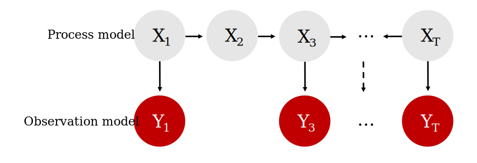

```{css, echo=FALSE}
details > summary {
  padding: 4px;
  background-color: #8F2727;
  color: white;
  border: none;
  box-shadow: 1px 1px 2px #bbbbbb;
  cursor: pointer;
}

details > summary:hover {
  background-color: #DCBCBC;
  color: #8F2727;
}

.scroll-300 {
  max-height: 300px;
  overflow-y: auto;
  background-color: inherit;
}

h1, #TOC>ul>li {
  color: #8F2727;
}

h2, #TOC>ul>ul>li {
  color: #8F2727;
}

h3, #TOC>ul>ul>li {
  color: #8F2727;
}

.list-group-item.active, .list-group-item.active:focus, .list-group-item.active:hover {
    z-index: 2;
    color: #fff;
    background-color: #DCBCBC;
    border-color: #DCBCBC;
}

a {
    color: purple;
    font-weight: bold;
}

a:hover {
    color: #C79999;
}

::selection {
  background: #DCBCBC;
  color: #8F2727;
}

.button_red {
  background-color: #8F2727;
  border: #8F2727;
  color: white;
}

.button_red:hover {
  background-color: #DCBCBC;
  color: #8F2727;
}
```

```{r klippy, echo=FALSE, include=TRUE, message = FALSE, warning = FALSE}
if(!requireNamespace('klippy')){
  remotes::install_github("rlesur/klippy")
}
klippy::klippy(position = c('top', 'right'), color = 'darkred')
```

```{r setup, include=FALSE}
knitr::opts_chunk$set(
  echo = TRUE,   
  dpi = 150,
  fig.asp = 0.8,
  fig.width = 6,
  out.width = "60%",
  fig.align = "center",
  class.source='klippy')
```

## Exercises and associated data
The data and modelling objects created in this notebook can be downloaded directly to save computational time.
```{r echo=FALSE, message = FALSE, warning = FALSE}
library(downloadthis)
download_dir(
  path = 'tutorial_4_physalia_cache/html/',
  output_name = "Tutorial4_exercise_data",
  button_label = "Click here to download all files needed for exercises",
  button_type = "success",
  has_icon = TRUE,
  icon = "fa fa-download",
  class = "button_red",
  self_contained = FALSE
)
```

<br />
Users who wish to complete the exercises can download a small template `R` script. Assuming you have already downloaded the data objects above, this script will load all data objects so that the steps used to create them are not necessary to tackle the exercises.
```{r echo=FALSE}
download_file(
  path = 'Tutorial4_exercises.R',
  output_name = "Tutorial4_exercises.R",
  button_label = "Click here to download the exercise R script",
  button_type = "success",
  has_icon = TRUE,
  icon = "fa fa-laptop-code",
  class = "button_red",
  self_contained = FALSE
)
```

## Load libraries and time series data
This tutorial relates to content covered in [Lecture 5](https://nicholasjclark.github.io/physalia-forecasting-course/day4/lecture_5_slidedeck){target="_blank"}, and relies on the following packages for manipulating data, shaping time series, fitting dynamic regression models and plotting:
```{r include = FALSE}
library(dplyr)
#remotes::install_github('nicholasjclark/mvgam',force = TRUE)
library(mvgam) 
library(tidybayes)
library(bayesplot)
library(gratia)
library(ggplot2); theme_set(theme_classic())
library(marginaleffects)
```

```{r eval = FALSE, purl = FALSE}
library(dplyr)
library(mvgam) 
library(tidybayes)
library(bayesplot)
library(gratia)
library(ggplot2); theme_set(theme_classic())
library(marginaleffects)
```


This tutorial will focus on one of `mvgam`'s more advanced features: the ability to fit dynamic models in a State-Space representation. We have not gone into too much detail about how these models work (but see [this outstanding resource from E. E. Holmes, M. D. Scheuerell, and E. J. Ward for many useful details](https://atsa-es.github.io/atsa/lectures.html){target="_blank"}, along with [this nice lecture by E. E. Holmes](https://www.youtube.com/watch?v=4nrZZGMY1bc){target="_blank"}).



<br>

Briefly, these models allow us to separately make inferences about the underlying dynamic *process model* that we are interested in (i.e. the evolution of a time series or a collection of time series) and the *observation model* (i.e. the way that we survey / measure this underlying process). This is extremely useful in ecology because our observations are always imperfect / noisy measurements of the thing we are interested in measuring. It is also helpful because we often know that some covariates will impact our ability to measure accurately (i.e. we cannot take accurate counts of rodents if there is a thunderstorm happening) while other covariate impact the underlying process (it is highly unlikely that rodent abundance responds to one storm, but instead probably responds to longer-term weather and climate variation). A State-Space model allows us to model both components in a single unified modelling framework. A major advantage of `mvgam` is that it can include nonlinear effects and random effects in BOTH model components while also capturing dynamic processes. I am not aware of any other packages that can easily do this, but of course there may be some.

### Lake Washington plankton data
The data we will use to illustrate how we can fit State-Space models in `mvgam` are from a long-term monitoring study of plankton counts (cells per mL) taken from Lake Washington in Washington, USA. The data are available as part of the `MARSS` package and can be downloaded using the following: 
```{r}
load(url('https://github.com/atsa-es/MARSS/raw/master/data/lakeWAplankton.rda'))
```

We will work with five different groups of plankton:
```{r}
outcomes <- c('Greens', 'Bluegreens', 'Diatoms', 'Unicells', 'Other.algae')
```

As usual, preparing the data into the correct format for `mvgam` modelling takes a little bit of wrangling in `dplyr`:
```{r plankton_data}
plankton_data <- xfun::cache_rds(do.call(rbind, lapply(outcomes, function(x){
  
  # create a group-specific dataframe with counts labelled 'y'
  # and the group name in the 'series' variable
  data.frame(year = lakeWAplanktonTrans[, 'Year'],
             month = lakeWAplanktonTrans[, 'Month'],
             y = lakeWAplanktonTrans[, x],
             series = x,
             temp = lakeWAplanktonTrans[, 'Temp'])})) %>%
  
  # change the 'series' label to a factor
  dplyr::mutate(series = factor(series)) %>%
  
  # filter to only include some years in the data
  dplyr::filter(year >= 1965 & year < 1975) %>%
  dplyr::arrange(year, month) %>%
  dplyr::group_by(series) %>%
  
  # z-score the counts so they are approximately standard normal
  dplyr::mutate(y = as.vector(scale(y))) %>%
  
  # add the time indicator
  dplyr::mutate(time = dplyr::row_number()) %>%
  dplyr::ungroup())
```

```{r eval=FALSE}
# loop across each plankton group to create the long datframe
plankton_data <- do.call(rbind, lapply(outcomes, function(x){
  
  # create a group-specific dataframe with counts labelled 'y'
  # and the group name in the 'series' variable
  data.frame(year = lakeWAplanktonTrans[, 'Year'],
             month = lakeWAplanktonTrans[, 'Month'],
             y = lakeWAplanktonTrans[, x],
             series = x,
             temp = lakeWAplanktonTrans[, 'Temp'])})) %>%
  
  # change the 'series' label to a factor
  dplyr::mutate(series = factor(series)) %>%
  
  # filter to only include some years in the data
  dplyr::filter(year >= 1965 & year < 1975) %>%
  dplyr::arrange(year, month) %>%
  dplyr::group_by(series) %>%
  
  # z-score the counts so they are approximately standard normal
  dplyr::mutate(y = as.vector(scale(y))) %>%
  
  # add the time indicator
  dplyr::mutate(time = dplyr::row_number()) %>%
  dplyr::ungroup()
```

Inspect the data structure
```{r}
head(plankton_data)
```

```{r}
dplyr::glimpse(plankton_data)
```

Note that we have z-scored the counts in this example as that will make it easier to specify priors for this simple example (though note that this is not completely necessary; it is often better to build a model that respects the properties of the actual outcome variables)
```{r}
plot_mvgam_series(data = plankton_data, series = 'all')
```

As usual, check the data for `NA`s:
```{r}
image(is.na(t(plankton_data)), axes = F,
      col = c('grey80', 'darkred'))
axis(3, at = seq(0,1, len = NCOL(plankton_data)), 
     labels = colnames(plankton_data))
```

### Manipulate data for modeling
We have some missing observations, but of course this isn't an issue for modelling in `mvgam`. A useful property to understand about these counts is that they tend to be highly seasonal. Below are some plots of z-scored counts against the z-scored temperature measurements in the lake for each month:
```{r}
plankton_data %>%
  dplyr::filter(series == 'Other.algae') %>%
  ggplot(aes(x = time, y = temp)) +
  geom_line(size = 1.1) +
  geom_line(aes(y = y), col = 'white',
            size = 1.2) +
  geom_line(aes(y = y), col = 'darkred',
            size = 1.1) +
  ylab('z-score') +
  xlab('Time') +
  ggtitle('Temperature (black) vs Other algae (red)')
```


```{r}
plankton_data %>%
  dplyr::filter(series == 'Diatoms') %>%
  ggplot(aes(x = time, y = temp)) +
  geom_line(size = 1.1) +
  geom_line(aes(y = y), col = 'white',
            size = 1.2) +
  geom_line(aes(y = y), col = 'darkred',
            size = 1.1) +
  ylab('z-score') +
  xlab('Time') +
  ggtitle('Temperature (black) vs Diatoms (red)')
```

```{r}
plankton_data %>%
  dplyr::filter(series == 'Greens') %>%
  ggplot(aes(x = time, y = temp)) +
  geom_line(size = 1.1) +
  geom_line(aes(y = y), col = 'white',
            size = 1.2) +
  geom_line(aes(y = y), col = 'darkred',
            size = 1.1) +
  ylab('z-score') +
  xlab('Time') +
  ggtitle('Temperature (black) vs Greens (red)')
```

We will have to try and capture this seasonality in our process model, which should be easy to do given the flexibility of GAMs. Next we will split the data into training and testing splits:
```{r plankton_train, echo = FALSE}
plankton_train <- xfun::cache_rds(plankton_data %>%
  dplyr::filter(time <= 112))

```

```{r plankton_test, echo = FALSE}
plankton_test <- xfun::cache_rds(plankton_data %>%
  dplyr::filter(time > 112))
```

```{r eval=FALSE}
plankton_train <- plankton_data %>%
  dplyr::filter(time <= 112)
plankton_test <- plankton_data %>%
  dplyr::filter(time > 112)
```

### Exercises
1. Calculate the number of timepoints in the training data that have non-missing observations for all five time series.

## Capturing seasonality
Now time to fit some models. This requires a bit of thinking about how we can best tackle the seasonal variation and the likely dependence structure in the data. These algae are interacting as part of a complex system within the same lake, so we certainly expect there to be some lagged cross-dependencies underling their dynamics. But if we do not capture the seasonal variation, our multivariate dynamic model will be forced to try and capture it, which could lead to poor convergence and unstable results (we could feasibly capture cyclic dynamics with a more complex multi-species Lotka-Volterra model, but ordinary differential equation approaches are beyond the scope of this workshop). 

First we will fit a model that does not include a dynamic component, just to see if it can reproduce the seasonal variation in the observations. This model builds from our hierarchical GAMs above by introducing hierarchical multidimensional smooths. It includes a "global" tensor product of the `month` and `temp` variables, capturing our expectation that algal seasonality responds to temperature variation. But this response should depend on when in the year these temperatures are recorded (i.e. a response to warm temperatures in Spring should be different to a response to warm temperatures in Autumn). The model also fits series-specific deviation smooths (i.e. one tensor product per series) to capture how each algal group's seasonality differs from the overall "global" seasonality. Note that we do not include series-specific intercepts in this model because each series was z-scored to have a mean of 0.
```{r notrend_mod, include = FALSE}
notrend_mod <- xfun::cache_rds(mvgam(y ~ 
                       te(temp, month, k = c(4, 4)) +
                       te(temp, month, k = c(4, 4), by = series),
                     family = gaussian(),
                     data = plankton_train,
                     newdata = plankton_test,
                     trend_model = 'None'),
                dir = 'cache_not_for_upload/')
```

```{r eval=FALSE}
notrend_mod <- mvgam(y ~ 
                       # tensor of temp and month to capture
                       # "global" seasonality
                       te(temp, month, k = c(4, 4)) +
                       
                       # series-specific deviation tensor products
                       te(temp, month, k = c(4, 4), by = series),
                     family = gaussian(),
                     data = plankton_train,
                     newdata = plankton_test,
                     trend_model = 'None')

```

The "global" tensor product smooth function can be quickly visualized using `gratia`:
```{r}
gratia::draw(notrend_mod$mgcv_model, select = 1)
```

We can then plot the deviation smooths for each algal group to see how they vary from the "global" pattern:
```{r}
gratia::draw(notrend_mod$mgcv_model, select = 2)
```

```{r}
gratia::draw(notrend_mod$mgcv_model, select = 3)
```

```{r}
gratia::draw(notrend_mod$mgcv_model, select = 4)
```

```{r}
gratia::draw(notrend_mod$mgcv_model, select = 5)
```

```{r}
gratia::draw(notrend_mod$mgcv_model, select = 6)
```

These multidimensional smooths have done a good job of capturing the seasonal variation in our observations:
```{r}
plot(notrend_mod, type = 'forecast', series = 1)
```

```{r}
plot(notrend_mod, type = 'forecast', series = 2)
```

```{r}
plot(notrend_mod, type = 'forecast', series = 3)
```

```{r}
plot(notrend_mod, type = 'forecast', series = 4)
```

```{r}
plot(notrend_mod, type = 'forecast', series = 5)
```

## Multiseries dynamics
The basic model gives us confidence that we can capture the seasonal variation in the observations. But the model has not captured the remaining temporal dynamics, which is obvious when we inspect Dunn-Smyth residuals for each series:
```{r}
plot(notrend_mod, type = 'residuals', series = 1)
```

```{r}
plot(notrend_mod, type = 'residuals', series = 2)
```

```{r}
plot(notrend_mod, type = 'residuals', series = 3)
```

```{r}
plot(notrend_mod, type = 'residuals', series = 4)
```

```{r}
plot(notrend_mod, type = 'residuals', series = 5)
```

Now it is time to get into multivariate State-Space models. We will fit two models that can both incorporate lagged cross-dependencies in the latent process models. The first model assumes that the process errors operate independently from one another, while the second assumes that there may be contemporaneous correlations in the process errors. Both models include a Vector Autoregressive component for the process means, and so both can model complex community dynamics. The models can be described mathematically as follows:

\begin{align*}
\boldsymbol{count}_t & \sim \text{Normal}(\mu_{obs[t]}, \sigma_{obs}) \\
\mu_{obs[t]} & = process_t \\
process_t & \sim \text{MVNormal}(\mu_{process[t]}, \Sigma_{process}) \\
\mu_{process[t]} & = VAR * process_{t-1} + f_{global}(\boldsymbol{month},\boldsymbol{temp})_t + f_{series}(\boldsymbol{month},\boldsymbol{temp})_t \\
f_{global}(\boldsymbol{month},\boldsymbol{temp}) & = \sum_{k=1}^{K}b_{global} * \beta_{global} \\
f_{series}(\boldsymbol{month},\boldsymbol{temp}) & = \sum_{k=1}^{K}b_{series} * \beta_{series} \end{align*}

Here you can see that there are no terms in the observation model apart from the underlying process model. But we could easily add covariates into the observation model if we felt that they could explain some of the systematic observation errors. We also assume independent observation processes (there is no covariance structure in the observation errors $\sigma_{obs}$).  At present, `mvgam` does not support multivariate observation models. But this feature will be added in future versions. However the underlying process model is multivariate, and there is a lot going on here. This component has a Vector Autoregressive part, where the process mean at time $t$ $(\mu_{process[t]})$ is a vector that evolves as a function of where the vector-valued process model was at time $t-1$. The $VAR$ matrix captures these dynamics with self-dependencies on the diagonal and possibly asymmetric cross-dependencies on the off-diagonals, while also incorporating the nonlinear smooth functions that capture seasonality for each series. The contemporaneous process errors are modeled by $\Sigma_{process}$, which can be constrained so that process errors are independent (i.e. setting the off-diagonals to 0) or can be fully parameterized using a Cholesky decomposition (using `Stan`'s $LKJcorr$ distribution to place a prior on the strength of inter-species correlations). For those that are interested in the inner-workings, `mvgam` makes use of a recent breakthrough by [Sarah Heaps to enforce stationarity of Bayesian VAR processes](https://www.tandfonline.com/doi/full/10.1080/10618600.2022.2079648). This is advantageous as we often don't expect forecast variance to increase without bound forever into the future, but many estimated VARs tend to behave this way. 

<br>
Ok that was a lot to take in. Let's fit some models to try and inspect what is going on and what they assume. But first, we need to update `mvgam`'s default priors for the observation and process errors. By default, `mvgam` uses a fairly wide Student-T prior on these parameters to avoid being overly informative. But our observations are z-scored and so we do not expect very large process or observation errors. However, we also do not expect very small observation errors either as we know these measurements are not perfect. So let's update the priors for these parameters. In doing so, you will get to see how the formula for the latent process (i.e. trend) model is used in `mvgam`:
```{r}
priors <- get_mvgam_priors(
  # observation formula, which has no terms in it
  y ~ -1,
  
  # process model formula, which includes the smooth functions
  trend_formula = ~ te(temp, month, k = c(4, 4)) +
    te(temp, month, k = c(4, 4), by = trend),
  
  # VAR1 model with uncorrelated process errors
  trend_model = 'VAR1',
  family = gaussian(),
  data = plankton_train)
```

Get names of all parameters whose priors can be modified:
```{r}
priors[, 3]
```

And their default prior distributions:
```{r}
priors[, 4]
```

Setting priors is easy in `mvgam` as you can use `brms` routines. Here we use more informative Normal priors for both error components, but we impose a lower bound of 0.2 for the observation errors:
```{r}
priors <- c(prior(normal(0.5, 0.1), class = sigma_obs, lb = 0.2),
            prior(normal(0.5, 0.25), class = sigma))
```

You may have noticed something else unique about this model: there is no intercept term in the observation formula. This is because a shared intercept parameter can sometimes be unidentifiable with respect to the latent VAR process, particularly if our series have similar long-run averages (which they do in this case because they were z-scored). We will often get better convergence in these State-Space models if we drop this parameter. `mvgam` accomplishes this by fixing the coefficient for the intercept to zero. Now we can fit the first model, which assumes that process errors are contemporaneously uncorrelated

Now we can fit the first model, which assumes that process errors are contemporaneously uncorrelated
```{r var_mod, include = FALSE}
var_mod <- xfun::cache_rds(mvgam(y ~ -1,
                 trend_formula = ~
                   # tensor of temp and month should capture
                   # seasonality
                   te(temp, month, k = c(4, 4)) +
                   # need to use 'trend' rather than series
                   # here
                   te(temp, month, k = c(4, 4), by = trend),
                 family = gaussian(),
                 data = plankton_train,
                 newdata = plankton_test,
                 trend_model = 'VAR1',
                 priors = priors, 
                 burnin = 1000),
                dir = 'cache_not_for_upload/')
```

```{r eval=FALSE}
var_mod <- mvgam(  
  # observation formula, which is empty
  y ~ -1,
  
  # process model formula, which includes the smooth functions
  trend_formula = ~ te(temp, month, k = c(4, 4)) +
    te(temp, month, k = c(4, 4), by = trend),
  
  # VAR1 model with uncorrelated process errors
  trend_model = 'VAR1',
  family = gaussian(),
  data = plankton_train,
  newdata = plankton_test,
  
  # include the updated priors
  priors = priors)
```

### Inspecting SS models
This model's summary is a bit different to other `mvgam` summaries. It separates parameters based on whether they belong to the observation model or to the latent process model. This is because we may often have covariates that impact the observations but not the latent process, so we can have fairly complex models for each component. You will notice that some parameters have not fully converged, particularly for the VAR coefficients (called `A` in the output) and for the process errors (`Sigma`). Note that we set `include_betas = FALSE` to stop the summary from printing output for all of the spline coefficients, which can be dense and hard to interpret:
```{r, class.output="scroll-300"}
summary(var_mod, include_betas = FALSE)
```

We can again plot the smooth functions, which this time operate on the process model. The coefficients for this model are now accessible through the `trend_mgcv_model` slot in the model object:
```{r}
gratia::draw(var_mod$trend_mgcv_model, select = 1)
```

We can see the same plot using the `mvgam` version by using `trend_effects = TRUE` in the plotting functions:
```{r}
plot(var_mod, 'smooths', trend_effects = TRUE)
```

The VAR matrix is of particular interest here, as it captures lagged dependencies and cross-dependencies in the latent process model:
```{r warning=FALSE, message=FALSE}
mcmc_plot(var_mod, variable = 'A', regex = TRUE, type = 'hist')
```

Unfortunately bayesplot doesn’t know this is a matrix of parameters so what we see is actually the transpose of the VAR matrix. A little bit of wrangling gives us these histograms in the correct order:
```{r}
A_pars <- matrix(NA, nrow = 5, ncol = 5)
for(i in 1:5){
  for(j in 1:5){
    A_pars[i, j] <- paste0('A[', i, ',', j, ']')
  }
}
mcmc_plot(var_mod, 
          variable = as.vector(t(A_pars)), 
          type = 'hist')
```

There is a lot happening in this matrix. Each cell captures the lagged effect of the process in the column on the process in the row in the next timestep. So for example, the effect in cell [5,2], which is quite strongly negative, means that an *increase* in the process for series 5 (Unicells) at time $t$ is expected to lead to a subsequent *decrease* in the process for series 2 (Diatoms) at time $t+1$. The latent process model is now capturing these effects and the smooth seasonal effects, so the trend plot shows our best estimate of what the *true* count should have been at each time point:
```{r}
plot(var_mod, type = 'trend', series = 1)
```

```{r}
plot(var_mod, type = 'trend', series = 3)
```

The process error $(\Sigma)$ captures unmodelled variation in the process models. Again, we fixed the off-diagonals to 0, so the histograms for these will look like flat boxes:
```{r warning=FALSE, message=FALSE}
Sigma_pars <- matrix(NA, nrow = 5, ncol = 5)
for(i in 1:5){
  for(j in 1:5){
    Sigma_pars[i, j] <- paste0('Sigma[', i, ',', j, ']')
  }
}
mcmc_plot(var_mod, 
          variable = as.vector(t(Sigma_pars)), 
          type = 'hist')
```

The observation error estimates $(\sigma_{obs})$ represent how much the model thinks we might miss the true count when we take our imperfect measurements: 
```{r warning=FALSE, message=FALSE}
mcmc_plot(var_mod, variable = 'sigma_obs', regex = TRUE, type = 'hist')
```

## Dynamic factor trends

Let's see how a dynamic factor model compares. Recall from the lecture that dynamic factor models can induce correlations among the time series using a reduced rank "factor" model. We effectively estimate fewer dynamic factors than we have series, but let each series depend on these factors to form it's series-specific trend. Priors for this model are simpler because the variances of the factors are fixed, so we don't need a prior for those.
```{r}
priors <- prior(normal(0.5, 0.1), class = sigma_obs, lb = 0.2)
```

And now we can fit the dynamic factor model, using three AR1 factors for the five series. Note that I am using fewer posterior samples for this model so it is easier to work with for completing the exercises:
```{r df_mod_full, include = FALSE}
df_mod_full <- xfun::cache_rds(mvgam(y ~ 
                                       te(temp, month, k = c(4, 4)) +
                   te(temp, month, k = c(4, 4), by = series),
                 family = gaussian(),
                 data = plankton_train,
                 newdata = plankton_test,
                 trend_model = AR(p = 1),
                 use_lv = TRUE,
                 n_lv = 3,
                 burnin = 1000,
                 priors = priors),
                dir = 'cache_not_for_upload/')
```

```{r df_mod, include = FALSE}
df_mod <- xfun::cache_rds(mvgam(y ~ 
                                  te(temp, month, k = c(4, 4)) +
                   te(temp, month, k = c(4, 4), by = series),
                 family = gaussian(),
                 data = plankton_train,
                 newdata = plankton_test,
                 trend_model = AR(p = 1),
                 use_lv = TRUE,
                 n_lv = 3,
                 burnin = 1000,
                 samples = 100,
                 priors = priors))
```

```{r eval=FALSE}
df_mod <- mvgam(  
  # observation formula
  y ~ te(temp, month, k = c(4, 4)) +
    te(temp, month, k = c(4, 4), by = series),
  
  # three AR1 factors
  trend_model = AR(p = 1),
  use_lv = TRUE,
  n_lv = 3,
  family = gaussian(),
  data = plankton_train,
  newdata = plankton_test,
  
  # include the updated priors
  priors = priors,
  
  # use reduced samples for inclusion in tutorial data
  samples = 100)
```

The summary now contains less information as we don't get details about the factor variances:
```{r, class.output="scroll-300"}
summary(df_mod, include_betas = FALSE)
```

Plot estimates for the three factors, which shows that all three have captured important temporal dynamics
```{r}
plot(df_mod, type = 'factors')
```

The loading matrix, which determines how each series depends on the set of factors, can be used to calculate correlations among the series. 
```{r}
mean_corrs <- lv_correlations(object = df_mod)$mean_correlations
mean_corrs
```

Here we can see some very strong patterns, i.e. strong positive correlations between Unicells and Bluegreens for example, and a strong negative correlation between Diatoms and Bluegreens. Plotting these as a heatmap, where blue colours show negative correlations and red colours show positive correlations, makes these relationships easier to visualise
```{r}
heatmap(mean_corrs,
        Colv = NA, Rowv = NA,
        cexRow = 1, cexCol = 1, symm = TRUE,
        distfun = function(c) as.dist(1 - c),
        col = hcl.colors(n = 12, palette = 'Blue-Red'))
```

But which model is better? We can compute the variogram score for out of sample forecasts to get a sense of which model does a better job of capturing the dependence structure in the true evaluation set:
```{r echo=FALSE}
# read in the full model that has all posterior samples
df_mod <- readRDS('./cache_not_for_upload/df_mod_full_0a9898e943842f27cee1fe37ebbaf078.rds')
```

```{r}
# create forecast objects for each model
fcvar <- forecast(var_mod)
fcdf <- forecast(df_mod)

# plot the difference in variogram scores; a negative value means the DF model is better, while a positive value means the VAR1 model is better
diff_scores <- score(fcdf, score = 'variogram')$all_series$score -
  score(fcvar, score = 'variogram')$all_series$score
plot(diff_scores, pch = 16, col = 'darkred', 
     ylim = c(-1*max(abs(diff_scores), na.rm = TRUE),
              max(abs(diff_scores), na.rm = TRUE)),
     bty = 'l',
     xlab = 'Forecast horizon',
     ylab = expression(variogram[DF]~-~variogram[VAR1]))
abline(h = 0, lty = 'dashed')
```

The models tend to provide similar forecasts, though the dynamic factor model does slightly better overall. We would probably need to use a more extensive rolling forecast evaluation exercise if we felt like we needed to only choose one for production. `mvgam` offers some utilities for doing this (i.e. see `?lfo_cv` for guidance).

### Exercises
1. Plot conditional effects of month and temperature for each algal group using the dynamic factor model. Hint, see the documentation in `?marginaleffects::plot_predictions` for guidance
2. Compare in-sample fits from the two models (`var_mod` and `df_mod`) using `loo_compare()`. Does this comparison agree with the forecast comparison above? Why might they differ?
3. Fit a second dynamic factor model that uses Gaussian Process factors in place of AR1 factors. Compare forecasts from this model to the AR1 factor model using the energy and variogram scores. Which model is preferred?

<details>
<summary>Check here for template code if you're having trouble plotting conditional effects by algal group</summary>
```{r, eval = FALSE}
# Replace the ? with the correct value(s)
# You can use 'plot_predictions' to generate conditional effects plots that are stratified over a number of variables (up to three at once).
# This will feed a particular grid of 'newdata' to the 'predict.mvgam' 
# function, returning conditional predictions on the response scale
?marginaleffects::plot_predictions
plot_predictions(df_mod,
                 condition = c(?, ?, ?),
                 conf_level = 0.8)
```
</details>

## Session Info
```{r, class.output="scroll-300"}
sessionInfo()
```


