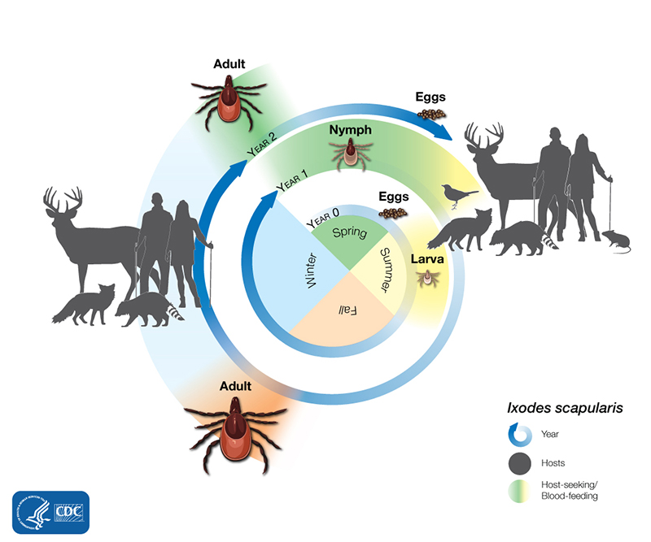
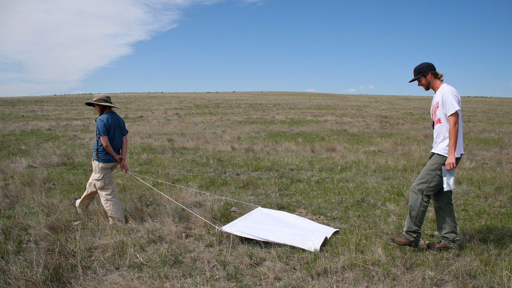

```{css, echo=FALSE}
details > summary {
  padding: 4px;
  background-color: #8F2727;
  color: white;
  border: none;
  box-shadow: 1px 1px 2px #bbbbbb;
  cursor: pointer;
}

details > summary:hover {
  background-color: #DCBCBC;
  color: #8F2727;
}

.scroll-300 {
  max-height: 300px;
  overflow-y: auto;
  background-color: inherit;
}

h1, #TOC>ul>li {
  color: #8F2727;
}

h2, #TOC>ul>ul>li {
  color: #8F2727;
}

h3, #TOC>ul>ul>li {
  color: #8F2727;
}

.list-group-item.active, .list-group-item.active:focus, .list-group-item.active:hover {
    z-index: 2;
    color: #fff;
    background-color: #DCBCBC;
    border-color: #DCBCBC;
}

a {
    color: purple;
    font-weight: bold;
}

a:hover {
    color: #C79999;
}

::selection {
  background: #DCBCBC;
  color: #8F2727;
}

.button_red {
  background-color: #8F2727;
  border: #8F2727;
  color: white;
}

.button_red:hover {
  background-color: #DCBCBC;
  color: #8F2727;
}
```

```{r klippy, echo=FALSE, include=TRUE, message = FALSE, warning = FALSE}
if(!requireNamespace('klippy')){
  remotes::install_github("rlesur/klippy")
}
klippy::klippy(position = c('top', 'right'), color = 'darkred')
```

```{r setup, include=FALSE}
knitr::opts_chunk$set(
  echo = TRUE,   
  dpi = 150,
  fig.asp = 0.8,
  fig.width = 6,
  out.width = "60%",
  fig.align = "center",
  class.source='klippy')
```

## Exercises and associated data
The data and modelling objects created in this notebook can be downloaded directly to save computational time.
```{r echo=FALSE, message = FALSE, warning = FALSE}
library(downloadthis)
download_dir(
  path = 'tutorial_4_physalia_cache/html/',
  output_name = "Tutorial4_exercise_data",
  button_label = "Click here to download all files needed for exercises",
  button_type = "success",
  has_icon = TRUE,
  icon = "fa fa-download",
  class = "button_red",
  self_contained = FALSE
)
```

<br />
Users who wish to complete the exercises can download a small template `R` script. Assuming you have already downloaded the data objects above, this script will load all data objects so that the steps used to create them are not necessary to tackle the exercises.
```{r echo=FALSE}
download_file(
  path = 'Tutorial4_exercises.R',
  output_name = "Tutorial4_exercises.R",
  button_label = "Click here to download the exercise R script",
  button_type = "success",
  has_icon = TRUE,
  icon = "fa fa-laptop-code",
  class = "button_red",
  self_contained = FALSE
)
```

## Load libraries and time series data
This tutorial relates to content covered in [Lecture 5](https://nicholasjclark.github.io/physalia-forecasting-course/day4/lecture_5_slidedeck){target="_blank"}, and relies on the following packages for manipulating data, shaping time series, fitting dynamic regression models and plotting:
```{r include = FALSE}
library(dplyr)
#remotes::install_github('nicholasjclark/mvgam',force = TRUE)
library(mvgam) 
library(tidybayes)
library(bayesplot)
library(gratia)
library(ggplot2)
library(marginaleffects)
```

```{r eval = FALSE, purl = FALSE}
library(dplyr)
library(mvgam) 
library(tidybayes)
library(bayesplot)
library(gratia)
library(ggplot2)
library(marginaleffects)
```




<br>

The data we will work with in this tutorial come from the National Ecological Observatory Network (NEON) tick drag cloth samples. *Ixodes scapularis* is a widespread tick species capable of transmitting a diversity of parasites to animals and humans, many of which are zoonotic. Due to the medical and ecological importance of this tick species, a common goal is to understand factors that influence their abundances. The NEON field team carries out standardised [long-term monitoring of tick abundances as well as other important indicators of ecological change](https://www.neonscience.org/data-collection/ticks){target="_blank"}. 

<br>

{target="_blank"}](resources/neon_map.png)

<br>

Nymphal abundance of *I. scapularis* is routinely recorded across NEON plots using a field sampling method called drag cloth sampling, which is a common method for sampling ticks in the landscape. Field researchers sample ticks by dragging a large cloth behind themselves through terrain that is suspected of harboring ticks, usually working in a grid-like pattern.

<br>



<br>

The sites have been sampled since 2014, resulting in a rich dataset of nymph abundance time series. These tick time series show strong seasonality and incorporate many of the challenging features associated with ecological data including overdispersion, high proportions of missingness and irregular sampling in time, making them useful for exploring the utility of dynamic GAMs. 

## Manipulating data for modelling
We begin by loading NEON tick data for the years 2014 - 2021, which were downloaded from NEON and prepared as described in [Clark & Wells 2022](https://besjournals.onlinelibrary.wiley.com/doi/full/10.1111/2041-210X.13974){target="_blank"}. You can read a bit about the data using the call `?mvgam::all_neon_tick_data`
```{r}
data("all_neon_tick_data")
```

Below is a convenience function to prepare the NEON *Ixodes scapularis* nymph survey data for modelling by filtering to the correct sites and getting data into the right long-format structure that we are used to using for `mvgam` models
```{r}
prep_neon_data = function(split_prop = 0.8){
    plotIDs <- c('SCBI_013','SCBI_002',
                 'SERC_001','SERC_005',
                 'SERC_006','SERC_012',
                 'BLAN_012', 'BLAN_005')
    
    # Filter to the correct plot IDs
    model_dat <- all_neon_tick_data %>%
      dplyr::mutate(target = ixodes_scapularis) %>%
      dplyr::filter(plotID %in% plotIDs) %>%
      dplyr::select(Year, epiWeek, plotID, target) %>%
      dplyr::mutate(epiWeek = as.numeric(epiWeek)) %>%
      dplyr::filter(Year > 2014 & Year < 2021) %>%
      dplyr::mutate(Year_orig = Year)
    
    # Fill in missing observations with NAs
    model_dat %>%
      dplyr::full_join(expand.grid(plotID = unique(model_dat$plotID),
                                   Year_orig = unique(model_dat$Year_orig),
                                   epiWeek = seq(1, 52))) %>%
      dplyr::left_join(all_neon_tick_data %>%
                         dplyr::select(siteID, plotID) %>%
                         dplyr::distinct()) %>%
      dplyr::mutate(series = plotID,
                    season = epiWeek,
                    year = as.vector(scale(Year_orig)),
                    y = target) %>%
      dplyr::select(-Year, -epiWeek, -target) %>%
      dplyr::ungroup() %>%
      dplyr::arrange(Year_orig, season, series) -> model_dat
    
    model_dat %>%
      dplyr::left_join(all_neon_tick_data %>%
                         dplyr::ungroup() %>%
                         dplyr::select(Year, siteID, cum_sdd, cum_gdd) %>%
                         dplyr::mutate(Year_orig = Year) %>%
                         dplyr::select(-Year) %>%
                         dplyr::distinct()) -> model_dat
    
    # Convert ids to factors
    model_dat = model_dat %>%
      dplyr::filter(Year_orig <= 2019) %>%
      dplyr::mutate(plotID = factor(plotID),
                    siteID = factor(siteID),
                    series = factor(series))
  
  # Scale the environmental covariate and store the mean and sd for later plotting
  sd_gdd <- sd(model_dat$cum_gdd)
  mean_gdd <- mean(model_dat$cum_gdd)
  model_dat$cum_gdd <- (model_dat$cum_gdd - mean_gdd) / sd_gdd
  
  # Add time column
  model_dat %>%
    dplyr::ungroup() %>%
    dplyr::group_by(series) %>%
    dplyr::arrange(Year_orig, season) %>%
    dplyr::mutate(time = seq(1, dplyr::n())) %>%
    dplyr::ungroup() -> model_dat
  
  # Split into training and testing
  data_train = model_dat[1:(floor(nrow(model_dat) * split_prop)),]
  data_test = model_dat[((floor(nrow(model_dat) * split_prop)) + 1):nrow(model_dat),]
  
  # Return needed objects in a list
  list(data_train = data_train, data_test = data_test,
       sd_gdd = sd_gdd, mean_gdd = mean_gdd)
}
```

Prep the data for hierarchical modelling in `mvgam` using the above function. Here we use a split of 80% training and 20% testing, leaving approximately one year of sampling for forecast evaluation. In the resulting data, the `series` variable represents the lowest level of aggregation we have in the data (i.e. the `plotID`s)
```{r tick_data, echo=FALSE}
tick_data <- xfun::cache_rds(prep_neon_data(split_prop = 0.8))
```

```{r eval=FALSE}
tick_data <- prep_neon_data(split_prop = 0.8)
```

Preview the data to understand how it is structured
```{r}
head(tick_data$data_train)
```

```{r}
dplyr::glimpse(tick_data$data_train)
```

### Inspecting the time series

There are an enormous number of `NA`s in these data, as the NEON field team only samples under certain conditions (`NA`s are shown as red bars in the below plot). As we have seen in previous lectures / tutorials, the vast majority of existing time series algorithms and models would fail immediately if we tried to apply them to these data!
```{r}
# look only at a few columns as only the y column has NAs
tick_data$data_train %>%
  dplyr::select(plotID, time, y) -> preview_data
image(is.na(t(preview_data %>%
                dplyr::arrange(dplyr::desc(time)))), axes = F,
      col = c('grey80', 'darkred'))
axis(3, at = seq(0,1, len = NCOL(preview_data)), 
     labels = colnames(preview_data))
```

Because of the high proportion of `NA`s, attempts to plot a timeseries line plot will not be as useful (though the other plots in this call will still be helpful to see the distribution of the data):
```{r}
plot_mvgam_series(data = tick_data$data_train, series = 1)
```

To inspect the actual timeseries, we will have to resort to plotting the observations as points rather than lines. A quick call to `ggplot2` will be better for our purposes:
```{r warning=FALSE, fig.asp = 1.2}
theme_set(theme_bw(base_size = 12, base_family = 'serif'))
ggplot(rbind(tick_data$data_train,
             tick_data$data_test) %>%
         dplyr::mutate(Site = siteID), aes(x = time, y = y, fill = Site)) +
  geom_point(shape = 21, colour = 'white', size = 2.5) + 
  facet_wrap(~plotID, ncol = 2, scales = 'free_y') +
  theme(axis.ticks = element_line(colour = "black", size = 1)) +
  labs(x = 'Time', y = 'Abundance')
```

As you can see, it is very hard to identify any patterns when plotting this way. A key question we'd like to investigate is whether the seasonal patterns in tick abundances vary across sites and plots. We can use some simple visuals to at least inspect variation in the relative counts per season, per site, which may reveal some useful insights: 
```{r results='hide', message=FALSE,warning=FALSE, fig.asp = 1.2}
rbind(tick_data$data_train,
      tick_data$data_test) %>%
  
  # calculate a total count per plot, per year
  dplyr::group_by(plotID, year) %>%
  dplyr::summarise(total_count = sum(y, na.rm = TRUE)) %>%
  
  # join back tot he original data
  dplyr::right_join(rbind(tick_data$data_train,
                          tick_data$data_test)) %>%
  
  # calculate the relative count as a proportion
  # by adjusting for the total yearly count
  dplyr::rowwise() %>%
  dplyr::mutate(rel_count = y / total_count) %>%
  
  # for each plotID, calculate the median proportion per
  # season to inspect overall seasonality
  dplyr::group_by(plotID, season) %>%
  dplyr::summarise(rel_count = median(rel_count, 
                                      na.rm = TRUE),
                   Site = unique(siteID)) -> seasonality

# visualize the seasonal patterns for each plotID
ggplot(seasonality, aes(x = season, y = rel_count, fill = Site)) +
  geom_smooth(size = 1.5, se = FALSE, aes(colour = Site)) +
  geom_point(shape = 21, colour = 'white', size = 2.5) + 
  ylim(c(0, 0.7)) +
  facet_wrap(~plotID, ncol = 2) +
  theme(axis.ticks = element_line(colour = "black", size = 1)) +
  labs(x = 'EpiWeek', y = 'Relative count')
```

This plot demonstrates that there are certainly similarities in the observed seasonal patterns, with tick abundances increasing in the warmer months of the year. We obviously cannot put too much faith in the smooth curves as they are only applied to the median relative counts per site. It would be far better if we could try and *learn* the overall seasonal patterns by leveraging all the data we have (regardless of how messy and sparse it is). Another consideration we need to make is that these data are strongly overdispersed, with a skew towards zeros and very small counts.
```{r warning=FALSE, message=FALSE, fig.asp = 1.2}
ggplot(rbind(tick_data$data_train,
             tick_data$data_test) %>%
         dplyr::mutate(Site = siteID), aes(x = y, fill = Site)) +
  geom_histogram() + 
  facet_wrap(~plotID, ncol = 2, scales = 'free_y') +
  theme(axis.ticks = element_line(colour = "black", size = 1)) +
  labs(x = 'Abundance', y = 'Frequency')
```

### Exercises
1. Calculate the number of timepoints in the training data that have non-missing observations for all eight time series. 

## Modelling tick abundance
We aim to build a model that can learn from all observed data and leverage the grouping structure in the observations to capture variation in seasonality and long-term trends for tick abundances among NEON sampling sites. These models can get quite complex, so it is often useful to start simple and work our way up in complexity.

### Complete pooling
Our first model will assume there is a single "global" smooth function that can adequately capture periodic seasonality in tick abundances. We use a cyclic smooth (`bs = 'cc'`) and supply a list of `knots` to ensure the smooth joins at the ends in the correct place. We also include a hierarchical intercept term to capture any variation in series-specific average counts. Finally, we use a Poisson observation model for initial models. This is because we'd like to capture as much of the dispersion in the data using our covariates, even though it not be possible to capture all of it. No dynamic trend component is included in this initial model, as we would like to describe as much of the variation as we can using the GAM linear predictor. Instead we use a non-wiggle smooth function of time for each plot. This should not only allow us to hone in on a useful model more quickly, it will make model diagnostics more useful to us because we avoid the perfect overfitting that can happen with flexible dynamic trend components
```{r model0, include = FALSE}
model0 <- xfun::cache_rds(mvgam(y ~                  
                  s(year, by = series, k = 4) +
                  s(series, bs = 're') +
                  s(season, bs = 'cc', k = 12),
                knots = list(season = c(0.5, 52.5)),
                family = poisson(),
                data = tick_data$data_train,
                newdata = tick_data$data_test,
                
                # No dynamic trend yet
                trend_model = 'None'),
                dir = 'cache_not_for_upload/')
```

```{r eval = FALSE}
model0 <- mvgam(y ~   
                  # hierarchical intercepts per series (plotID)
                  s(series, bs = 're') +
                  
                  # separate smooths of year to capture changing levels across
                  # the sampling period for each series (plotID)
                  s(year, by = series, k = 4) +
                  
                  # a "global" smooth of season to capture the overall
                  # seasonal pattern
                  s(season, bs = 'cc', k = 12),
                
                # knots to ensure the seasonal smooth joins between the last 
                # week and first week of the year
                knots = list(season = c(0.5, 52.5)),
                
                # Poisson observations
                family = poisson(),
                data = tick_data$data_train,
                newdata = tick_data$data_test,
                
                # No dynamic trend yet
                trend_model = 'None')
```

The model can be described mathematically as follows:
\begin{align*}
\boldsymbol{ticks}_t & \sim \text{Poisson}(\lambda_t) \\
log(\lambda_t) & = \alpha_{plot} + f(\boldsymbol{time})_t + f_{global}(\boldsymbol{epiweek})_t \\
\alpha_{plot} & \sim \text{Normal}(\mu_{plot}, \sigma_{plot}) \\
\mu_{plot} & \sim \text{Normal}(0, 1) \\
\sigma_{plot} & \sim \text{Exponential}(0.5) \\
f(\boldsymbol{time}) & = \sum_{k=1}^{K}b_{time} * \beta_{time} \\
f_{global}(\boldsymbol{epiweek}) & = \sum_{k=1}^{K}b_{global} * \beta_{global} \end{align*}

The model summary is shown below, which indicates there was no evidence of problematic posterior spaces encountered by the HMC sampler
```{r Summarise the fitted model, class.output="scroll-300"}
summary(model0)
```

The model has found support for varying intercepts among series:
```{r}
plot(model0, type = 're')
```

It has also estimated declining trends for most of the series
```{r}
plot(model0, type = 'smooths')
```

But as we've seen previously, we're better off using targeted predictions to understand the model and think about how to make improvements. The `plot_predictions` function from `marginaleffects` can be used here to inspect conditional seasonal predictions for each series. This is a good first step to ensure the model's predictions seem sensible
```{r warning=FALSE, fig.asp = 1.2}
plot_predictions(model0, condition = c('season', 'series', 'series'),
                 points = 0.5, rug = TRUE) +
  facet_wrap(~series, ncol = 2, scales = 'free_y') +
  theme(legend.position = 'none')
```

### Plotting residuals vs season

The above plot shows us that the predictions seem to match the overall periodic patterns in the observations, but it is hard to get a sense of where the model might be failing. To do so, we can inspect posterior median residuals vs `season` to get a sense of any unmodelled seasonal variation across time series. This can be done using a very similar call to `ggplot2` as the one we used above to inspect seasonality in relative counts. Because we will be making such a plot for each model, it is better to wrap the code in a function:
```{r}
plot_season_resids = function(object){
  # Take 100 posterior draws of Dunn Smyth residuals in the correct
  # order (arranged by series and then time)
  resid_points <- lapply(seq_len(100), function(j){
    data.frame(series = tick_data$data_train %>%
                 dplyr::arrange(series, time) %>%
                 dplyr::pull(series),
               resid = unlist(lapply(seq_along(object$resids), function(x){
                 object$resids[[x]][j, ]
               })))
  })
  
  # Bind arranged data to each of the 100 posterior residual draws
  all_resids <- do.call(rbind, lapply(seq_len(100), function(j){
    tick_data$data_train %>%
      dplyr::arrange(series, time) %>%
      dplyr::mutate(Site = siteID) %>%
      dplyr::bind_cols(data.frame(resid = resid_points[[j]]$resid))
  }))
  
  # Plot
  ggplot(all_resids, aes(x = season, y = resid, fill = Site)) +
    geom_jitter(shape = 16, colour = 'black', size = 1,
                alpha = 0.1) +
    geom_smooth(size = 1.5, se = FALSE, colour = 'white',
                method = 'gam', formula = y ~ s(x, k = 8)) +
    geom_smooth(size = 1.25, se = FALSE, aes(colour = Site),
                method = 'gam', formula = y ~ s(x, k = 8)) +
    facet_wrap(~plotID, ncol = 2) +
    ylim(c(-4, 4)) +
    xlim(c(9, 52)) +
    theme(axis.ticks = element_line(colour = "black", size = 1)) +
    labs(x = 'EpiWeek', y = 'DS residuals')
}
```

When we call this function and provide an `mvgam` model, it will plot 100 posterior draws of Dunn-Smyth residuals and then plot a smooth curve over the top to help us inspect any possible nonlinear relationships that have not been captured by the model:
```{r warning=FALSE,message=FALSE, fig.asp = 1.2}
plot_season_resids(object = model0)
```

The fact that we have support for systematic, nonlinear relationships between residuals and seasonal periods suggests our simple assumption of fixed seasonality among all sites is not adequate. We can supplement this plot with a similar investigation of median posterior *partial* residuals, which can be readily calculated by predicting from the underlying `mgcv` object in the model. Below is a function to plot partial residuals for 100 posterior draws against the smooth of seasonality for each series:
```{r}
plot_season_partials = function(object){
  # Take 100 posterior draws of Dunn Smyth residuals in the correct
  # order (arranged by series and then time)
  resid_points <- lapply(seq_len(100), function(j){
    data.frame(series = tick_data$data_train %>%
                 dplyr::arrange(series, time) %>%
                 dplyr::pull(series),
               resid = unlist(lapply(seq_along(object$resids), function(x){
                 object$resids[[x]][j, ]
               })))
  })
  
  # Calculate link scale predictions for the observations, ignoring all
  # non-seasonal smooth terms
  all_terms <- unlist(lapply(seq_along(object$mgcv_model$smooth), function(x){
     object$mgcv_model$smooth[[x]]$label
  }))
  non_season_terms <- all_terms[!grepl('season', all_terms, fixed = TRUE)]
  
  tick_data$data_train %>%
    dplyr::bind_cols(data.frame(smooth_pred = predict(object$mgcv_model,
                                                      exclude = non_season_terms,
                                                      type = 'link'))) %>%
    dplyr::arrange(series, time) %>%
    dplyr::mutate(Site = siteID) -> smooth_preds
  
  # Calculate partial residuals for each of the 100 posterior residual draws
  all_partials <- do.call(rbind, lapply(seq_len(100), function(j){
    smooth_preds %>%
      dplyr::bind_cols(data.frame(resid = resid_points[[j]]$resid)) %>%
      dplyr::mutate(partial_resid = smooth_pred + resid)
  }))
  
  # Plot
  ggplot(all_partials, aes(x = season, y = smooth_pred, colour = Site)) +
    geom_jitter(shape = 16, colour = 'black', size = 1,
                alpha = 0.1,
                mapping = aes(x = season, y = partial_resid)) +
        geom_smooth(size = 1.5, se = FALSE, colour = 'white',
                method = 'gam', formula = y ~ s(x, bs = 'cc')) +
    geom_smooth(size = 1.25, se = FALSE, aes(colour = Site),
                method = 'gam', formula = y ~ s(x, bs = 'cc')) +
    facet_wrap(~plotID, ncol = 2) +
    theme(axis.ticks = element_line(colour = "black", size = 1)) +
    labs(x = 'EpiWeek', y = 'Median smooth & partial residuals')
}
```

Now we can use this function to plot partial residuals against seasonality for our first model
```{r warning=FALSE,message=FALSE, fig.asp = 1.2}
plot_season_partials(object = model0)
```

This plot shows that partial residuals concentrate above or below the smooth in certain EpiWeeks for many of the series (look at SCBI_013 in weeks 30 - 40, for example). This again suggests we need to expand the model to better represent variation in periodic seasonal patterns

### Site-level partial pooling
The next model will use hierarchical smooths to try and capture seasonality. As in the first model, we retain the global cyclic smooth of `season`. But we now add a second set of seasonal smooths that can vary among `siteID`s. This is the second level of aggregation in our data (i.e. national -> site -> plot). So we are now assuming that plots existing in the same site may share the same seasonal patterns, but these patterns may *differ* from the seasonal patterns in other sites. Once again, we do not include a dynamic trend component yet:
```{r model1, include = FALSE}
model1 <- xfun::cache_rds(mvgam(y ~                  
    s(series, bs = 're') +
    s(year, by = series, k = 4) +
    s(season, bs = 'cc', k = 12) +
    s(season, by = siteID, bs = 'cc', k = 12),
  knots = list(season = c(0.5, 52.5)),
  family = poisson(),
  data = tick_data$data_train,
  newdata = tick_data$data_test,
  
  # No trend in this first model
  trend_model = 'None'),
                dir = 'cache_not_for_upload/')
```

```{r eval = FALSE}
model1 <- mvgam(y ~                  
                  
                  # hierarchical intercepts per series (plotID)
                  s(series, bs = 're') +
                  
                  # separate smooths of year to capture changing levels across
                  # the sampling period for each series (plotID)
                  s(year, by = series, k = 4) +
                  
                  # a "global" smooth of season to capture the overall
                  # seasonal pattern
                  s(season, bs = 'cc', k = 12) +
                  
                  # a set of "deviation" smooths to capture site-level 
                  # variation in seasonal patterns
                  s(season, by = siteID, bs = 'cc', k = 12),
                
                # knots to ensure the seasonal smooth joins between the last 
                # week and first week of the year
                knots = list(season = c(0.5, 52.5)),
                
                # Poisson observations
                family = poisson(),
                data = tick_data$data_train,
                newdata = tick_data$data_test,
                
                # No trend
                trend_model = 'None')
```

Note the use of the `by` argument in the site-level smooths. This implies that each site-level smooth has its own unique smoothing parameter, so we are not necessarly forcing all the deviations to have the same level of smoothness. This is find for our purposes as we don't have very many levels of `siteID`. But when fitting hierarchical smooths it can often make sense to use a different strategy, which will be shown in the next model below. But back to this model, which can be described mathematically as follows:

\begin{align*}
\boldsymbol{ticks}_t & \sim \text{Poisson}(\lambda_t) \\
log(\lambda_t) & = \alpha_{plot} + f(\boldsymbol{time})_t + f_{global}(\boldsymbol{epiweek})_t + f_{site}(\boldsymbol{epiweek})_t \\
\alpha_{plot} & \sim \text{Normal}(\mu_{plot}, \sigma_{plot}) \\
\mu_{plot} & \sim \text{Normal}(0, 1) \\
\sigma_{plot} & \sim \text{Exponential}(0.5) \\
f(\boldsymbol{time}) & = \sum_{k=1}^{K}b_{time} * \beta_{time} \\
f_{global}(\boldsymbol{epiweek}) & = \sum_{k=1}^{K}b_{global} * \beta_{global} \\
f_{site}(\boldsymbol{epiweek}) & = \sum_{k=1}^{K}b_{site} * \beta_{site}  \end{align*}

The model summary is shown below, which again indicates there was no evidence of problematic posterior spaces
```{r class.output="scroll-300"}
summary(model1)
```

A plot of the smooth functions from this model now shows the "global" smooth of `season` as well as the site-level deviation smooths:
```{r}
plot(model1, type = 'smooths')
```

This plot shows that site-level deviations from the "global" smooth are strongly supported for site SCBI, but less so for the other sites. We can repeat the plots from above to see if the model does a better job of capturing seasonal variation:
```{r warning=FALSE, fig.asp = 1.2}
plot_predictions(model1, condition = c('season', 'series', 'series'),
                 points = 0.5, rug = TRUE) +
  facet_wrap(~series, ncol = 2, scales = 'free_y') +
  theme(legend.position = 'none')
```

As before, the conditional predictions plot looks reasonable but is harder to use for diagnosing unmodelled variation. The plot of residuals vs seasonality is more informative:
```{r warning=FALSE,message=FALSE, fig.asp = 1.2}
plot_season_resids(object = model1)
```

The trend lines are flatter for the two SCBI plots, but nonlinear patterns remain for many of the actual series. The plot of partial residuals also shows only minor improvements:
```{r warning=FALSE,message=FALSE, fig.asp = 1.2}
plot_season_partials(object = model1)
```

### Plot-level partial pooling
The next model is similar to `model1` as it also uses hierarchical smooths to try and capture seasonality. But this time our seasonal deviation smooths will be allowed to vary among `plotID`s. This is the lowest level of aggregation in our data, meaning we are now assuming that seasonal patterns for each unique time series may *differ* from the seasonal patterns in the other series. This model also shows a different way of setting up hierarchical smooths, this time using the factor-smooth interaction basis. This basis forces each level of the factor variable (`series`, in this case) to share a smoothing penalty, which can be more efficient when we have many levels of a factor because they can learn from one another through the shared penalty. See `?mgcv::smooth.construct.fs.smooth.spec` for details. These smooths *can* absorb variation in intercepts because they do not need to be zero-centred, so we technically could remove the hierarchical intercepts from this model. But I tend to find that this results in more problematic posterior spaces (divergences and poor convergence), so I like to keep the intercepts in the model. Once again, we do not include a dynamic trend component yet:
```{r model2, include = FALSE}
model2 <- xfun::cache_rds(mvgam(y ~                  
                  s(series, bs = 're') +
                  s(year, by = series, k = 4) +
                  s(season, bs = 'cc', k = 12) +
                  s(season, series, bs = 'fs', xt = list(bs = 'cc'), k = 12),
                knots = list(season = c(0.5, 52.5)),
                family = poisson(),
                data = tick_data$data_train,
                newdata = tick_data$data_test,
                
                # No trend
                trend_model = 'None'),
                dir = 'cache_not_for_upload/')
```

```{r eval = FALSE}
model2 <- mvgam(y ~                  
                  #hierarchical intercepts per series (plotID)
                  s(series, bs = 're') +
                    
                  # separate smooths of year to capture changing levels across
                  # the sampling period for each series (plotID)
                  s(year, by = series, k = 4) +
                  
                  # a "global" smooth of season to capture the overall
                  # seasonal pattern
                  s(season, bs = 'cc', k = 12) +
                  
                  # a set of "deviation" smooths to capture plot-level 
                  # variation in seasonal patterns; here we use the 
                  # fs basis to foce each plot-level deviation smooth to 
                  # use the same smoothing penalty; this is more equivalent
                  # to a 'random effect'
                  s(season, series, bs = 'fs', xt = list(bs = 'cc'), k = 12),
                
                # knots to ensure the seasonal smooth joins between the last 
                # week and first week of the year
                knots = list(season = c(0.5, 52.5)),
                
                # Poisson observations
                family = poisson(),
                data = tick_data$data_train,
                newdata = tick_data$data_test,
                
                # No trend
                trend_model = 'None')
```

The model can be described mathematically as follows:

\begin{align*}
\boldsymbol{ticks}_t & \sim \text{Poisson}(\lambda_t) \\
log(\lambda_t) & = \alpha_{plot} + f(\boldsymbol{time})_t + f_{global}(\boldsymbol{epiweek})_t + f_{plot}(\boldsymbol{epiweek})_t \\
\alpha_{plot} & \sim \text{Normal}(\mu_{plot}, \sigma_{plot}) \\
\mu_{plot} & \sim \text{Normal}(0, 1) \\
\sigma_{plot} & \sim \text{Exponential}(0.5) \\
f(\boldsymbol{time}) & = \sum_{k=1}^{K}b_{time} * \beta_{time} \\
f_{global}(\boldsymbol{epiweek}) & = \sum_{k=1}^{K}b_{global} * \beta_{global} \\
f_{plot}(\boldsymbol{epiweek}) & = \sum_{k=1}^{K}b_{plot} * \beta_{plot} \end{align*}

The model summary again indicates there was no evidence of problematic posterior spaces
```{r class.output="scroll-300"}
summary(model2)
```

A plot of the smooth functions from this model now shows the "global" smooth of `season` as well as the eight plot-level deviation smooths. When plotting `fs` smooths, I find it much easier to visualize patterns using the `gratia::draw` plot method:
```{r, fig.asp = 0.6}
gratia::draw(model2$mgcv_model, select = c('s(season)', 's(season,series)'))  
```

This plot shows that plot-level deviations from the "global" smooth are supported for many of the plot-level time series. But as we add more and more smooths, it becomes harder to understand what the model is trying to tell us. We can again repeat the plots from above to see if the model does a better job of capturing seasonal variation:
```{r warning=FALSE, fig.asp = 1.2}
plot_predictions(model2, condition = c('season', 'series', 'series'),
                 points = 0.5, rug = TRUE) +
  facet_wrap(~series, ncol = 2, scales = 'free_y') +
  theme(legend.position = 'none')
```

The conditional smooth predictions look more realistic now than in the previous two models. This is a good sign. The plot of median residuals vs seasonality now looks better, with less evidence of remaining systematic variation:
```{r warning=FALSE,message=FALSE, fig.asp = 1.2}
plot_season_resids(model2)
```

As do the partial residuals:
```{r warning=FALSE,message=FALSE, fig.asp = 1.2}
plot_season_partials(object = model2)
```

### Exercises
1. Fit each of the above models using `mgcv` and interrogate them (hint, use `method = 'REML` for the best smoothing parameter selection results).
2. If you were selecting among the three `mgcv` models using approximate hypothesis tests with a generalized likelihood ratio test (using `anova.gam`), which model would you end up with? (hint, use `test = 'Chisq'` to perform model comparisons)

## Multivariate dynamics
The above steps were useful to identify a model that is complex enough to both learn from all series to identify shared seasonal patterns while also capturing how seasonality varies across series. But we would prefer to replace the smooth term of `year` with a time series model that will likely give better and more sensible forecasts. The models above consistently estimated declining trends in tick abundance over time for most of the series. This shouldn't be too surprising, as large-scale climate variation, such as periods of dryer or warmer conditions, could have wide-ranging impacts on tick abundances and activity rates over many the NEON sites. We'd therefore generally expect to see some similarity in trends for many of these sampling locations. We can capitalize on these expected correlations using a dynamic factor model for the trends. In the below model, we build on `model2` by adding a dynamic factor model for the long-term trends. This is used to replace the series-specific smooths of `year` that we were previously using to capture long-term variation. Because of the strong similarities in trends, we shouldn't need too many latent factors. Also, because we need to forecast around 52 timepoints ahead, we should use a temporal model that has longer "memory" than say an AR1 or even an AR3 model. Instead, we will use Gaussian Processes to capture the smooth dynamic factors: 

```{r model3, include = FALSE}
model3 <- xfun::cache_rds(mvgam(y ~                  
                  s(series, bs = 're') +
                  s(season, bs = 'cc', k = 12) +
                  s(season, series, bs = 'fs', xt = list(bs = 'cc'), k = 12),
                knots = list(season = c(0.5, 52.5)),
                family = poisson(),
                data = tick_data$data_train,
                newdata = tick_data$data_test,
                
                # A dynamic factor trend
                trend_model = 'GP',
                use_lv = TRUE,
                n_lv = 3),
                dir = 'cache_not_for_upload/')
```

```{r eval = FALSE}
model3 <- mvgam(y ~                  
                  #hierarchical intercepts per series (plotID)
                  s(series, bs = 're') +
                  
                  # a "global" smooth of season to capture the overall
                  # seasonal pattern
                  s(season, bs = 'cc', k = 12) +
                  
                  # a set of "deviation" smooths to capture plot-level 
                  # variation in seasonal patterns; here we use the 
                  # fs basis to foce each plot-level deviation smooth to 
                  # use the same smoothing penalty; this is more equivalent
                  # to a 'random effect'
                  s(season, series, bs = 'fs', xt = list(bs = 'cc'), k = 12),
                
                # knots to ensure the seasonal smooth joins between the last 
                # week and first week of the year
                knots = list(season = c(0.5, 52.5)),
                
                # Poisson observations
                family = poisson(),
                data = tick_data$data_train,
                newdata = tick_data$data_test,
                
                # A dynamic factor trend with three latent factors
                trend_model = 'GP',
                use_lv = TRUE,
                n_lv = 3)
```

The model can be described mathematically as follows:

\begin{align*}
\boldsymbol{ticks}_t & \sim \text{Poisson}(\lambda_t) \\
log(\lambda_t) & = \alpha_{plot} + f(\boldsymbol{time})_t + f_{global}(\boldsymbol{epiweek})_t + f_{plot}(\boldsymbol{epiweek})_t + z_{t} \\
\alpha_{plot} & \sim \text{Normal}(\mu_{plot}, \sigma_{plot}) \\
\mu_{plot} & \sim \text{Normal}(0, 1) \\
\sigma_{plot} & \sim \text{Exponential}(0.5) \\
f(\boldsymbol{time}) & = \sum_{k=1}^{K}b_{time} * \beta_{time} \\
f_{global}(\boldsymbol{epiweek}) & = \sum_{k=1}^{K}b_{global} * \beta_{global} \\
f_{plot}(\boldsymbol{epiweek}) & = \sum_{k=1}^{K}b_{plot} * \beta_{plot} \\
z & \sim \text{MVNormal}(0, \Sigma_{error}) \\
\Sigma_{error}[t_i, t_j] & = \alpha^2 * exp(-0.5 * ((|t_i - t_j| / \rho))^2) \\
\alpha & \sim \text{StudentT}(3, 0, 2.5)[0, ] \\
\rho & \sim \text{InverseGamma}(1.5, 9) \end{align*}

The model summary:
```{r class.output="scroll-300"}
summary(model3)
```

We can plot the smooth effects again to see that they haven't changed much from the inclusion of the dynamic factor Gaussian Process trends
```{r, fig.asp = 0.6}
gratia::draw(model3$mgcv_model, select = c('s(season)', 's(season,series)'))  
```

### Examining dynamic factors
A useful plot when working with dynamic factor models is to plot the actual latent factors. This plot shows that the three factors are capturing different temporal patterns
```{r}
plot_mvgam_factors(model3)
```

Each time series has a set of coefficients (or weights) that control how it *depends* on these latent factors. It is this combination of weights, which must be estimated by the model, that controls the overall dynamics of the time series. The weights have [some restrictions to ensure the model is identifiable](https://discourse.mc-stan.org/t/identifiability-of-gllvm-factor-analytic-model/24891){target="_blank"}, but we won't go into those details here. These loading weights can be used to induce correlations in the dynamic trends of our time series (series with more similar loading weights will have more strongly correlated dynamic trends). We can take advantage of this property to inspect the induced correlation matrix:
```{r}
correlations <- lv_correlations(object = model3)
```

The mean posterior correlation matrix can be plotted using `ggplot2` (note, this is the only time in the workshop when I'll use `tidyr` functionality, so if you do not have this installed then don't worry about it!)
```{r message=FALSE,warning=FALSE}
mean_correlations <- correlations$mean_correlations
mean_correlations[upper.tri(mean_correlations)] <- NA
mean_correlations <- data.frame(mean_correlations)
mean_correlations %>%
  dplyr::add_rownames("series1") %>%
  tidyr::pivot_longer(-c(series1), 
                      names_to = "series2", 
                      values_to = "Correlation") -> mean_correlations
ggplot(mean_correlations,
       aes(x = series1, y = series2)) + geom_tile(aes(fill = Correlation)) +
  scale_fill_gradient2(low="darkred", mid="white", high="darkblue",
                       midpoint = 0,
                       breaks = seq(-1,1,length.out = 5),
                       limits = c(-1, 1),
                       name = 'Trend\ncorrelation') + labs(x = '', y = '') +
  theme(axis.text.x = element_text(angle = 45, hjust=1))
```

This plot shows there are is a lot of structure that is being captured with our dimension-reduced dynamic factor model. For example, series SERC_012 (series 8) and BLAN_005 (series 1) show a fairly strong *negative* correlation:
```{r}
plot(model3, type = 'trend', series = 1)
```

```{r}
plot(model3, type = 'trend', series = 8)
```

While two of the SERC plots (SERC_006 and SERC_012) show a fairly strong *positive* correlation:
```{r}
plot(model3, type = 'trend', series = 7)
```

```{r}
plot(model3, type = 'trend', series = 8)
```

Because of these positively correlated trends, the forecasts for these two series will be similar:
```{r}
plot(model3, type = 'forecast', series = 7)
```

```{r}
plot(model3, type = 'forecast', series = 8)
```

This is an extremely useful and practical property of dynamic factor models, the fact that we can learn complex correlation structures that are informed by all our data, giving us reasonable forecasts that will respect those correlation structures. 

### Comparing forecasts
But a key question is whether this more complex dynamic factor model can produce better forecasts than the much simpler model that used smooth functions of `year`. Here we will calculate the out of sample DRPS for each series and then simply take the sums as a measure of forecast performance. We don't have much choice for computing more complex multivariate scores in this example because many of the individual NEON plots were not sampled at the same time in the out of sample period. First, we use the `forecast.mvgam` and `score.mvgam_forecast` functions to compute the out of sample DRPS for the last three models:
```{r}
model1_scores <- score(forecast(model1), score = 'drps')
model2_scores <- score(forecast(model2), score = 'drps')
model3_scores <- score(forecast(model3), score = 'drps')
```

Now we simply loop across each series, take the sum of all non-`NA` scores and then take an overall sum. The model that achieves the *lowest* score is the best in this case:
```{r}
sum(unlist(lapply(1:8, function(x){
  sum(model1_scores[[x]]$score, na.rm = TRUE)
})))

sum(unlist(lapply(1:8, function(x){
  sum(model2_scores[[x]]$score, na.rm = TRUE)
})))

sum(unlist(lapply(1:8, function(x){
  sum(model3_scores[[x]]$score, na.rm = TRUE)
})))
```

The dynamic factor model (`model3`) gives the best out of sample forecast performance in this case, which should not be surprising given our understanding of how problematic it can sometimes be to use spline extrapolation for producing forecasts

### Exercises
1. Fit a version of `model3` that uses Negative Binomial observations in place of the Poisson. Look at the estimates for the overdispserion parameters *$\phi$ and comment on what they are capturing
2. Fit another version of the model but this time constrain the GP length scale parameters $\rho$ using a $Normal(12, 2)$ prior. Do any of your conclusions change?

## State-Space VAR models
A final example in this tutorial will use a different dataset to showcase one of `mvgam`'s more advanced features: the ability to fit dynamic models in a State-Space representation. We have not gone into too much detail about how these models work (but see [this outstanding resource from E. E. Holmes, M. D. Scheuerell, and E. J. Ward for many useful details](https://atsa-es.github.io/atsa/lectures.html){target="_blank"}, along with [this nice lecture by E. E. Holmes](https://www.youtube.com/watch?v=4nrZZGMY1bc){target="_blank"}).


<br>

Briefly, these models allow us to separately make inferences about the underlying dynamic *process model* that we are interested in (i.e. the evolution of a time series or a collection of time series) and the *observation model* (i.e. the way that we survey / measure this underlying process). This is extremely useful in ecology because our observations are always imperfect / noisy measurements of the thing we are interested in measuring. It is also helpful because we often know that some covariates will impact our ability to measure accurately (i.e. we cannot take accurate counts of rodents if there is a thunderstorm happening) while other covariate impact the underlying process (it is highly unlikely that rodent abundance responds to one storm, but instead probably responds to longer-term weather and climate variation). A State-Space model allows us to model both components in a single unified modelling framework. A major advantage of `mvgam` is that it can include nonlinear effects and random effects in BOTH model components while also capturing dynamic processes. I am not aware of any other packages that can easily do this, but of course there may be some.

### Lake Washington plankton data
The data we will use to illustrate how we can fit State-Space models in `mvgam` are from a long-term monitoring study of plankton counts (cells per mL) taken from Lake Washington in Washington, USA. The data are available as part of the `MARSS` package and can be downloaed using the following: 
```{r}
load(url('https://github.com/atsa-es/MARSS/raw/master/data/lakeWAplankton.rda'))
```

We will work with five different groups of plankton:
```{r}
outcomes <- c('Greens', 'Bluegreens', 'Diatoms', 'Unicells', 'Other.algae')
```

As usual, preparing the data into the correct format for `mvgam` modelling takes a little bit of wrangling in `dplyr`:
```{r plankton_data}
plankton_data <- xfun::cache_rds(do.call(rbind, lapply(outcomes, function(x){
  
  # create a group-specific dataframe with counts labelled 'y'
  # and the group name in the 'series' variable
  data.frame(year = lakeWAplanktonTrans[, 'Year'],
             month = lakeWAplanktonTrans[, 'Month'],
             y = lakeWAplanktonTrans[, x],
             series = x,
             temp = lakeWAplanktonTrans[, 'Temp'])})) %>%
  
  # change the 'series' label to a factor
  dplyr::mutate(series = factor(series)) %>%
  
  # filter to only include some years in the data
  dplyr::filter(year >= 1965 & year < 1975) %>%
  dplyr::arrange(year, month) %>%
  dplyr::group_by(series) %>%
  
  # z-score the counts so they are approximately standard normal
  dplyr::mutate(y = as.vector(scale(y))) %>%
  
  # add the time indicator
  dplyr::mutate(time = dplyr::row_number()) %>%
  dplyr::ungroup())
```

```{r eval=FALSE}
# loop across each plankton group to create the long datframe
plankton_data <- do.call(rbind, lapply(outcomes, function(x){
  
  # create a group-specific dataframe with counts labelled 'y'
  # and the group name in the 'series' variable
  data.frame(year = lakeWAplanktonTrans[, 'Year'],
             month = lakeWAplanktonTrans[, 'Month'],
             y = lakeWAplanktonTrans[, x],
             series = x,
             temp = lakeWAplanktonTrans[, 'Temp'])})) %>%
  
  # change the 'series' label to a factor
  dplyr::mutate(series = factor(series)) %>%
  
  # filter to only include some years in the data
  dplyr::filter(year >= 1965 & year < 1975) %>%
  dplyr::arrange(year, month) %>%
  dplyr::group_by(series) %>%
  
  # z-score the counts so they are approximately standard normal
  dplyr::mutate(y = as.vector(scale(y))) %>%
  
  # add the time indicator
  dplyr::mutate(time = dplyr::row_number()) %>%
  dplyr::ungroup()
```

Inspect the data structure
```{r}
head(plankton_data)
```

```{r}
dplyr::glimpse(plankton_data)
```

Note that we have z-scored the counts in this example as that will make it easier to specify priors for this simple example (though note that this is not completely necessary; it is often better to build a model that respects the properties of the actual outcome variables)
```{r}
plot_mvgam_series(data = plankton_data, series = 'all')
```

As usual, check the data for `NA`s:
```{r}
image(is.na(t(plankton_data)), axes = F,
      col = c('grey80', 'darkred'))
axis(3, at = seq(0,1, len = NCOL(plankton_data)), 
     labels = colnames(plankton_data))
```

We have some missing observations, but of course this isn't an issue for modelling in `mvgam`. A useful property to understand about these counts is that they tend to be highly seasonal. Below are some plots of z-scored counts against the z-scored temperature measurements in the lake for each month:
```{r}
plankton_data %>%
  dplyr::filter(series == 'Other.algae') %>%
  ggplot(aes(x = time, y = temp)) +
  geom_line(size = 1.1) +
  geom_line(aes(y = y), col = 'white',
            size = 1.2) +
  geom_line(aes(y = y), col = 'darkred',
            size = 1.1) +
  ylab('z-score') +
  xlab('Time') +
  ggtitle('Temperature (black) vs Other algae (red)')
```


```{r}
plankton_data %>%
  dplyr::filter(series == 'Diatoms') %>%
  ggplot(aes(x = time, y = temp)) +
  geom_line(size = 1.1) +
  geom_line(aes(y = y), col = 'white',
            size = 1.2) +
  geom_line(aes(y = y), col = 'darkred',
            size = 1.1) +
  ylab('z-score') +
  xlab('Time') +
  ggtitle('Temperature (black) vs Diatoms (red)')
```

```{r}
plankton_data %>%
  dplyr::filter(series == 'Greens') %>%
  ggplot(aes(x = time, y = temp)) +
  geom_line(size = 1.1) +
  geom_line(aes(y = y), col = 'white',
            size = 1.2) +
  geom_line(aes(y = y), col = 'darkred',
            size = 1.1) +
  ylab('z-score') +
  xlab('Time') +
  ggtitle('Temperature (black) vs Greens (red)')
```

We will have to try and capture this seasonality in our process model, which should be easy to do given the flexibility of GAMs. Next we will split the data into training and testing splits:
```{r plankton_train}
plankton_train <- xfun::cache_rds(plankton_data %>%
  dplyr::filter(time <= 112))

```

```{r plankton_test}
plankton_test <- xfun::cache_rds(plankton_data %>%
  dplyr::filter(time > 112))
```

```{r eval=FALSE}
plankton_train <- plankton_data %>%
  dplyr::filter(time <= 112)
plankton_test <- plankton_data %>%
  dplyr::filter(time > 112)
```

Now time to fit some models. This requires a bit of thinking about how we can best tackle the seasonal variation and the likely dependence structure in the data. These algae are interacting as part of a complex system within the same lake, so we certainly expect there to be some lagged cross-dependencies underling their dynamics. But if we do not capture the seasonal variation, our multivariate dynamic model will be forced to try and capture it, which could lead to poor convergence and unstable results (we could feasibly capture cyclic dynamics with a more complex multi-species Lotka-Volterra model, but ordinary differential equation approaches are beyond the scope of this workshop). 

### Capturing seasonality

First we will fit a model that does not include a dynamic component, just to see if it can reproduce the seasonal variation in the observations. This model builds from our hierarchical GAMs above by introducing hierarchical multidimensional smooths. It includes a "global" tensor product of the `month` and `temp` variables, capturing our expectation that algal seasonality responds to temperature variation. But this response should depend on when in the year these temperatures are recorded (i.e. a response to warm temperatures in Spring should be different to a response to warm temperatures in Autumn). The model also fits series-specific deviation smooths (i.e. one tensor product per series) to capture how each algal group's seasonality differs from the overal "global" seasonality. Note that we do not include series-specific intercepts in this model because each series was z-scored to have a mean of 0.
```{r notrend_mod, include = FALSE}
notrend_mod <- xfun::cache_rds(mvgam(y ~ 
                       te(temp, month, k = c(4, 4)) +
                       te(temp, month, k = c(4, 4), by = series),
                     family = gaussian(),
                     data = plankton_train,
                     newdata = plankton_test,
                     trend_model = 'None'),
                dir = 'cache_not_for_upload/')
```

```{r eval=FALSE}
notrend_mod <- mvgam(y ~ 
                       # tensor of temp and month to capture
                       # "global" seasonality
                       te(temp, month, k = c(4, 4)) +
                       
                       # series-specific deviation tensor products
                       te(temp, month, k = c(4, 4), by = series),
                     family = gaussian(),
                     data = plankton_train,
                     newdata = plankton_test,
                     trend_model = 'None')

```

The "global" tensor product smooth function can be quickly visualized using `gratia`:
```{r}
gratia::draw(notrend_mod$mgcv_model, select = 1)
```

We can then plot the deviation smooths for each algal group to see how they vary from the "global" pattern:
```{r}
gratia::draw(notrend_mod$mgcv_model, select = 2)
```

```{r}
gratia::draw(notrend_mod$mgcv_model, select = 3)
```

```{r}
gratia::draw(notrend_mod$mgcv_model, select = 4)
```

```{r}
gratia::draw(notrend_mod$mgcv_model, select = 5)
```

```{r}
gratia::draw(notrend_mod$mgcv_model, select = 6)
```

These multidimensional smooths have done a good job of capturing the seasonal variation in our observations:
```{r}
plot(notrend_mod, type = 'forecast', series = 1)
```

```{r}
plot(notrend_mod, type = 'forecast', series = 2)
```

```{r}
plot(notrend_mod, type = 'forecast', series = 3)
```

```{r}
plot(notrend_mod, type = 'forecast', series = 4)
```

```{r}
plot(notrend_mod, type = 'forecast', series = 5)
```

### Multiseries dynamics
The basic model gives us confidence that we can capture the seasonal variation in the observations. But the model has not captured the remaining temporal dynamics, which is obvious when we inspect Dunn-Smyth residuals for each series:
```{r}
plot(notrend_mod, type = 'residuals', series = 1)
```

```{r}
plot(notrend_mod, type = 'residuals', series = 2)
```

```{r}
plot(notrend_mod, type = 'residuals', series = 3)
```

```{r}
plot(notrend_mod, type = 'residuals', series = 4)
```

```{r}
plot(notrend_mod, type = 'residuals', series = 5)
```

Now it is time to get into multivariate State-Space models. We will fit two models that can both incorporate lagged cross-dependencies in the latent process models. The first model assumes that the process errors operate independnetly from one another, while the second assumes that there may be contemporaneous correlations in the process errors. Both models include a Vector Autoregressive component for the process means, and so both can model complex community dynamics. The models can be described mathematically as follows:

\begin{align*}
\boldsymbol{count}_t & \sim \text{Normal}(\mu_{obs[t]}, \sigma_{obs}) \\
\mu_{obs[t]} & = \alpha + process_t \\
\sigma_{obs} & \sim \text{Uniform}(0.15, 1) \\
process_t & \sim \text{MVNormal}(\mu_{process[t]}, \Sigma_{process}) \\
\mu_{process[t]} & = VAR * process_{t-1} + f_{global}(\boldsymbol{month},\boldsymbol{temp})_t + f_{series}(\boldsymbol{month},\boldsymbol{temp})_t \\
f_{global}(\boldsymbol{month},\boldsymbol{temp}) & = \sum_{k=1}^{K}b_{global} * \beta_{global} \\
f_{series}(\boldsymbol{month},\boldsymbol{temp}) & = \sum_{k=1}^{K}b_{series} * \beta_{series} \\
VAR & \sim \text{Normal}(0, 1) \\
\Sigma_{process} & = \text{diag}(\sigma_{process}) * \text{R} * \text{diag}(\sigma_{process}) \\
\text{R} & \sim \text{LKJcorr}(2) \end{align*}

Here you can see that we assume independent observation processes (there is no covariance structure in the observation errors $\sigma_{obs}$) but there is a log going on in the underlying process model. This component has a Vector Autoregressive part (where the process mean at time $t$ $(\mu_{process[t]})$) is a vector that evolves as a function of where the vector-valued process model was at time $t-1$. The $VAR$ matrix captures these dynamics with self-dependencies on the diagonal and possibly assymetric cross-dependencies on the off-diagonals. The contemporaneous process errors are captured by $\Sigma_{process}$, which can be constrained so that process errors are independent (i.e. setting the off-diagonals to 0) or can be fully parameterized using a Cholesky decomposition (using `Stan`'s $LKJcorr$ distribution to place a prior on the strength of inter-species correlations). 

<br>
Ok that was a lot to take in. Let's fit some models to try and inspect what is going on and what they assume. But first, we need to update `mvgam`'s default priors for the observation errors. By default, `mvgam` uses a fairly wide Student-T prior on this parameter because the package doesn't know what range the observations will be on. But our observations are z-scored and so we do not expect very large observation errors. However, we also do not expect very small observation errors. And I can tell you that if the sampler starts exploring these values, wacky things can happen! So let's update the prior for this parameter. In doing so, you will get to see how the formula for the latent process (i.e. trend) model is used in `mvgam`:
```{r}
priors <- get_mvgam_priors(
  # observation formula, which just uses an intercept
  y ~ 1,
  
  # process model formula, which includes the smooth functions
  trend_formula = ~ te(temp, month, k = c(4, 4)) +
    te(temp, month, k = c(4, 4), by = trend),
  
  # VAR1 model with uncorrelated process errors
  trend_model = 'VAR1',
  family = gaussian(),
  data = plankton_train)
priors[,2:3]
```

Update the sigma_obs prior so that it avoids very small and very large values that are nonsensical
```{r}
priors <- prior(uniform(0.1, 1), class = sigma_obs, lb = 0.1, ub = 1)
```

Now we can fit the first model, which assumes that process errors are contemporaneously uncorrelated
```{r var_mod, include = FALSE}
var_mod <- xfun::cache_rds(mvgam(y ~ 1,
                 trend_formula = ~
                   # tensor of temp and month should capture
                   # seasonality
                   te(temp, month, k = c(4, 4)) +
                   # need to use 'trend' rather than series
                   # here
                   te(temp, month, k = c(4, 4), by = trend),
                 family = gaussian(),
                 data = plankton_train,
                 newdata = plankton_test,
                 trend_model = 'VAR1',
                 priors = priors),
                dir = 'cache_not_for_upload/')
```

```{r eval=FALSE}
var_mod <- mvgam(  
  # observation formula, which just uses an intercept
  y ~ 1,
  
  # process model formula, which includes the smooth functions
  trend_formula = ~ te(temp, month, k = c(4, 4)) +
    te(temp, month, k = c(4, 4), by = trend),
  
  # VAR1 model with uncorrelated process errors
  trend_model = 'VAR1',
  family = gaussian(),
  data = plankton_train,
  newdata = plankton_test,
  
  # include the updated priors
  priors = priors)
```

### Inspecting SS models
This model's summary is a bit different to the ones we have seen previously. It separates parameters based on whether they belong to the observation model or to the latent process model. This is because we may often have covariates that impact the observations but not the latent process, so we can have fairly complex models for each component. You will notice that some parameters have not fully converged, particularly for the VAR coefficients (called `A` in the output) and for the process errors (`Sigma`)
```{r, class.output="scroll-300"}
summary(var_mod)
```

We can again plot the smooth functions, which this time operate on the process model. The coefficients for this model are now accessible through the `trend_mgcv_model` slot in the model object:
```{r}
gratia::draw(var_mod$trend_mgcv_model, select = 1)
```

We can see the same plot using the `mvgam` version by using `trend_effects = TRUE` in the plotting functions:
```{r}
plot(var_mod, 'smooths', trend_effects = TRUE)
```

The VAR matrix is of particular interest here, as it captures lagged dependencies and cross-dependencies in the latent process model:
```{r warning=FALSE, message=FALSE}
mcmc_plot(var_mod, variable = 'A', regex = TRUE, type = 'hist')
```

Unfortunately bayesplot doesn’t know this is a matrix of parameters so what we see is actually the transpose of the VAR matrix. A little bit of wrangling gives us these histograms in the correct order:
```{r}
A_pars <- matrix(NA, nrow = 5, ncol = 5)
for(i in 1:5){
  for(j in 1:5){
    A_pars[i, j] <- paste0('A[', i, ',', j, ']')
  }
}
mcmc_plot(var_mod, 
          variable = as.vector(t(A_pars)), 
          type = 'hist')
```

There is a lot happening in this matrix. Each cell captures the lagged effect of the process in the column on the process in the row in the next timestep. So for example, the effect in cell [3,1], which is quite strongly negative, means that an *increase* in the process for series 3 (Greens) at time $t$ is expected to lead to a subsequent *decrease* in the process for series 1 (Bluegreens) at time $t+1$. The latent process model is now capturing these effects and the smooth seasonal effects, so the trend plot shows our best estimate of what the *true* count should have been at each time point:
```{r}
plot(var_mod, type = 'trend', series = 1)
```

```{r}
plot(var_mod, type = 'trend', series = 3)
```

The process error $(\Sigma)$ captures unmodelled variation in the process models. Again, we fixed the off-diagonals to 0, so the histograms for these will look like flat boxes:
```{r warning=FALSE, message=FALSE}
Sigma_pars <- matrix(NA, nrow = 5, ncol = 5)
for(i in 1:5){
  for(j in 1:5){
    Sigma_pars[i, j] <- paste0('Sigma[', i, ',', j, ']')
  }
}
mcmc_plot(var_mod, 
          variable = as.vector(t(Sigma_pars)), 
          type = 'hist')
```

The observation error estimates $(\sigma_{obs})$ represent how much the model thinks we might miss the true count when we take our imperfect measurements: 
```{r warning=FALSE, message=FALSE}
mcmc_plot(var_mod, variable = 'sigma_obs', regex = TRUE, type = 'hist')
```

These are still a bit hard to identify overall. 

### Correlated process errors

Let's see if the estimates improve when we allow the process errors to be correlatedOnce again, we need to first update the priors for the observation errors:
```{r}
priors <- get_mvgam_priors(
  # observation formula, which just uses an intercept
  y ~ 1,
  
  # process model formula, which includes the smooth functions
  trend_formula = ~ te(temp, month, k = c(4, 4)) +
    te(temp, month, k = c(4, 4), by = trend),
  
  # VAR1 model with correlated process errors
  trend_model = 'VAR1cor',
  family = gaussian(),
  data = plankton_train)
priors[,2:3]
```

```{r}
priors <- prior(uniform(0.1, 1), class = sigma_obs, lb = 0.1, ub = 1)
```

And now we can fit the correlated process error model. Note that I am using fewer posterior samples for this model so it is easier to work with for completing the exercises:
```{r varcor_mod_full, include = FALSE, eval=FALSE}
varcor_mod <- xfun::cache_rds(mvgam(y ~ 1,
                 trend_formula = ~
                   # tensor of temp and month should capture
                   # seasonality
                   te(temp, month, k = c(4, 4)) +
                   # need to use 'trend' rather than series
                   # here
                   te(temp, month, k = c(4, 4), by = trend),
                 family = gaussian(),
                 data = plankton_train,
                 newdata = plankton_test,
                 trend_model = 'VAR1cor',
                 priors = priors),
                dir = 'cache_not_for_upload/')
```

```{r varcor_mod, include = FALSE}
varcor_mod <- xfun::cache_rds(mvgam(y ~ 1,
                 trend_formula = ~
                   # tensor of temp and month should capture
                   # seasonality
                   te(temp, month, k = c(4, 4)) +
                   # need to use 'trend' rather than series
                   # here
                   te(temp, month, k = c(4, 4), by = trend),
                 family = gaussian(),
                 data = plankton_train,
                 newdata = plankton_test,
                 trend_model = 'VAR1cor',
                 samples = 100,
                 priors = priors))
```

```{r eval=FALSE}
varcor_mod <- mvgam(  
  # observation formula, which just uses an intercept
  y ~ 1,
  
  # process model formula, which includes the smooth functions
  trend_formula = ~ te(temp, month, k = c(4, 4)) +
    te(temp, month, k = c(4, 4), by = trend),
  
  # VAR1 model with correlated process errors
  trend_model = 'VAR1cor',
  family = gaussian(),
  data = plankton_train,
  newdata = plankton_test,
  
  # include the updated priors
  priors = priors,
  
  # use reduced samples for inclusion in tutorial data
  samples = 100)
```

Plot convergence diagnostics for the two models, which shows that the more complex model with correlated errors has better convergence:
```{r}
mcmc_plot(varcor_mod, type = 'rhat') +
  labs(title = 'VAR1cor')
```

The summary now also contains the estimates for the full process error matrix:
```{r, class.output="scroll-300"}
summary(varcor_mod)
```

This model has converged better than the first model (that assumed process errors were independent), possibly telling us that this is a more appropriate model. The $(\Sigma)$ matrix now captures any evidence of contemporaneously correlated process error:
```{r warning=FALSE, message=FALSE}
Sigma_pars <- matrix(NA, nrow = 5, ncol = 5)
for(i in 1:5){
  for(j in 1:5){
    Sigma_pars[i, j] <- paste0('Sigma[', i, ',', j, ']')
  }
}
mcmc_plot(varcor_mod, 
          variable = as.vector(t(Sigma_pars)), 
          type = 'hist')
```

This symmetric matrix tells us there is support for correlated process errors. For example, series 1 and 3 (Bluegreens and Greens) show negatively correlated process errors, while series 1 and 4 (Bluegreens and Other.algae) show positively correlated errors. But it is easier to interpret these estimates if we convert the covariance matrix to a correlation matrix. Here we compute the posterior median process error correlations:
```{r}
Sigma_post <- as.matrix(varcor_mod, variable = 'Sigma', regex = TRUE)
median_correlations <- cov2cor(matrix(apply(Sigma_post, 2, median),
                                      nrow = 5, ncol = 5))
rownames(median_correlations) <- 
  colnames(median_correlations) <- 
  levels(plankton_train$series)

round(median_correlations, 2)
```

Because this model is able to capture correlated errors, the VAR matrix has changed slightly:
```{r warning=FALSE, message=FALSE}
A_pars <- matrix(NA, nrow = 5, ncol = 5)
for(i in 1:5){
  for(j in 1:5){
    A_pars[i, j] <- paste0('A[', i, ',', j, ']')
  }
}
mcmc_plot(varcor_mod, 
          variable = as.vector(t(A_pars)), 
          type = 'hist')
```

We still have some evidence of lagged cross-dependence, but some of these interactions have now been pulled more toward zero. But which model is better? We can compute the variogram score for out of sample forecasts to get a sense of which model does a better job of capturing the dependence structure in the true evaluation set:
```{r echo=FALSE}
# read in the full model that has all posterior samples
varcor_mod <- readRDS('./cache_not_for_upload/varcor_mod_72cc5c9e63bd179790e32d98d66f9bd4.rds')
```

```{r}
# create forecast objects for each model
fcvar <- forecast(var_mod)
fcvarcor <- forecast(varcor_mod)

# plot the difference in variogram scores; a negative value means the VAR1cor model is better, while a positive value means the VAR1 model is better
diff_scores <- score(fcvarcor, score = 'variogram')$all_series$score -
  score(fcvar, score = 'variogram')$all_series$score
plot(diff_scores, pch = 16, col = 'darkred', 
     ylim = c(-1*max(abs(diff_scores), na.rm = TRUE),
              max(abs(diff_scores), na.rm = TRUE)),
     bty = 'l',
     xlab = 'Forecast horizon',
     ylab = expression(variogram[VAR1cor]~-~variogram[VAR1]))
abline(h = 0, lty = 'dashed')
```

The VAR1cor model seems to do a better job overall, but there are some horizons where the uncorrelated error model gives slightly better forecasts. This is often the case when comparing models: some models give better forecasts *some of the time*, while other models do better in other contexts. But overall, I'd choose the second model here as it converged better and tends to give better community-level forecasts

### Exercises
1. Plot conditional effects of month and temperature for each algal group. Hint, see the documentation in `?marginaleffects::plot_predictions` for guidance
2. Calculate the posterior median process error correlation matrix. Which two algal groups are the most *negatively* correlated in their process errors? Hint, see `?mvgam::as.matrix.mvgam` for guidance on extracting posterior estimates of $\Sigma$. Each posterior draw will be a vector of length 25, so you will need to convert that vector to a matrix. Then you can see `?cov2cor` for guidance on calculating correlation matrices from a covariance matrix

<details>
<summary>Check here for template code if you're having trouble plotting conditional effects by algal group</summary>
```{r, eval = FALSE}
# Replace the ? with the correct value(s)
# You can use 'plot_predictions' to generate conditional effects plots that are stratified over a number of variables (up to three at once).
# This will feed a particular grid of 'newdata' to the 'predict.mvgam' 
# function, returning conditional predictions on the response scale
?marginaleffects::plot_predictions
plot_predictions(varcor_mod,
                 condition = c(?, ?, ?),
                 conf_level = 0.8)
```
</details>

<br>

<details>
<summary>Check here for template code if you're having trouble calculating the posterior median error correlation matrix</summary>
```{r, eval = FALSE}
# Replace the ? with the correct value(s)
# You can use 'as.matrix.mvgam' to extract posterior estimates of the process error matrix Sigma
?mvgam::as.matrix.mvgam
Sigmas <- as.matrix(varcor_mod, variable = ?, regex = ?)

# Each draw will be a vector of length 25 (representing the 5x5 covariance matrix); calculate posterior medians for each column
?apply
?median
median_Sigma <- apply(Sigmas, ?, ?)

# Convert to a correlation matrix
?cov2cor
cov2cor(matrix(median_Sigma, nrow = 5, ncol = 5))
```
</details>

## Session Info
```{r, class.output="scroll-300"}
sessionInfo()
```


